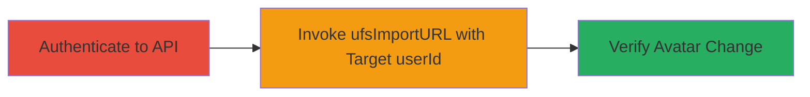

# Rocket.Chat Improper Access Control for Avatar Upload on Other Users

Multi-stage attack chain demonstrating exploitation of improper access control in Rocket.Chat's FileUpload.js, specifically the ufsImportURL method around line 210, which fails to validate the userId parameter. This allows any authenticated user to upload images from a URL and set them as avatars for other users, potentially enabling social engineering or privacy breaches depending on the storage backend like GridFS.

## Chain Metrics Dashboard

| Metric | Value |
|--------|-------|
| Chain Status | Unverified |
| Total Steps | 3 |
| Execution Time | ~5 minutes |
| Skill Level | Intermediate |
| Complexity | Medium |
| Impact Level | High |

## Attack Flow Visualization



## Prerequisites & Requirements

### Required Tools

- Browser developer tools or WebSocket client for DDP calls
- Access to a Rocket.Chat instance

### Target Environment

- Rocket.Chat server (Node.js/Meteor-based)
- Services: MongoDB with GridFS for file storage
- Ports: Standard web ports (80/443)

### Initial Access Requirements

- Valid authenticated user credentials (any non-admin user)
- Network access to the Rocket.Chat API endpoints (WebSocket or REST)
- Target userId of another user

## Detailed Attack Procedures

### Step 1: Authenticate to the API
procedure: [[procedures/Authenticate-to-Rocket.Chat-API]]

**Objective**: Obtain an authenticated session to access the API methods.

**Instructions**: Log in as an unprivileged user via the Rocket.Chat login interface or API to establish a WebSocket connection for DDP method calls.

**Expected Output**: Successful login with auth token or session established.

**Success Indicators**:
- WebSocket connection active
- Ability to send authenticated requests

### Step 2: Invoke ufsImportURL Method for Other User Avatar
procedure: [[procedures/Invoke-ufsImportURL-for-Other-User-Avatar]]

**Objective**: Upload an image from a URL and set it as the avatar for a different user by specifying their userId without validation.

**Instructions**: Use the authenticated session to send a DDP method call to ufsImportURL with the target userId in the file metadata. Execute [[commands/invoke-ufsimporturl-ddp]] via WebSocket:

```json
{"msg":"method","method":"ufsImportURL","params":["https://radicallyopensecurity.com/images/ros-logo.gif",{"name": "ros.jpg", "extension": "jpg", "type": "text/plain", "userId": "<TARGET_USER_ID>"},"Avatars"],"id":"15"}
```

Replace `<TARGET_USER_ID>` with the ID of the user whose avatar is to be changed.

**Expected Output**: Server response indicating successful upload and storage in the 'Avatars' store.

**Success Indicators**:
- No error in DDP response
- File uploaded to GridFS backend

### Step 3: Verify Avatar Change
procedure: [[procedures/Verify-Avatar-Change]]

**Objective**: Confirm the avatar modification by refreshing the client view.

**Instructions**: Clear browser cache and reload the Rocket.Chat page or user profile to load the new avatar image.

**Expected Output**: The targeted user's profile displays the uploaded image as their avatar.

**Success Indicators**:
- New avatar visible on user profile
- Image matches the uploaded URL content

## Attack Chain Summary

### Key Achievements

1. Authenticated access to exploit the API without admin privileges
2. Successful upload and assignment of avatar to arbitrary user
3. Visual confirmation of privacy violation

## Technique & Tactic Coverage

### MITRE ATT&CK Techniques

- [[Exploit Public-Facing Application]] Exploit Public-Facing Application
- [[Valid Accounts]] Valid Accounts

### MITRE ATT&CK Tactics

- [[Initial Access]] Initial Access
- [[Lateral Movement]] Lateral Movement

---
*Last updated: 2023-10-01T00:00:00Z*
