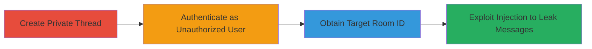

---
tags:
  - mongodb-injection
  - nosql-injection
  - information-disclosure
  - access-bypass
  - rocket-chat
type: attack_chain
tools: []
tactics:
  - '[[Collection]]'
verified: false
platforms:
  - Web
  - MongoDB
submitted: true
complexity: medium
created_at: '2023-10-01T00:00:00Z'
procedures:
  - '[[procedures/Create-Private-Thread-in-Rocket-Chat]]'
  - '[[procedures/Authenticate-as-Unauthorized-User-in-Rocket-Chat]]'
  - '[[procedures/Obtain-Target-Private-Room-ID]]'
  - '[[procedures/Exploit-MongoDB-Injection-with-Regex-on-rid]]'
step_count: 4
techniques:
  - '[[Exploit Public-Facing Application]]'
  - '[[Data from Information Repositories]]'
updated_at: '2025-12-14T17:32:01.569Z'
description: >-
  Authenticated MongoDB injection in Rocket.Chat's chat.getThreadsList API
  endpoint using unsanitized 'rid' parameter to bypass access controls and
  disclose sensitive thread messages from private rooms.
skill_level: intermediate
impact_level: high
id: 7a26aa4c-2318-4bba-9530-804549340351
validated: true
mitre_tactics:
  - '[[Collection]]'
mitre_techniques:
  - '[[Exploit Public-Facing Application]]'
  - '[[Data from Information Repositories]]'
---
# Rocket.Chat MongoDB Injection to Leak Private Thread Messages

Multi-stage attack chain demonstrating exploitation of a MongoDB injection vulnerability in Rocket.Chat to leak private thread messages from unauthorized rooms.

## Chain Metrics Dashboard

| Metric | Value |
|--------|-------|
| Chain Status | Unverified |
| Total Steps | 4 |
| Execution Time | ~5 minutes |
| Skill Level | Intermediate |
| Complexity | Medium |
| Impact Level | High |

## Attack Flow Visualization



## Prerequisites & Requirements

### Required Tools

- Browser with developer tools (for API calls)
- Valid Rocket.Chat credentials for setup and attacker accounts

### Target Environment

- Rocket.Chat instance (web-based)
- MongoDB backend
- Network access to the Rocket.Chat API

### Initial Access Requirements

- Authenticated access as a user who can create private rooms (e.g., admin or regular user)
- Separate authenticated session as unauthorized user
- Knowledge of a public room ID like 'GENERAL'

## Detailed Attack Procedures

### Step 1: Create Private Thread
procedure: [[procedures/Create-Private-Thread-in-Rocket-Chat]]

**Objective**: Set up a private room with a thread containing sensitive messages to serve as the target for leakage.

**Instructions**: Use the Rocket.Chat web interface or API to create a private room between two users and start a thread with sensitive content.

**Expected Output**: Confirmation of thread creation, with messages stored in MongoDB associated with the private room ID.

**Success Indicators**:
- Private room created successfully
- Thread messages visible only to authorized users

### Step 2: Authenticate as Unauthorized User
procedure: [[procedures/Authenticate-as-Unauthorized-User-in-Rocket-Chat]]

**Objective**: Log in as an attacker account without access to the private room to simulate unauthorized access.

**Instructions**: Use valid credentials for an account (e.g., Trudy) that lacks permissions to the target private room.

**Expected Output**: Successful login session with access to public rooms like GENERAL but not private ones.

**Success Indicators**:
- Login token obtained
- Access to public channels confirmed, private denied

### Step 3: Obtain Target Private Room ID
procedure: [[procedures/Obtain-Target-Private-Room-ID]]

**Objective**: Identify the room ID of the private thread to target in the injection payload.

**Instructions**: Leak or enumerate the room ID through other means, such as social engineering, prior reconnaissance, or inspecting network traffic during authorized access.

**Expected Output**: Specific room ID string (e.g., '7sJLzbjDL7iL56Lmc' for a message, but room-level ID like a hex string).

**Success Indicators**:
- Room ID acquired
- Verified as private via direct access attempt

### Step 4: Exploit MongoDB Injection
procedure: [[procedures/Exploit-MongoDB-Injection-with-Regex-on-rid]]

**Objective**: Craft a malicious API request using regex to bypass ACL and retrieve private threads in storage order.

**Instructions**: In the browser console or via API client, execute [[commands/rocket-chat-fetch-threads-list-regex]] with the target room ID appended to a public room regex. For validation, attempt direct message access with [[commands/meteor-call-get-messages]] to confirm denial.

```javascript
fetchApi("chat.getThreadsList?rid[$regex]=GENERAL|${TARGET_ROOM}")
```

**Expected Output**: JSON with 'threads' array including leaked private messages (e.g., _id, rid, msg, ts, u).

**Success Indicators**:
- Leaked threads from private room in response
- Direct access attempt returns 'error-not-allowed'

## Attack Chain Summary

### Key Achievements

1. Bypassed room access controls via unsanitized 'rid' parameter
2. Leaked sensitive thread messages using MongoDB regex injection
3. Demonstrated information disclosure without direct privileges

## Technique & Tactic Coverage

### MITRE ATT&CK Techniques

- [[Exploit Public-Facing Application]]
- [[Data from Information Repositories]]

### MITRE ATT&CK Tactics

- [[Collection]]

---
*Last updated: 2023-10-01T00:00:00Z*
