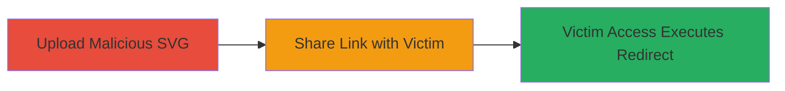

---
tags:
  - open-redirect
  - xss
  - svg
  - rocket-chat
  - phishing
  - file-upload
type: attack_chain
tools: []
tactics:
  - '[[Initial Access]]'
verified: false
platforms:
  - Web
submitted: true
complexity: medium
created_at: '2023-10-01T00:00:00Z'
procedures:
  - '[[procedures/Upload-Malicious-SVG-to-Rocket-Chat]]'
  - '[[procedures/Trigger-Open-Redirect-via-Shared-File-Link]]'
step_count: 2
techniques:
  - '[[Drive-by Compromise]]'
  - '[[JavaScript]]'
updated_at: '2025-12-14T17:24:27.157Z'
description: >-
  Multi-stage attack exploiting Rocket.Chat's file upload feature to upload a
  malicious SVG containing JavaScript, enabling open redirects to phishing sites
  when victims access the shared link.
skill_level: intermediate
impact_level: high
id: cba6b90c-70f5-4e82-b2de-6cb8de80ec15
validated: true
mitre_tactics:
  - '[[Initial Access]]'
mitre_techniques:
  - '[[Drive-by Compromise]]'
  - '[[JavaScript]]'
---
# Rocket.Chat Open Redirect via Malicious SVG File Upload

Multi-stage attack chain demonstrating exploitation of Rocket.Chat's file upload vulnerability, where unsanitized SVG files with embedded JavaScript enable open redirects to phishing sites or client-side attacks like malware downloads.

## Chain Metrics Dashboard

| Metric | Value |
|--------|-------|
| Chain Status | Unverified |
| Total Steps | 2 |
| Execution Time | ~5 minutes |
| Skill Level | Intermediate |
| Complexity | Medium |
| Impact Level | High |

## Attack Flow Visualization



## Prerequisites & Requirements

### Required Tools

- Text editor for crafting SVG (e.g., VS Code)
- Web browser for testing

### Target Environment

- Rocket.Chat instance (web-based, Node.js backend)
- Access to a chat room for file upload
- External storage integration like Google Cloud Storage

### Initial Access Requirements

- Valid user account in Rocket.Chat
- Ability to upload files to chats
- No special privileges needed beyond standard user access

## Detailed Attack Procedures

### Step 1: Upload Malicious SVG
procedure: [[procedures/Upload-Malicious-SVG-to-Rocket-Chat]]

**Objective**: Deliver a malicious SVG file containing JavaScript to a Rocket.Chat chat, which gets stored and served via a platform URL that allows script execution.

**Instructions**: Create an SVG file with embedded JavaScript for redirection, then upload it to any chat room in Rocket.Chat.

1. Craft the SVG payload using a text editor:

```html
<svg xmlns="http://www.w3.org/2000/svg" onload="window.location='https://phishing-site.com'">
  <script>window.location.href='https://phishing-site.com';</script>
</svg>
```

Save as `malicious.svg`.

2. Log in to Rocket.Chat and navigate to a chat room.

3. Use the file upload interface to attach and send `malicious.svg`.

The file will be stored on external storage (e.g., storage.googleapis.com) but accessible via a Rocket.Chat URL like `https://open.rocket.chat/file-upload/ID/malicious.svg`.

**Expected Output**: File uploaded successfully, with a shareable link generated in the chat.

**Success Indicators**:
- Upload confirmation in chat
- Shareable URL visible (e.g., containing `/file-upload/`)

### Step 2: Trigger Open Redirect
procedure: [[procedures/Trigger-Open-Redirect-via-Shared-File-Link]]

**Objective**: Induce a victim to access the uploaded file's URL, executing the embedded JavaScript to redirect to a malicious site for phishing or further exploits.

**Instructions**: Share the file link with the victim and monitor for access.

1. Copy the generated Rocket.Chat file URL from the chat (e.g., `https://open.rocket.chat/file-upload/ID/malicious.svg`).

2. Share the URL via email, chat, or other means to trick the victim into clicking it (spearphishing link).

3. When the victim visits the URL, the SVG is served, and the JavaScript executes, redirecting to the attacker's controlled site.

Test the URL yourself in an incognito browser to verify the redirect works without errors.

**Expected Output**: Browser redirects to the phishing site upon accessing the URL.

**Success Indicators**:
- Redirect occurs on URL access
- Victim's browser executes JS (observable via network logs or phishing site analytics)

## Attack Chain Summary

### Key Achievements

1. Successful upload of executable SVG payload to Rocket.Chat
2. Generation of a weaponized URL that bypasses storage sanitization
3. Client-side execution leading to phishing or malware delivery

## Technique & Tactic Coverage

### MITRE ATT&CK Techniques

- [[Drive-by Compromise]]
- [[JavaScript]]

### MITRE ATT&CK Tactics

- [[Initial Access]]

---
*Last updated: 2023-10-01T00:00:00Z*
