---
tags:
  - nosql-injection
  - blind-injection
  - account-takeover
  - rce
  - rocket-chat
  - mongodb
type: attack_chain
tools:
  - '[[tools/post-auth-nosqli-py]]'
  - '[[tools/Python3]]'
  - '[[tools/requests]]'
  - '[[tools/bcrypt]]'
  - '[[tools/git]]'
  - '[[tools/docker-compose]]'
tactics:
  - '[[Initial Access]]'
  - '[[Execution]]'
  - '[[Discovery]]'
  - '[[Collection]]'
verified: false
platforms:
  - Web
  - Linux
  - Docker
  - Node.js
submitted: true
complexity: medium
created_at: '2023-10-01T00:00:00Z'
procedures:
  - '[[procedures/Authenticate-as-Normal-User-to-Rocket-Chat]]'
  - '[[procedures/Identify-Admin-Users-via-Blind-NoSQL-Injection]]'
  - '[[procedures/Leak-Admin-Email-via-Blind-Injection]]'
  - '[[procedures/Request-Password-Reset-for-Target-Admin]]'
  - '[[procedures/Leak-Password-Reset-Token-via-Blind-Injection]]'
  - '[[procedures/Leak-2FA-Secrets-if-Enabled]]'
  - '[[procedures/Reset-Admin-Password-Using-Leaked-Data]]'
  - '[[procedures/Create-Malicious-Incoming-Webhook-as-Admin]]'
  - '[[procedures/Trigger-Webhook-for-Remote-Code-Execution]]'
  - '[[procedures/Verify-RCE-with-Shell-Commands]]'
step_count: 10
techniques:
  - '[[Exploit Public-Facing Application]]'
  - '[[Valid Accounts]]'
  - '[[JavaScript]]'
updated_at: '2025-12-14T17:32:20.469Z'
description: >-
  A multi-stage attack exploiting blind NoSQL injection in Rocket.Chat's
  users.list API to leak admin credentials, achieve account takeover, and
  execute remote code via malicious webhooks.
skill_level: intermediate
impact_level: high
id: 3562fa17-6cf4-41e3-910c-864fbfa950c1
validated: true
mitre_tactics:
  - '[[Initial Access]]'
  - '[[Execution]]'
  - '[[Discovery]]'
  - '[[Collection]]'
mitre_techniques:
  - '[[Exploit Public-Facing Application]]'
  - '[[Valid Accounts]]'
  - '[[JavaScript]]'
---
# Rocket.Chat Post-Authentication Blind NoSQL Injection Leading to Admin Takeover and RCE

Multi-stage attack chain exploiting a post-authentication blind NoSQL injection in the users.list API endpoint of Rocket.Chat (versions prior to patch, e.g., 3.12.1). An authenticated attacker uses the 'query' parameter to inject MongoDB $where operators, constructing blind oracles to leak sensitive data from the users collection, such as admin emails, password reset tokens, and 2FA secrets. This enables admin account takeover, creation of malicious incoming webhooks for arbitrary script execution, resulting in remote code execution (RCE) as the server user, full instance compromise, database access, and exfiltration of external credentials.

## Chain Metrics Dashboard

| Metric | Value |
|--------|-------|
| Chain Status | Unverified |
| Total Steps | 10 |
| Execution Time | ~30 minutes |
| Skill Level | Intermediate |
| Complexity | Medium |
| Impact Level | High |

## Attack Flow Visualization

```mermaid
graph LR
    A[Initial Access: Authenticate as User] --> B[Discovery: Identify Admin via NoSQLi]
    B --> C[Collection: Leak Email and Tokens]
    C --> D[Credential Access: Request and Leak Reset/2FA]
    D --> E[Lateral Movement: Account Takeover]
    E --> F[Execution: Create Malicious Webhook]
    F --> G[Impact: Trigger RCE]
    G --> H[Persistence: Verify Shell Access]

    style A fill:#e74c3c
    style B fill:#f39c12
    style C fill:#f39c12
    style D fill:#3498db
    style E fill:#9b59b6
    style F fill:#e67e22
    style G fill:#e74c3c
    style H fill:#27ae60
```

## Prerequisites & Requirements

### Required Tools

- [[tools/post-auth-nosqli-py]]
- [[tools/Python3]]
- [[tools/requests]]
- [[tools/bcrypt]]
- [[tools/git]]
- [[tools/docker-compose]]

### Target Environment

- Rocket.Chat instance (vulnerable version, e.g., 3.12.1) running on Node.js with MongoDB backend
- Exposed on port 3000 (default)
- Docker for local reproduction

### Initial Access Requirements

- Ability to create/register a non-admin user account
- Network access to the Rocket.Chat API (e.g., http://target:3000/api/v1/)
- No prior admin access needed; post-authentication exploit

## Detailed Attack Procedures

### Step 1: Authenticate as Normal User
procedure: [[procedures/Authenticate-as-Normal-User-to-Rocket-Chat]]

**Objective**: Gain authenticated access to the API as a low-privilege user to reach the vulnerable endpoint.

**Instructions**: Register a non-admin user via the Rocket.Chat web interface or API, then authenticate using the provided credentials in the exploit script.

**Expected Output**: Successful API session with auth token.

**Success Indicators**:
- API responses include user data without errors
- Access to /api/v1/users.list confirmed

### Step 2: Identify Admin User via NoSQL Injection
procedure: [[procedures/Identify-Admin-Users-via-Blind-NoSQL-Injection]]

**Objective**: Use blind NoSQL injection to discover admin users by querying roles.

**Instructions**: Run the exploit script with a $where payload targeting admin roles: Send {"$where":"this.roles.includes('admin')"} to /api/v1/users.list?query= and check for matching response lengths or contents.

**Expected Output**: Identification of admin username or ID.

**Success Indicators**:
- Response indicates presence of admin (e.g., non-empty user list)
- No 403 or validation errors

### Step 3: Leak Admin Email via Blind Injection
procedure: [[procedures/Leak-Admin-Email-via-Blind-Injection]]

**Objective**: Iteratively guess and extract the admin's email address character by character using blind oracles.

**Instructions**: Use the script to send payloads like {"$where":"this.roles.includes('admin') && /^a/.test(this.emails[0].address)"} and infer matches from response differences.

**Expected Output**: Full leaked email address.

**Success Indicators**:
- Character guesses confirmed via response timing or size
- Complete email reconstructed

### Step 4: Request Password Reset for Target Admin
procedure: [[procedures/Request-Password-Reset-for-Target-Admin]]

**Objective**: Trigger a password reset using the leaked email to generate a reset token stored in the database.

**Instructions**: Submit a password reset request via the Rocket.Chat interface or API using the leaked admin email.

**Expected Output**: Reset token generated and stored for the admin user.

**Success Indicators**:
- Reset email sent (if configured) or token available in DB
- No errors in reset submission

### Step 5: Leak Password Reset Token via Blind Injection
procedure: [[procedures/Leak-Password-Reset-Token-via-Blind-Injection]]

**Objective**: Extract the newly generated reset token character by character.

**Instructions**: After reset, inject payloads like {"$where":"this.roles.includes('admin') && /^A/.test(this.services.password.reset.token)"} to guess the token.

**Expected Output**: Full reset token leaked.

**Success Indicators**:
- Token characters inferred correctly
- Token usable for reset

### Step 6: Leak 2FA Secrets if Enabled
procedure: [[procedures/Leak-2FA-Secrets-if-Enabled]]

**Objective**: If 2FA is active, leak TOTP secrets or email tokens to bypass authentication.

**Instructions**: Use similar $where oracles targeting 2FA fields, e.g., services.totp.secret, iterating over possible values.

**Expected Output**: 2FA secret or token hash leaked.

**Success Indicators**:
- 2FA data extracted if present
- Bypass possible in subsequent steps

### Step 7: Reset Admin Password Using Leaked Data
procedure: [[procedures/Reset-Admin-Password-Using-Leaked-Data]]

**Objective**: Use the leaked token and 2FA data to change the admin password and gain control.

**Instructions**: Submit reset form with leaked token, new password (e.g., 'DEbCf2b0A2BE79bBcDf1'), and bypassed 2FA.

**Expected Output**: Admin account password updated.

**Success Indicators**:
- Login successful with new credentials
- Admin privileges confirmed

### Step 8: Create Malicious Incoming Webhook as Admin
procedure: [[procedures/Create-Malicious-Incoming-Webhook-as-Admin]]

**Objective**: With admin access, set up a webhook that executes arbitrary scripts on the server.

**Instructions**: As admin, create an incoming integration/webhook with a script payload, e.g., named 'backdoor-9Fbd6E5A' with a secret for triggering.

**Expected Output**: Webhook URL and secret obtained.

**Success Indicators**:
- Webhook created without errors
- URL accessible for triggering

### Step 9: Trigger Webhook for Remote Code Execution
procedure: [[procedures/Trigger-Webhook-for-Remote-Code-Execution]]

**Objective**: Send payloads to the webhook to execute commands in the server context.

**Instructions**: POST to the webhook URL with command scripts, executed as the 'rocketchat' user.

**Expected Output**: Commands run on server.

**Success Indicators**:
- Server-side execution confirmed
- No sandboxing blocks

### Step 10: Verify RCE with Shell Commands
procedure: [[procedures/Verify-RCE-with-Shell-Commands]]

**Objective**: Confirm RCE by running identity commands in the interactive shell provided by the exploit.

**Instructions**: Execute [[commands/whoami]] and [[commands/id]] via the webhook shell.

**Expected Output**: 'rocketchat' user confirmed.

**Success Indicators**:
- whoami: rocketchat
- id: uid=65533(rocketchat) gid=65533(rocketchat)

## Attack Chain Summary

### Key Achievements

1. Blind NoSQL injection to leak admin credentials without direct output
2. Account takeover of admin via reset token exploitation
3. RCE through unsanitized webhook script execution, granting full server control

## Technique & Tactic Coverage

### MITRE ATT&CK Techniques

- [[Exploit Public-Facing Application]] Exploit Public-Facing Application (NoSQL injection in API)
- [[Valid Accounts]] Valid Accounts (account takeover)
- [[JavaScript]] JavaScript (webhook script execution for RCE)

### MITRE ATT&CK Tactics

- [[Initial Access]] Initial Access (authenticated exploitation)
- [[Discovery]] Discovery (admin identification)
- [[Collection]] Collection (data leakage)
- [[Execution]] Execution (RCE)

---

*Last updated: 2023-10-01T00:00:00Z*
