---
tags:
  - nosql-injection
  - blind-injection
  - account-takeover
  - rce
  - webhook
  - mongodb
  - rocket-chat
type: attack_chain
tools:
  - '[[tools/Python3]]'
  - '[[tools/requests]]'
  - '[[tools/git]]'
  - '[[tools/Docker-Compose]]'
  - '[[tools/post_auth_nosqli.py]]'
tactics:
  - '[[Initial Access]]'
  - '[[Discovery]]'
  - '[[Lateral Movement]]'
  - '[[Execution]]'
verified: false
platforms:
  - Web
  - Linux
  - Docker
submitted: true
complexity: medium
created_at: '2023-10-01T00:00:00Z'
procedures:
  - '[[procedures/Authenticate-as-Normal-User-and-Identify-Admin]]'
  - '[[procedures/Leak-Admin-Email-via-Blind-NoSQL-Injection]]'
  - '[[procedures/Request-Password-Reset-for-Admin]]'
  - '[[procedures/Leak-Password-Reset-Token-via-Blind-Injection]]'
  - '[[procedures/Leak-2FA-Secrets-if-Enabled]]'
  - '[[procedures/Reset-Admin-Password-Using-Leaked-Token]]'
  - '[[procedures/Take-Over-Admin-Account-and-Create-Malicious-Webhook]]'
  - '[[procedures/Execute-Commands-via-Webhook-for-RCE]]'
  - '[[procedures/Restore-Admin-Password-and-Drop-Into-Interactive-Shell]]'
step_count: 9
techniques:
  - '[[Exploit Public-Facing Application]]'
  - '[[Account Discovery]]'
  - '[[Domain Accounts]]'
  - '[[JavaScript]]'
updated_at: '2025-12-14T03:46:14.849Z'
description: >-
  A multi-stage attack exploiting blind NoSQL injection in Rocket.Chat's
  users.list API to leak admin credentials, perform account takeover, and
  achieve RCE via malicious webhooks.
skill_level: intermediate
impact_level: high
id: 1f31fe1c-645a-4174-a4b6-e61ac2fa2c59
validated: true
mitre_tactics:
  - '[[Initial Access]]'
  - '[[Discovery]]'
  - '[[Lateral Movement]]'
  - '[[Execution]]'
mitre_techniques:
  - '[[Exploit Public-Facing Application]]'
  - '[[Account Discovery]]'
  - '[[Domain Accounts]]'
  - '[[JavaScript]]'
---
# Rocket.Chat Post-Authentication Blind NoSQL Injection Leading to Remote Code Execution

Multi-stage attack chain demonstrating a complete attack workflow exploiting blind NoSQL injection in Rocket.Chat to achieve full server compromise.

## Chain Metrics Dashboard

| Metric | Value |
|--------|-------|
| Chain Status | Unverified |
| Total Steps | 9 |
| Execution Time | ~30 minutes |
| Skill Level | Intermediate |
| Complexity | Medium |
| Impact Level | High |

## Attack Flow Visualization

```mermaid
graph LR
    A[Initial Access: Authenticate User] --> B[Discovery: Identify Admin]
    B --> C[Collection: Leak Email]
    C --> D[Collection: Leak Reset Token]
    D --> E[Collection: Leak 2FA Secrets]
    E --> F[Lateral Movement: Account Takeover]
    F --> G[Execution: Create Malicious Webhook]
    G --> H[Execution: RCE via Webhook]
    H --> I[Persistence: Interactive Shell]

    style A fill:#e74c3c
    style B fill:#f39c12
    style C fill:#f39c12
    style D fill:#f39c12
    style E fill:#f39c12
    style F fill:#3498db
    style G fill:#3498db
    style H fill:#27ae60
    style I fill:#27ae60
```



## Prerequisites & Requirements

### Required Tools

- [[tools/Python3]]
- [[tools/requests]]
- [[tools/git]]
- [[tools/Docker-Compose]]
- [[tools/post_auth_nosqli.py]]

### Target Environment

- Rocket.Chat version 3.12.1 or vulnerable releases
- MongoDB backend
- Exposed on port 3000
- Dockerized deployment

### Initial Access Requirements

- Valid low-privilege user credentials
- Network access to the Rocket.Chat API
- Python environment for scripting

## Detailed Attack Procedures

### Step 1: Authenticate as Normal User and Identify Admin

procedure: [[procedures/Authenticate-as-Normal-User-and-Identify-Admin]]

**Objective**: Gain authenticated access and discover admin users via NoSQL injection.

**Instructions**: Authenticate using the Python script with user credentials, then query the users.list API with a $where operator to find admins.

Use [[commands/python3-post-auth-nosqli]] to run the initial authentication and admin identification:

```bash
python3 post_auth_nosqli.py -u attacker -p attacker 'http://localhost:3000'
```

**Expected Output**: Admin usernames and IDs listed in the script output.

**Success Indicators**:
- Authentication successful
- Admin user details retrieved

### Step 2: Leak Admin Email via Blind NoSQL Injection

procedure: [[procedures/Leak-Admin-Email-via-Blind-NoSQL-Injection]]

**Objective**: Extract admin email character by character using conditional blind injection.

**Instructions**: Iterate over possible characters in the email field using $where queries on the users.list API.

The script handles this automatically via [[commands/python3-post-auth-nosqli]]:

```bash
python3 post_auth_nosqli.py -u attacker -p attacker 'http://localhost:3000'
```

**Expected Output**: Full admin email address leaked and displayed.

**Success Indicators**:
- Email characters confirmed via response differences
- Complete email reconstructed

### Step 3: Request Password Reset for Admin

procedure: [[procedures/Request-Password-Reset-for-Admin]]

**Objective**: Trigger a password reset to generate a reset token for the admin account.

**Instructions**: Use the leaked email to call the password reset API endpoint.

Integrated in [[commands/python3-post-auth-nosqli]]:

```bash
python3 post_auth_nosqli.py -u attacker -p attacker 'http://localhost:3000'
```

**Expected Output**: Reset token generated and stored in the admin's user document.

**Success Indicators**:
- API response confirms reset request
- Token available for subsequent leakage

### Step 4: Leak Password Reset Token via Blind Injection

procedure: [[procedures/Leak-Password-Reset-Token-via-Blind-Injection]]

**Objective**: Extract the reset token character by character from the user document.

**Instructions**: Tailor $where queries to the specific admin user and token field.

Handled by [[commands/python3-post-auth-nosqli]]:

```bash
python3 post_auth_nosqli.py -u attacker -p attacker 'http://localhost:3000'
```

**Expected Output**: Complete reset token string outputted.

**Success Indicators**:
- Token characters verified
- Full token usable for reset

### Step 5: Leak 2FA Secrets if Enabled

procedure: [[procedures/Leak-2FA-Secrets-if-Enabled]]

**Objective**: Extract TOTP secrets or 2FA tokens if multi-factor authentication is active.

**Instructions**: Use blind injection on relevant fields like services.totp.secret.

Via [[commands/python3-post-auth-nosqli]]:

```bash
python3 post_auth_nosqli.py -u attacker -p attacker 'http://localhost:3000'
```

**Expected Output**: 2FA secrets or hashes leaked if present.

**Success Indicators**:
- 2FA fields detected and extracted
- Bypasses for 2FA obtained

### Step 6: Reset Admin Password Using Leaked Token

procedure: [[procedures/Reset-Admin-Password-Using-Leaked-Token]]

**Objective**: Change the admin password to gain control of the account.

**Instructions**: Submit reset request with leaked token and new password, using leaked 2FA if needed.

Executed in [[commands/python3-post-auth-nosqli]]:

```bash
python3 post_auth_nosqli.py -u attacker -p attacker 'http://localhost:3000'
```

**Expected Output**: Password successfully reset; admin login possible with new creds.

**Success Indicators**:
- API confirms password change
- Login as admin succeeds

### Step 7: Take Over Admin Account and Create Malicious Webhook

procedure: [[procedures/Take-Over-Admin-Account-and-Create-Malicious-Webhook]]

**Objective**: As admin, create an incoming webhook that executes arbitrary JavaScript.

**Instructions**: Use admin API to set up webhook with RCE payload.

Part of [[commands/python3-post-auth-nosqli]]:

```bash
python3 post_auth_nosqli.py -u attacker -p attacker 'http://localhost:3000'
```

**Expected Output**: Webhook created and ready for triggering.

**Success Indicators**:
- Webhook ID returned
- Script injection confirmed

### Step 8: Execute Commands via Webhook for RCE

procedure: [[procedures/Execute-Commands-via-Webhook-for-RCE]]

**Objective**: Trigger the webhook to run system commands as the rocketchat user.

**Instructions**: Send payloads to the webhook URL to spawn shells or execute commands.

Triggered via [[commands/python3-post-auth-nosqli]]:

```bash
python3 post_auth_nosqli.py -u attacker -p attacker 'http://localhost:3000'
```

**Expected Output**: Command outputs like whoami showing 'rocketchat'.

**Success Indicators**:
- RCE confirmed via command execution
- Server process context access

### Step 9: Restore Admin Password and Drop Into Interactive Shell

procedure: [[procedures/Restore-Admin-Password-and-Drop-Into-Interactive-Shell]]

**Objective**: Clean up by restoring original password and providing persistent access.

**Instructions**: Use webhook to reset password back and maintain shell.

Finalized in [[commands/python3-post-auth-nosqli]]:

```bash
python3 post_auth_nosqli.py -u attacker -p attacker 'http://localhost:3000'
```

**Expected Output**: Interactive shell prompt for further commands.

**Success Indicators**:
- Password restored
- Persistent shell access

## Attack Chain Summary

### Key Achievements

1. Blind NoSQL injection to leak sensitive admin data
2. Account takeover via password reset exploitation
3. Full RCE through unsandboxed webhook execution

## Technique & Tactic Coverage

### MITRE ATT&CK Techniques

- [[Exploit Public-Facing Application]]
- [[Account Discovery]]
- [[Domain Accounts]]
- [[JavaScript]]

### MITRE ATT&CK Tactics

- [[Initial Access]]
- [[Discovery]]
- [[Lateral Movement]]
- [[Execution]]

---

*Last updated: 2023-10-01T00:00:00Z*
