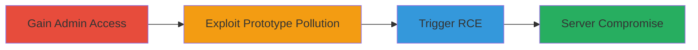

---
tags:
  - prototype-pollution
  - rce
  - command-injection
  - rocketchat
type: attack_chain
tools: []
tactics:
  - '[[Initial Access]]'
  - '[[Execution]]'
commands:
  - '[[commands/curl-prototype-pollution-payload]]'
  - '[[commands/node-command-injection-test]]'
platforms:
  - Web
  - Node.js
complexity: medium
procedures:
  - '[[procedures/Gain-Admin-Access-in-Rocket.Chat]]'
  - '[[procedures/Exploit-Prototype-Pollution]]'
  - '[[procedures/Trigger-RCE-via-Command-Injection]]'
step_count: 3
techniques:
  - '[[Exploit Public-Facing Application]]'
  - '[[JavaScript]]'
description: >-
  Multi-stage attack exploiting Prototype Pollution in Rocket.Chat to achieve
  remote code execution under admin privileges, affecting both cloud and
  self-hosted deployments.
skill_level: intermediate
impact_level: high
id: b061f1a0-f40e-4115-8fc0-2012699b4dd6
created_at: '2025-12-14T17:23:36.793Z'
updated_at: '2025-12-14T17:23:36.793Z'
verified: false
validated: true
submitted: true
mitre_tactics:
  - '[[Initial Access]]'
  - '[[Execution]]'
mitre_techniques:
  - '[[Exploit Public-Facing Application]]'
  - '[[JavaScript]]'
---
# Rocket.Chat Prototype Pollution Leading to Admin RCE

Multi-stage attack chain demonstrating exploitation of a Prototype Pollution vulnerability in Rocket.Chat to pollute the JavaScript prototype chain, enabling command injection and remote code execution (RCE) under admin privileges. This affects open-source Rocket.Chat deployments, including cloud-hosted instances where users can self-register and escalate to admin, and self-hosted setups potentially chained with XSS for broader impact.

## Chain Metrics Dashboard

| Metric | Value |
|--------|-------|
| Chain Status | Unverified |
| Total Steps | 3 |
| Execution Time | ~10 minutes |
| Skill Level | Intermediate |
| Complexity | Medium |
| Impact Level | High |

## Attack Flow Visualization



## Prerequisites & Requirements

### Required Tools

- Browser or curl for API requests
- Node.js environment for testing payloads (optional)

### Target Environment

- Rocket.Chat server (version vulnerable to prototype pollution, e.g., pre-patch releases)
- Web platform with Node.js and Meteor tech stack
- Admin privileges required for full RCE; exploitable via user self-registration in cloud setups
- Open ports: 3000 (default HTTP/HTTPS for Rocket.Chat)

### Initial Access Requirements

- Valid user account (can be self-registered)
- Network access to the Rocket.Chat instance
- Admin escalation possible via server creation in cloud environments

## Detailed Attack Procedures

### Step 1: Gain Admin Access
procedure: [[procedures/Gain-Admin-Access-in-Rocket.Chat]]

**Objective**: Obtain admin privileges on the Rocket.Chat server, enabling access to vulnerable endpoints.

**Instructions**: Register a new user account if not already present, then create a new server instance in cloud deployments to automatically gain admin rights. For self-hosted, leverage any existing auth bypass or social engineering to elevate.

**Expected Output**: Successful login as admin user with elevated permissions visible in the dashboard.

**Success Indicators**:
- Admin role confirmed in user settings
- Access to server administration panels

### Step 2: Exploit Prototype Pollution
procedure: [[procedures/Exploit-Prototype-Pollution]]

**Objective**: Pollute the JavaScript prototype chain by injecting malicious properties via a vulnerable endpoint, setting up for command injection.

**Instructions**: As an admin, send a crafted payload to the vulnerable feature (e.g., an API endpoint handling object merges without sanitization). Use [[commands/curl-prototype-pollution-payload]] to inject __proto__ properties:

```bash
curl -X POST -H "Content-Type: application/json" -d '{"__proto__":{"injectedProperty":"maliciousValue"}}' http://target-rocketchat.com/api/v1/vulnerable-endpoint
```

Verify pollution by checking if global objects reflect the change, e.g., via a follow-up request or console access.

**Expected Output**: Server-side prototype chain altered, with injected properties accessible in JS execution context.

**Success Indicators**:
- Injected property appears in non-target objects (e.g., JSON.stringify({}) includes "injectedProperty")
- No immediate errors; server continues responding

### Step 3: Trigger RCE via Command Injection
procedure: [[procedures/Trigger-RCE-via-Command-Injection]]

**Objective**: Leverage the polluted prototype to inject and execute arbitrary commands on the server.

**Instructions**: With the prototype polluted (e.g., a property like 'command' now defaults to a shell executor), trigger execution by interacting with a feature that uses the polluted chain, such as a file upload or settings update. Test with [[commands/node-command-injection-test]] in a local Node.js setup to simulate:

```bash
node -e "require('child_process').exec('whoami', (err, stdout) => console.log(stdout))"
```

In the target, send a request that invokes the polluted function, e.g., updating a config that spawns a process.

**Expected Output**: Command output returned or visible in logs/response, confirming shell access.

**Success Indicators**:
- Arbitrary command executed (e.g., 'id' or 'whoami' output)
- Persistent access or reverse shell established

## Attack Chain Summary

### Key Achievements

1. Admin privilege escalation via self-registration and server creation
2. Successful prototype chain pollution without detection
3. Full RCE on the Node.js server, compromising the entire infrastructure

## Technique & Tactic Coverage

### MITRE ATT&CK Techniques

- [[Exploit Public-Facing Application]]
- [[JavaScript]]

### MITRE ATT&CK Tactics

- [[Initial Access]]
- [[Execution]]

---
*Last updated: 2023-10-01T00:00:00Z*
