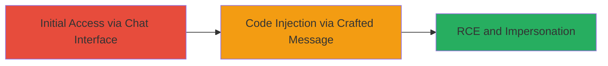

# Rocket.Chat RCE and User Impersonation via Code Injection in Meteor.call

Multi-stage attack chain demonstrating exploitation of a code injection vulnerability in Rocket.Chat's Meteor.call method, allowing attackers to execute arbitrary JavaScript code on the server and impersonate users, resulting in full application compromise.

## Chain Metrics Dashboard

| Metric | Value |
|--------|-------|
| Chain Status | Unverified |
| Total Steps | 2 |
| Execution Time | ~5 minutes |
| Skill Level | Intermediate |
| Complexity | Medium |
| Impact Level | High |

## Attack Flow Visualization

## Prerequisites & Requirements

### Required Tools

- Browser with developer tools (e.g., Chrome DevTools)
- Optional: Proxy tool like Burp Suite for request interception

### Target Environment

- Rocket.Chat instance vulnerable to CVE-2019-XXXX (pre-December 2019 versions)
- Web platform accessible via browser
- Node.js and Meteor.js tech stack

### Initial Access Requirements

- Network access to the Rocket.Chat web application
- No prior credentials required (remote exploitation possible)
- Ability to send messages in a chat room

## Detailed Attack Procedures

### Step 1: Initial Access

procedure: [[procedures/Exploit-Code-Injection-in-Rocket.Chat-Meteor.call]]

**Objective**: Gain access to the Rocket.Chat interface and prepare for message crafting to exploit the Meteor.call vulnerability.

**Instructions**: Navigate to the target Rocket.Chat instance in a web browser. Join or create a chat room where message sending is possible. Open browser developer tools (F12) to inspect network requests and console for JavaScript execution.

**Expected Output**: Active chat session with visible message input field.

**Success Indicators**:
- Successful login or guest access to chat
- Developer tools open without errors

### Step 2: Execution and Exploitation

procedure: [[procedures/Exploit-Code-Injection-in-Rocket.Chat-Meteor.call]]

**Objective**: Craft and send a malicious message object to trigger code injection via Meteor.call, achieving RCE and user impersonation.

**Instructions**: Use the browser console or intercept requests to modify the message object passed to Meteor.call. Construct a payload that injects arbitrary JavaScript code, such as executing server-side commands or overriding user sessions for impersonation. Send the crafted message through the chat interface.

**Expected Output**: Server-side code execution, evidenced by logs or unexpected behavior (e.g., new files created or user session changes).

**Success Indicators**:
- Arbitrary code runs on the server
- Successful impersonation of another user
- Application compromise confirmed via unauthorized actions

## Attack Chain Summary

### Key Achievements

1. Remote access to Rocket.Chat without authentication escalation
2. Injection of malicious JavaScript via insufficiently validated message objects
3. Full server compromise through RCE and user impersonation

## Technique & Tactic Coverage

### MITRE ATT&CK Techniques

- [[Exploit Public-Facing Application]]
- [[JavaScript]]

### MITRE ATT&CK Tactics

- [[Execution]]
- [[Defense Evasion]]

---
*Last updated: 2023-10-01T00:00:00Z*
