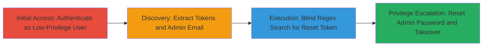

# Rocket.Chat Regex-Based Admin Account Takeover via Blind Search

Multi-stage attack chain demonstrating a complete attack workflow exploiting a vulnerability in Rocket.Chat's password reset mechanism, allowing a low-privilege authenticated user to retrieve an admin's reset token through blind regex searches without traditional SQL injection.

## Chain Metrics Dashboard

| Metric | Value |
|--------|-------|
| Chain Status | Unverified |
| Total Steps | 4 |
| Execution Time | ~10 minutes |
| Skill Level | Intermediate |
| Complexity | Medium |
| Impact Level | High |

## Attack Flow Visualization

## Prerequisites & Requirements

### Required Tools

- [[tools/Custom-Python-Script-for-Rocket-Chat-Exploitation]]

### Target Environment

- Rocket.Chat web application (version vulnerable to CVE or similar, e.g., pre-patch for report #1581059)
- Required services/ports: Web server on standard HTTP/HTTPS (e.g., port 3000)
- Network access requirements: Direct access to the Rocket.Chat instance as an authenticated user

### Initial Access Requirements

- Low-privilege user credentials for Rocket.Chat
- Network position: Internal or external access to the web interface
- Prior access needed: None, but valid low-privilege account required

## Detailed Attack Procedures

### Step 1: Authenticate as Low-Privilege User
procedure: [[procedures/Authenticate-as-Low-Privilege-User-in-Rocket-Chat]]

**Objective**: Gain initial access to the Rocket.Chat application as a standard user to enable subsequent authenticated requests.

**Instructions**: Log in to the Rocket.Chat web interface using low-privilege credentials. This establishes a session for token extraction.

**Expected Output**: Successful login, redirect to dashboard, and session cookies set.

**Success Indicators**:
- User dashboard accessible
- No admin privileges granted

### Step 2: Extract Authentication Tokens from Session
procedure: [[procedures/Extract-Authentication-Tokens-from-Rocket-Chat-Session]]

**Objective**: Obtain the rc_uid and rc_token necessary for scripting authenticated API requests.

**Instructions**: Inspect the browser's developer tools (Network or Application tab) to copy the rc_uid (user ID) and rc_token (auth token) from cookies or request headers.

**Expected Output**: rc_uid and rc_token values copied for use in scripts.

**Success Indicators**:
- Valid rc_uid and rc_token retrieved
- Tokens can be used in API calls without authentication errors

### Step 3: Discover Admin Email Address
procedure: [[procedures/Discover-Admin-Email-Address-in-Rocket-Chat]]

**Objective**: Identify the admin user's email address to target the password reset token search.

**Instructions**: Use the custom Python script with extracted tokens to query user information endpoints and identify the admin email, possibly via a search or list function.

**Expected Output**: Admin email address (e.g., admin@rocket.chat) obtained.

**Success Indicators**:
- Admin email confirmed
- Script executes without errors

### Step 4: Extract Admin Password Reset Token via Blind Regex Search
procedure: [[procedures/Extract-Admin-Password-Reset-Token-via-Blind-Regex-Search]]

**Objective**: Perform a blind regex search to retrieve the admin's password reset token, enabling password reset.

**Instructions**: Run the custom Python script using the admin email and tokens to conduct iterative regex searches on the vulnerable endpoint, extracting the reset token character by character or via pattern matching.

**Expected Output**: Full password reset token string.

**Success Indicators**:
- Reset token obtained
- Token can be used to initiate password reset

## Attack Chain Summary

### Key Achievements

1. Authenticated access as low-privilege user without detection
2. Discovery of admin email and extraction of sensitive reset token via non-traditional blind search
3. Successful admin account takeover and privilege escalation to full admin access

## Technique & Tactic Coverage

### MITRE ATT&CK Techniques

- [[Exploit Public-Facing Application]]
- [[Valid Accounts]]

### MITRE ATT&CK Tactics

- [[Initial Access]]
- [[Privilege Escalation]]

---
*Last updated: 2023-10-01T00:00:00Z*
