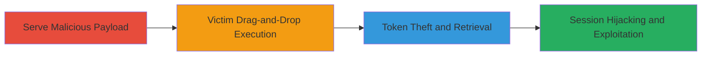

---
tags:
  - xss
  - self-xss
  - session-hijacking
  - rocketchat
type: attack_chain
tools:
  - '[[tools/Python-HTTP-Server]]'
tactics:
  - '[[Execution]]'
  - '[[Credential Access]]'
verified: false
platforms:
  - Web
submitted: true
complexity: medium
created_at: '2023-10-01T00:00:00Z'
procedures:
  - '[[procedures/Prepare-and-Serve-Malicious-Payload-for-Self-XSS]]'
  - '[[procedures/Execute-Self-XSS-via-Drag-and-Drop]]'
  - '[[procedures/Retrieve-and-Apply-Stolen-Session-Token]]'
  - '[[procedures/Exploit-Hijacked-Session-for-Account-Takeover]]'
step_count: 4
techniques:
  - '[[JavaScript]]'
  - '[[Steal Web Session Cookie]]'
updated_at: '2025-12-14T03:46:32.177Z'
description: >-
  Multi-stage attack exploiting Self-XSS in Rocket.Chat's drag-and-drop feature
  to steal session tokens and hijack user accounts, enabling unauthorized access
  to chats, profile modifications, and potential server configuration changes.
skill_level: intermediate
impact_level: high
id: ddc3e01a-f6ea-4112-a385-f612950985c0
validated: true
mitre_tactics:
  - '[[Execution]]'
  - '[[Credential Access]]'
mitre_techniques:
  - '[[JavaScript]]'
  - '[[Steal Web Session Cookie]]'
---
# Rocket.Chat Session Hijacking via Self-XSS in Drag-and-Drop Image Upload

Multi-stage attack chain demonstrating a complete workflow for exploiting a Self-XSS vulnerability in Rocket.Chat's drag-and-drop image upload feature to steal Meteor login tokens and achieve full account takeover.

## Chain Metrics Dashboard

| Metric | Value |
|--------|-------|
| Chain Status | Unverified |
| Total Steps | 4 |
| Execution Time | ~5 minutes |
| Skill Level | Intermediate |
| Complexity | Medium |
| Impact Level | High |

## Attack Flow Visualization



## Prerequisites & Requirements

### Required Tools

- [[tools/Python-HTTP-Server]]

### Target Environment

- Web platform with Rocket.Chat instance (built on Meteor.js and Node.js)
- Required services/ports: HTTP server on port 8000 for payload hosting
- Network access requirements: Attacker must be able to host a local server accessible to the victim (e.g., via shared network or social engineering)

### Initial Access Requirements

- No prior credentials needed; relies on social engineering to trick victim into dragging the payload
- Network position: Attacker needs to communicate with victim to deliver the payload file
- Prior access needed: None, but victim must be an authenticated Rocket.Chat user

## Detailed Attack Procedures

### Step 1: Prepare and Serve Malicious Payload
procedure: [[procedures/Prepare-and-Serve-Malicious-Payload-for-Self-XSS]]

**Objective**: Create and host an HTML file disguised as an image containing JavaScript to exfiltrate the victim's Meteor.loginToken.

**Instructions**: First, create the malicious HTML payload file named something like "fake-image.html" (disguised as .jpg or .png via social engineering). The payload should include JavaScript that extracts localStorage['Meteor.loginToken'] and sends it to the attacker's server. Then, start the HTTP server using [[commands/python-http-server-start]]:

```bash
python -m http.server
```

Provide the URL (e.g., http://attacker-ip:8000/fake-image.html) to the victim, tricking them into downloading and dragging it.

**Expected Output**: Server logs show "Serving HTTP on 0.0.0.0 port 8000 (http://0.0.0.0:8000/) ..."

**Success Indicators**:
- Server starts without errors
- Payload file is accessible via browser at the hosted URL

### Step 2: Execute Self-XSS via Drag-and-Drop
procedure: [[procedures/Execute-Self-XSS-via-Drag-and-Drop]]

**Objective**: Trick the victim into dragging the malicious file into the Rocket.Chat chat, triggering JavaScript execution in their browser context.

**Instructions**: Use social engineering (e.g., email or message) to convince the victim that the file is a legitimate image to share in the chat. Once dragged into the chat text box, the insufficient sanitization allows the HTML/JS to execute, logging the session token to the attacker's server.

**Expected Output**: No visible error in chat; payload executes silently in victim's browser.

**Success Indicators**:
- Victim confirms dragging the file
- Attacker's server receives a POST request with the token (monitored in step 3)

### Step 3: Retrieve and Apply Stolen Session Token
procedure: [[procedures/Retrieve-and-Apply-Stolen-Session-Token]]

**Objective**: Capture the exfiltrated token from server logs and inject it into the attacker's browser to hijack the session.

**Instructions**: Monitor the Python HTTP server logs for the incoming request containing the victim's Meteor.loginToken. Open the Rocket.Chat instance in a new browser tab, then use developer tools console to set the token:

```javascript
localStorage.setItem('Meteor.loginToken', 'stolen-token-value-here');
```

Rocket.Chat will detect the token and authenticate automatically.

**Expected Output**: Browser redirects to the victim's dashboard upon token injection.

**Success Indicators**:
- Token appears in server logs
- Attacker gains access to victim's account without password

### Step 4: Exploit Hijacked Session for Account Takeover
procedure: [[procedures/Exploit-Hijacked-Session-for-Account-Takeover]]

**Objective**: Use the hijacked session to perform unauthorized actions like reading chats, modifying profiles, enabling 2FA to lock the account, or altering server configs if privileged.

**Instructions**: With the session active, navigate to private chats to read messages, go to user settings to change profile info, or enable 2FA via account settings. For elevated privileges, access admin panels to modify configurations.

**Expected Output**: Successful actions reflected in the interface (e.g., 2FA enabled, chats visible).

**Success Indicators**:
- Access to victim's private data
- Ability to perform destructive actions like account locking

## Attack Chain Summary

### Key Achievements

1. Successful Self-XSS execution via drag-and-drop without direct access
2. Stealthy session token theft and hijacking
3. Full account takeover enabling data exfiltration and privilege abuse

## Technique & Tactic Coverage

### MITRE ATT&CK Techniques

- [[JavaScript]]
- [[Steal Web Session Cookie]]

### MITRE ATT&CK Tactics

- [[Execution]]
- [[Credential Access]]

---
*Last updated: 2023-10-01T00:00:00Z*
