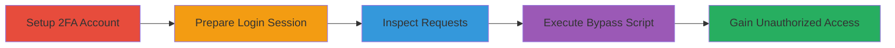

---
tags:
  - auth-bypass
  - 2fa-bypass
  - totp
  - rocket-chat
  - cas
type: attack_chain
tools:
  - '[[tools/Web-Inspector]]'
tactics:
  - '[[Initial Access]]'
verified: false
platforms:
  - Web
submitted: true
complexity: low
created_at: '2024-01-01T00:00:00Z'
procedures:
  - '[[procedures/Create-Rocket.Chat-Account-with-TOTP-2FA]]'
  - '[[procedures/Logout-and-Prepare-Rocket.Chat-Login]]'
  - '[[procedures/Inspect-Rocket.Chat-Login-Requests-with-Web-Inspector]]'
  - '[[procedures/Execute-Rocket.Chat-2FA-Bypass-Script]]'
step_count: 4
techniques:
  - '[[Exploit Public-Facing Application]]'
  - '[[Valid Accounts]]'
updated_at: '2025-12-14T17:31:11.193Z'
description: >-
  A multi-step attack to bypass TOTP two-factor authentication in Rocket.Chat by
  manipulating the 'cas' parameter in login requests, allowing unauthorized
  access with valid credentials but without the second factor.
skill_level: intermediate
impact_level: high
id: d7fc3252-3adf-425d-bb84-18208b959716
validated: true
mitre_tactics:
  - '[[Initial Access]]'
mitre_techniques:
  - '[[Exploit Public-Facing Application]]'
  - '[[Valid Accounts]]'
---
# Rocket.Chat TOTP 2FA Bypass via CAS Parameter

Multi-stage attack chain demonstrating a complete attack workflow to bypass TOTP 2FA in Rocket.Chat by exploiting a server-side logic flaw in the authentication handler.

## Chain Metrics Dashboard

| Metric | Value |
|--------|-------|
| Chain Status | Unverified |
| Total Steps | 4 |
| Execution Time | ~5 minutes |
| Skill Level | Intermediate |
| Complexity | Low |
| Impact Level | High |

## Attack Flow Visualization



## Prerequisites & Requirements

### Required Tools

- [[tools/Web-Inspector]]

### Target Environment

- Web-based Rocket.Chat instance (JavaScript, Meteor, Node.js stack)
- No specific ports required beyond standard HTTPS (443)
- Attacker must have network access to the login endpoint (/api/v1/login)

### Initial Access Requirements

- Ability to register a new account on the target Rocket.Chat instance
- Valid username and password for the target account
- Invalid or arbitrary TOTP code (e.g., '000000')
- No prior session or elevated privileges needed

## Detailed Attack Procedures

### Step 1: Create 2FA-Enabled Account
procedure: [[procedures/Create-Rocket.Chat-Account-with-TOTP-2FA]]

**Objective**: Establish a test account with TOTP 2FA enabled to simulate a protected target.

**Instructions**: Navigate to the Rocket.Chat registration page and create a new user account. During setup, enable TOTP 2FA by scanning the QR code with an authenticator app and entering a valid code.

**Expected Output**: Successful account creation confirmation and 2FA setup completion.

**Success Indicators**:
- Account login requires TOTP code
- User profile shows 2FA enabled

### Step 2: Logout and Prepare Login
procedure: [[procedures/Logout-and-Prepare-Rocket.Chat-Login]]

**Objective**: Clear any active session to force a fresh login attempt, setting up for request interception.

**Instructions**: Log out of the account via the user menu and refresh the login page to ensure no cookies or sessions persist.

**Expected Output**: Clean login interface with no active session.

**Success Indicators**:
- No automatic login or session restoration
- Login form is presented

### Step 3: Open Web Inspector for Request Inspection
procedure: [[procedures/Inspect-Rocket.Chat-Login-Requests-with-Web-Inspector]]

**Objective**: Prepare to monitor and modify the login request using browser developer tools.

**Instructions**: Open the browser's Developer Tools (F12 or right-click > Inspect), navigate to the Network tab, and attempt a normal login to observe the request structure.

**Expected Output**: Visible POST request to /api/v1/login in the Network tab.

**Success Indicators**:
- Network tab captures login requests
- Request payload includes username, password, and code fields

### Step 4: Execute Bypass Script
procedure: [[procedures/Execute-Rocket.Chat-2FA-Bypass-Script]]

**Objective**: Send a modified login request with the 'cas': true parameter to skip TOTP validation.

**Instructions**: Switch to the Console tab in Developer Tools. Execute the bypass script using [[commands/rocket-chat-2fa-bypass-js]] by pasting it and replacing placeholders with actual credentials and an invalid TOTP code.

```javascript
fetch('/api/v1/login', {
  method: 'POST',
  headers: {
    'Content-Type': 'application/json'
  },
  body: JSON.stringify({
    user: 'your_username',
    password: 'your_password',
    code: '000000',
    cas: true
  })
}).then(response => response.json()).then(data => console.log(data));
```

**Expected Output**: JSON response with auth token and user data, indicating successful login.

**Success Indicators**:
- Authentication succeeds without valid TOTP
- Access to account dashboard granted
- Server returns {"status": "success", "data": {"authToken": "...", "userId": "..."}}

## Attack Chain Summary

### Key Achievements

1. Created and configured a 2FA-protected account for testing.
2. Intercepted and modified the login request to include the bypassing 'cas' parameter.
3. Achieved unauthorized access by skipping TOTP validation.
4. Demonstrated full account takeover with valid credentials only.

## Technique & Tactic Coverage

### MITRE ATT&CK Techniques

- [[Exploit Public-Facing Application]] Exploit Public-Facing Application
- [[Valid Accounts]] Valid Accounts

### MITRE ATT&CK Tactics

- [[Initial Access]] Initial Access

---

*Last updated: 2024-01-01T00:00:00Z*
