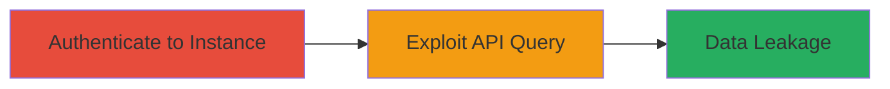

# Rocket.Chat Users.List API NoSQL Injection for Admin User Data Leakage

Multi-stage attack chain demonstrating exploitation of Rocket.Chat's vulnerable REST API endpoint to disclose sensitive user information.

## Chain Metrics Dashboard

| Metric | Value |
|--------|-------|
| Chain Status | Unverified |
| Total Steps | 2 |
| Execution Time | ~5 minutes |
| Skill Level | Intermediate |
| Complexity | Medium |
| Impact Level | High |

## Attack Flow Visualization



## Prerequisites & Requirements

### Required Tools

- [[tools/curl]]

### Target Environment

- Rocket.Chat instance (e.g., open.rocket.chat)
- Web platform with Node.js and MongoDB backend
- No specific ports required beyond standard HTTPS (443)

### Initial Access Requirements

- Ability to sign up for an account on the Rocket.Chat instance
- Browser access to retrieve authentication tokens
- Network access to the target API endpoint

## Detailed Attack Procedures

### Step 1: Authenticate to Rocket.Chat Instance
procedure: [[procedures/Authenticate-to-Rocket-Chat-Instance]]

**Objective**: Gain authenticated access to the Rocket.Chat instance and obtain necessary tokens for API requests.

**Instructions**: Sign up for an account on the target instance, such as open.rocket.chat, using the web interface. Once logged in, inspect browser storage (e.g., via Developer Tools > Application > Local Storage) to retrieve the X-Auth-Token and X-User-Id values.

**Expected Output**: Valid X-Auth-Token and X-User-Id strings stored for use in subsequent API calls.

**Success Indicators**:
- Successful login to the web interface
- Tokens visible in browser storage

### Step 2: Exploit Users.List API with Custom Query
procedure: [[procedures/Exploit-Rocket-Chat-Users-List-API]]

**Objective**: Send a crafted query to the vulnerable endpoint to leak admin user data from the MongoDB users collection.

**Instructions**: Use [[commands/curl-rocket-chat-users-list-exploit]] to issue a GET request to the /api/v1/users.list endpoint with a JSON query filtering for admin roles:

```bash
curl --location -g --request GET 'https://open.rocket.chat/api/v1/users.list?query={"roles":"admin"}' --header 'X-Auth-Token: YOUR_TOKEN' --header 'X-Requested-With: XMLHttpRequest' --header 'X-User-Id: YOUR_USER_ID'
```

Replace YOUR_TOKEN and YOUR_USER_ID with values from Step 1. This executes an arbitrary MongoDB find() query without validation.

**Expected Output**: JSON response with user metadata, including emails, roles, and other details for all admin users (password hashes excluded).

**Success Indicators**:
- Response contains array of admin users with sensitive fields like emails
- No authentication errors; query executes successfully

## Attack Chain Summary

### Key Achievements

1. Authenticated access to Rocket.Chat API
2. Arbitrary query execution on users collection
3. Leakage of admin emails and roles for potential follow-on attacks like brute-force

## Technique & Tactic Coverage

### MITRE ATT&CK Techniques

- [[Exploit Public-Facing Application]] Exploit Public-Facing Application
- [[Account Discovery]] Account Discovery

### MITRE ATT&CK Tactics

- [[Initial Access]] Initial Access
- [[Discovery]] Discovery

*Last updated: 2023-10-01T00:00:00Z*
