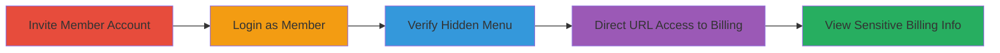

---
tags:
  - broken-access-control
  - billing-exposure
  - rockset
  - authorization-bypass
type: attack_chain
tools: []
tactics:
  - '[[Initial Access]]'
verified: false
platforms:
  - Web
submitted: true
complexity: low
created_at: '2024-10-01T00:00:00Z'
procedures:
  - '[[procedures/Invite-Member-Account-in-Rockset]]'
  - '[[procedures/Login-as-Member-to-Rockset-Console]]'
  - '[[procedures/Verify-Hidden-Billing-Menu-in-Rockset]]'
  - '[[procedures/Directly-Access-Rockset-Billing-Page]]'
step_count: 4
techniques:
  - '[[Valid Accounts]]'
updated_at: '2025-12-14T17:28:51.660Z'
description: >-
  Multi-stage attack demonstrating improper access control in Rockset's web
  console, where member accounts can bypass UI restrictions to view sensitive
  admin-only billing details via direct URL access.
skill_level: beginner
impact_level: high
id: f276d7d3-3db4-4895-a26f-ef54c901daca
validated: true
mitre_tactics:
  - '[[Initial Access]]'
mitre_techniques:
  - '[[Valid Accounts]]'
---
# Rockset Console Broken Access Control Allowing Member Access to Admin Billing Information

Multi-stage attack chain demonstrating a complete attack workflow exploiting improper access controls in Rockset's web console. An admin invites a member, who then logs in and directly accesses the hidden billing page to view sensitive financial data like payment methods.

## Chain Metrics Dashboard

| Metric | Value |
|--------|-------|
| Chain Status | Unverified |
| Total Steps | 4 |
| Execution Time | ~5 minutes |
| Skill Level | Beginner |
| Complexity | Low |
| Impact Level | High |

## Attack Flow Visualization

## Prerequisites & Requirements

### Required Tools

- Web browser (e.g., Chrome or Firefox)

### Target Environment

- Rockset web console (https://console.rockset.com/)
- Admin account with invitation privileges
- Member email address (e.g., a test email like himanshujoshitest2019@gmail.com)

### Initial Access Requirements

- Valid admin credentials for Rockset
- Network access to the Rockset console
- No prior member account access needed, but email for invitation

## Detailed Attack Procedures

### Step 1: Invite Member Account
procedure: [[procedures/Invite-Member-Account-in-Rockset]]

**Objective**: Create a limited-privilege member account to simulate unauthorized access.

**Instructions**: Log in to the Rockset console as an admin and invite a new user with member role privileges using a test email address.

**Expected Output**: Invitation email sent to the member email, confirming account creation.

**Success Indicators**:
- Invitation email received
- Member account listed in admin user management

### Step 2: Login as Member
procedure: [[procedures/Login-as-Member-to-Rockset-Console]]

**Objective**: Authenticate into the console using the member account to establish a session with limited privileges.

**Instructions**: Navigate to the Rockset console login page and sign in with the member email and temporary password from the invitation.

**Expected Output**: Successful login redirecting to the member dashboard, without admin features visible.

**Success Indicators**:
- Member dashboard loads
- No admin menu options appear

### Step 3: Verify Hidden Billing Menu
procedure: [[procedures/Verify-Hidden-Billing-Menu-in-Rockset]]

**Objective**: Confirm that the billing page is intentionally hidden from the navigation menu for member accounts, highlighting the reliance on client-side controls.

**Instructions**: Inspect the left-hand navigation menu or sidebar after login; search for any billing or account settings options.

**Expected Output**: No billing option visible in the menu, as per member privilege restrictions.

**Success Indicators**:
- Navigation menu lacks billing link
- Attempt to search or browse menus yields no access

### Step 4: Directly Access Billing Page
procedure: [[procedures/Directly-Access-Rockset-Billing-Page]]

**Objective**: Bypass the hidden menu by directly navigating to the billing URL, exploiting the lack of server-side authorization checks.

**Instructions**: In the browser address bar, enter the direct URL to the billing page and load it.

**Expected Output**: The billing page loads fully, displaying sensitive details such as payment methods, billing history, and financial information intended for admins only.

**Success Indicators**:
- Page loads without errors
- Sensitive data like credit card details or invoices visible
- No access denied message

## Attack Chain Summary

### Key Achievements

1. Successfully invited and logged in as a member account with limited UI access.
2. Verified client-side hiding of admin features like billing.
3. Bypassed controls via direct URL to expose sensitive financial data.
4. Demonstrated potential for data exposure leading to privacy breaches or further attacks.

## Technique & Tactic Coverage

### MITRE ATT&CK Techniques

- [[Valid Accounts]]

### MITRE ATT&CK Tactics

- [[Initial Access]]

---

*Last updated: 2024-10-01T00:00:00Z*
