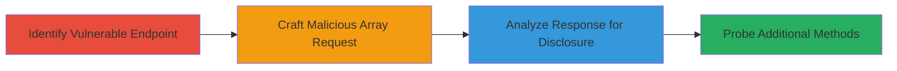

---
tags:
  - rails
  - redirect
  - information-disclosure
  - method-execution
  - web-vulnerability
type: attack_chain
tools: []
tactics:
  - '[[Initial Access]]'
  - '[[Discovery]]'
verified: false
platforms:
  - Web
  - Ruby on Rails
submitted: true
complexity: medium
created_at: '2023-10-01T00:00:00Z'
procedures:
  - '[[procedures/Identify-Vulnerable-Redirect-Code-in-Rails]]'
  - '[[procedures/Craft-Array-Parameter-Request-to-Trigger-Method-Call]]'
  - '[[procedures/Observe-Response-for-Route-Disclosure-and-Method-Probing]]'
step_count: 3
techniques:
  - '[[Exploit Public-Facing Application]]'
  - '[[System Information Discovery]]'
updated_at: '2025-12-14T17:23:27.494Z'
description: >-
  An attack chain exploiting the Ruby on Rails Action Pack vulnerability in
  redirect_to and polymorphic_url helpers to disclose route information and
  execute unintended controller methods via array parameters.
skill_level: intermediate
impact_level: high
id: 38cfd48e-4395-4e08-a73e-e42f571c07ae
validated: true
mitre_tactics:
  - '[[Initial Access]]'
  - '[[Discovery]]'
mitre_techniques:
  - '[[Exploit Public-Facing Application]]'
  - '[[System Information Discovery]]'
---
# Ruby on Rails Action Pack Redirect Vulnerability Exploitation for Information Disclosure and Method Execution

Multi-stage attack chain demonstrating exploitation of the Ruby on Rails Action Pack vulnerability, where untrusted user input in redirect_to or polymorphic_url helpers allows attackers to probe for route names and execute unintended public controller methods ending in _url via array-form parameters. This leads to information disclosure through error responses and potential redirection to sensitive locations.

## Chain Metrics Dashboard

| Metric | Value |
|--------|-------|
| Chain Status | Unverified |
| Total Steps | 3 |
| Execution Time | ~5 minutes |
| Skill Level | Intermediate |
| Complexity | Medium |
| Impact Level | High |

## Attack Flow Visualization



## Prerequisites & Requirements

### Required Tools

- [[tools/curl]]
- Web browser or proxy like Burp Suite for request crafting

### Target Environment

- Ruby on Rails application using Action Pack (versions prior to patch)
- Unauthenticated web routes with redirect_to(params[:user_input]) patterns
- HTTP/HTTPS access to the application

### Initial Access Requirements

- No credentials required (unauthenticated)
- Direct network access to the web application
- No prior access needed

## Detailed Attack Procedures

### Step 1: Identify Vulnerable Endpoint
procedure: [[procedures/Identify-Vulnerable-Redirect-Code-in-Rails]]

**Objective**: Locate controllers or routes using redirect_to or polymorphic_url with untrusted user input to confirm exploitability.

**Instructions**: Review the application's source code or use reconnaissance to identify endpoints that redirect based on parameters. Look for patterns like `redirect_to(params[:some_param])` on unauthenticated routes. Use [[commands/curl-get-endpoint]] to test for redirect behavior:

```bash
curl -v -X GET "http://target.com/vulnerable?some_param=test" -o response.html
```

Then inspect the response for redirect headers indicating dynamic redirection.

**Expected Output**: HTTP 302 redirect or server response showing parameter influence on location.

**Success Indicators**:
- Redirect header present with parameter value
- No input sanitization evident in response

### Step 2: Craft Malicious Array Request
procedure: [[procedures/Craft-Array-Parameter-Request-to-Trigger-Method-Call]]

**Objective**: Send a request with array-form parameters to trigger dynamic method invocation like `something_url`.

**Instructions**: Craft a GET or POST request using array notation, e.g., `?user_input[]=something`, which sets `params[:user_input] = ["something"]` and attempts to call `something_url`. Use [[commands/curl-array-probe]] to send the request:

```bash
curl -v -X GET "http://target.com/vulnerable?user_input[]=admin_url" -o response.html
```

Repeat with different values to test various method names.

**Expected Output**: Redirect to the method's return value if it exists, or a 500 error if not.

**Success Indicators**:
- Successful redirect indicates method existence
- 500 error with method-related traceback

### Step 3: Analyze Response for Disclosure
procedure: [[procedures/Observe-Response-for-Route-Disclosure-and-Method-Probing]]

**Objective**: Interpret responses to disclose available routes/methods and potentially execute unintended redirects.

**Instructions**: Monitor responses from previous requests. Successful redirects reveal valid _url methods; errors disclose non-existent ones via stack traces. Use [[commands/curl-multiple-probes]] to automate probing multiple potential method names:

```bash
for method in admin_url user_url secret_url; do curl -v -X GET "http://target.com/vulnerable?user_input[]=$method" && echo "Probed: $method"; done
```

Analyze logs or responses for patterns in errors or redirects.

**Expected Output**: Mix of 302 redirects and 500 errors, with error messages potentially listing Rails routes or methods in tracebacks.

**Success Indicators**:
- Disclosure of internal route names via error details
- Unintended method execution leading to sensitive redirects

## Attack Chain Summary

### Key Achievements

1. Identified vulnerable redirect patterns in Rails controllers
2. Triggered dynamic method calls via array parameters for probing
3. Achieved information disclosure on application routes and methods

## Technique & Tactic Coverage

### MITRE ATT&CK Techniques

- [[Exploit Public-Facing Application]]
- [[System Information Discovery]]

### MITRE ATT&CK Tactics

- [[Initial Access]]
- [[Discovery]]

---
*Last updated: 2023-10-01T00:00:00Z*
