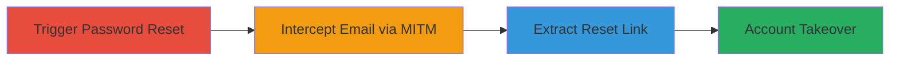

# RubyGems Password Reset Email Interception via MITM for Account Takeover

Multi-stage attack chain demonstrating a complete attack workflow exploiting unencrypted password reset emails from RubyGems, hosted on AWS EC2, to enable man-in-the-middle interception and subsequent account takeover.

## Chain Metrics Dashboard

| Metric | Value |
|--------|-------|
| Chain Status | Unverified |
| Total Steps | 4 |
| Execution Time | ~5 minutes |
| Skill Level | Intermediate |
| Complexity | Medium |
| Impact Level | High |

## Attack Flow Visualization

## Prerequisites & Requirements

### Required Tools

- Network interception tool (e.g., Wireshark for monitoring, or ARP spoofing tools for active MITM)

### Target Environment

- Web platform: rubygems.org
- Services: AWS EC2 instance (ec2-52-43-250-235.us-west-2.compute.amazonaws.com)
- Tech stack: Ruby on Rails (inferred from RubyGems)
- Network access: Position to perform MITM on email delivery path (e.g., shared network or ISP-level interception)

### Initial Access Requirements

- Victim email address associated with a RubyGems account
- Ability to trigger reset (public access to rubygems.org)
- MITM capability on the email transmission route

## Detailed Attack Procedures

### Step 1: Trigger Password Reset
procedure: [[procedures/Trigger-RubyGems-Password-Reset]]

**Objective**: Initiate the password reset process to generate and send an unencrypted email containing the reset link.

**Instructions**: Navigate to the RubyGems password reset page at https://rubygems.org/password/new and enter the victim's email address to request a reset. This triggers an email from help@rubygems.org with subject "Change your password" containing the sensitive reset link.

**Expected Output**: Confirmation on the web page that a reset email has been sent.

**Success Indicators**:
- Reset request submitted successfully
- Email transmission initiated from AWS EC2 server

### Step 2: Intercept Email Transmission via MITM
procedure: [[procedures/Intercept-Email-Transmission-via-MITM]]

**Objective**: Capture the clear-text email in transit due to the absence of TLS encryption.

**Instructions**: Position yourself to perform a man-in-the-middle attack on the network path between the RubyGems AWS EC2 instance and the victim's email server. Monitor for SMTP traffic; email headers will indicate no encryption, e.g., "encryption: ec2-52-43-250-235.us-west-2.compute.amazonaws.com did not encrypt this message".

**Expected Output**: Intercepted email packet with full headers and body visible in clear text.

**Success Indicators**:
- Email headers confirm lack of TLS
- Full email content (from, to, subject, body) captured

### Step 3: Extract Reset Link from Intercepted Email
procedure: [[procedures/Extract-Reset-Link-from-Intercepted-Email]]

**Objective**: Parse the intercepted email to obtain the password reset link.

**Instructions**: Analyze the email body for the reset URL, typically in the form of a temporary token link from RubyGems. Note details like from: help@rubygems.org, to: victim@gmail.com, subject: Change your password.

**Expected Output**: Valid reset link URL extracted.

**Success Indicators**:
- Reset link identified and copied
- Link format matches RubyGems reset pattern (e.g., containing a token)

### Step 4: Execute Account Takeover with Reset Link
procedure: [[procedures/Execute-Account-Takeover-with-Reset-Link]]

**Objective**: Use the intercepted link to reset the victim's password and gain unauthorized access.

**Instructions**: Open the extracted reset link in a browser, enter a new password, and submit. This changes the account credentials, allowing login with the new password.

**Expected Output**: Successful password change confirmation and access to the RubyGems account dashboard.

**Success Indicators**:
- Password reset completed
- Full control of the victim's account achieved

## Attack Chain Summary

### Key Achievements

1. Exploitation of missing TLS in email delivery for interception
2. Extraction of sensitive reset token without authentication
3. Complete account takeover enabling unauthorized access to RubyGems resources

## Technique & Tactic Coverage

### MITRE ATT&CK Techniques

- [[Adversary-in-the-Middle]] Adversary-in-the-Middle
- [[Valid Accounts]] Valid Accounts

### MITRE ATT&CK Tactics

- [[Credential Access]] Credential Access
- [[Initial Access]] Initial Access

---
*Last updated: 2023-10-01T00:00:00Z*
