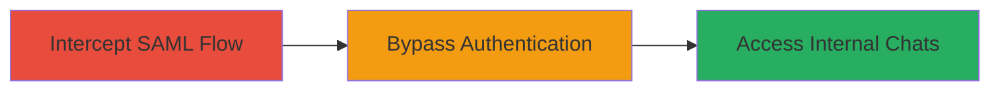

# SAML Authentication Bypass Leading to Unauthorized Internal Chat Access

Multi-stage attack chain demonstrating a complete attack workflow exploiting improper SAML verification on uchat.uberinternal.com.

## Chain Metrics Dashboard

| Metric | Value |
|--------|-------|
| Chain Status | Unverified |
| Total Steps | 1 |
| Execution Time | ~5 minutes |
| Skill Level | Intermediate |
| Complexity | Medium |
| Impact Level | High |

## Attack Flow Visualization

## Prerequisites & Requirements

### Required Tools

- [[tools/Burp-Suite]]

### Target Environment

- Web platform with SAML integration (e.g., OneLogin)
- Required services: OneLogin SAML provider
- Network access: Ability to reach https://uchat.uberinternal.com/

### Initial Access Requirements

- No prior credentials needed due to bypass
- Network position: External access to the login endpoint
- Prior access: None, but valid SAML flow initiation required

## Detailed Attack Procedures

### Step 1: SAML Authentication Bypass
procedure: [[procedures/Bypass-SAML-Authentication-via-Improper-Verification]]

**Objective**: Exploit improper SAML verification to bypass OneLogin authentication and gain unauthorized access to internal Uber chats.

**Instructions**: Configure a proxy like Burp Suite to intercept traffic. Initiate the SAML login flow to uchat.uberinternal.com, capture the SAML response from OneLogin, modify it to remove or alter the signature validation, and forward the tampered response to bypass checks.

Use [[tools/Burp-Suite]] to intercept the SAML POST request:

1. Set browser proxy to Burp.
2. Navigate to https://uchat.uberinternal.com/ and start login.
3. In Burp, intercept the SAML assertion POST to the ACS endpoint.
4. Edit the XML to strip the Signature element or set invalid values.
5. Forward the request.

**Expected Output**: Successful login redirect to the internal chat dashboard without valid OneLogin credentials.

**Success Indicators**:
- Access granted to uchat.uberinternal.com dashboard
- Ability to view sensitive internal communications
- No authentication errors post-modification

## Attack Chain Summary

### Key Achievements

1. Bypassed OneLogin SAML authentication via improper verification
2. Gained unauthorized access to Uber's internal chat application
3. Potential exposure of sensitive internal communications

## Technique & Tactic Coverage

### MITRE ATT&CK Techniques

- [[Valid Accounts]]

### MITRE ATT&CK Tactics

- [[Initial Access]]

---
*Last updated: 2023-10-01T00:00:00Z*
