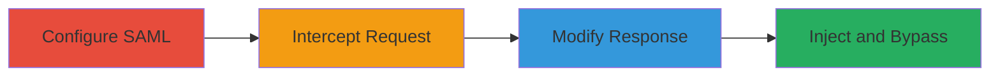

---
tags:
  - saml
  - authentication-bypass
  - rocket-chat
  - web
type: attack_chain
tools:
  - '[[tools/Proxy-Tool]]'
  - '[[tools/Python3]]'
  - '[[tools/samlbypasspoc-py]]'
tactics:
  - '[[Initial Access]]'
commands:
  - '[[commands/python-samlbypass-poc]]'
platforms:
  - Web
complexity: medium
procedures:
  - '[[procedures/Configure-Rocket-Chat-for-SAML-Authentication]]'
  - '[[procedures/Intercept-SAML-Login-Request]]'
  - '[[procedures/Generate-Modified-SAML-Response-with-POC-Script]]'
  - '[[procedures/Inject-Modified-Response-and-Bypass-Authentication]]'
step_count: 4
techniques:
  - '[[Exploit Public-Facing Application]]'
  - '[[Valid Accounts]]'
description: >-
  Exploits improper SAML response validation in Rocket.Chat to bypass
  authentication and log in as any user
skill_level: intermediate
impact_level: high
id: 84966703-b9f6-4f76-8d88-0c9749ba0f72
created_at: '2025-12-13T09:01:26.326Z'
updated_at: '2025-12-13T09:01:26.326Z'
verified: false
validated: true
submitted: true
mitre_tactics:
  - '[[Initial Access]]'
mitre_techniques:
  - '[[Exploit Public-Facing Application]]'
  - '[[Valid Accounts]]'
---
# SAML Authentication Bypass in Rocket.Chat via Response Injection

Multi-stage attack chain demonstrating how to exploit a vulnerability in Rocket.Chat's SAML authentication by injecting a malicious unsigned Response element to bypass validation and gain unauthorized access as any user, such as an administrator.

## Chain Metrics Dashboard

| Metric | Value |
|--------|-------|
| Chain Status | Unverified |
| Total Steps | 4 |
| Execution Time | ~10 minutes |
| Skill Level | Intermediate |
| Complexity | Medium |
| Impact Level | High |

## Attack Flow Visualization



## Prerequisites & Requirements

### Required Tools

- [[tools/Proxy-Tool]]
- [[tools/Python3]]
- [[tools/samlbypasspoc-py]]

### Target Environment

- Web-based Rocket.Chat application
- SAML authentication service enabled
- Network access to the Rocket.Chat login endpoint

### Initial Access Requirements

- Access to the Rocket.Chat login page
- Ability to intercept HTTP traffic (e.g., via proxy)
- No prior credentials required

## Detailed Attack Procedures

### Step 1: Configure SAML Authentication
procedure: [[procedures/Configure-Rocket-Chat-for-SAML-Authentication]]

**Objective**: Set up the target Rocket.Chat instance to use SAML authentication, enabling the vulnerable login flow.

**Instructions**: Access the Rocket.Chat administration panel and enable SAML authentication in the configuration settings. This activates the SAML response processing in saml_utils.js.

**Expected Output**: SAML login option appears on the login page.

**Success Indicators**:
- SAML authentication is successfully configured
- Login attempts redirect to the SAML provider

### Step 2: Intercept SAML Login Request
procedure: [[procedures/Intercept-SAML-Login-Request]]

**Objective**: Capture the SAML login POST request to extract the original SAMLResponse parameter.

**Instructions**: Use a proxy tool like [[tools/Proxy-Tool]] to intercept the HTTP POST request during a SAML login attempt. Focus on capturing the SAMLResponse parameter in the request body.

**Expected Output**: Intercepted request with URL-encoded SAMLResponse value.

**Success Indicators**:
- POST request captured
- SAMLResponse parameter extracted

### Step 3: Generate Modified SAML Response
procedure: [[procedures/Generate-Modified-SAML-Response-with-POC-Script]]

**Objective**: Create a malicious SAMLResponse by injecting an unsigned Response element with custom assertions for admin access.

**Instructions**: Run the POC script using [[commands/python-samlbypass-poc]]:

```bash
python3 samlbypasspoc.py <URL_encoded_SAMLResponse>
```

Modify the script from line 25 to set desired attributes like OrganizationName, Email, and NameID (e.g., to 'admin').

**Expected Output**: Modified SAMLResponse string ready for injection.

**Success Indicators**:
- Script executes without errors
- Modified response includes injected assertions

### Step 4: Inject Modified Response and Bypass Authentication
procedure: [[procedures/Inject-Modified-Response-and-Bypass-Authentication]]

**Objective**: Replace the original SAMLResponse in the intercepted request and forward it to achieve authentication bypass.

**Instructions**: In the proxy tool [[tools/Proxy-Tool]], replace the SAMLResponse parameter with the modified value from the POC script and forward the request to the server.

**Expected Output**: Successful login as the targeted user (e.g., admin) without valid credentials.

**Success Indicators**:
- Authentication succeeds
- Access granted to admin dashboard or user account

## Attack Chain Summary

### Key Achievements

1. Bypassed SAML signature validation
2. Injected custom assertions for arbitrary user login
3. Gained unauthorized admin access

## Technique & Tactic Coverage

### MITRE ATT&CK Techniques

- [[Exploit Public-Facing Application]]
- [[Valid Accounts]]

### MITRE ATT&CK Tactics

- [[Initial Access]]

*Last updated: 2023-10-01T00:00:00Z*
