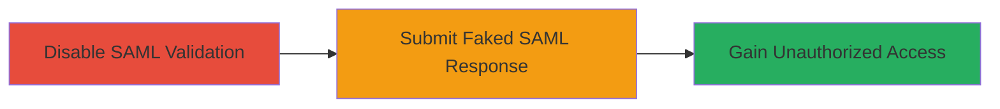

---
tags:
  - saml
  - authentication-bypass
  - meteor
  - rocket-chat
type: attack_chain
tools: []
tactics:
  - '[[Initial Access]]'
commands:
  - '[[commands/meteor-call-add-saml-service]]'
platforms:
  - Web
complexity: medium
procedures:
  - '[[procedures/Disable-SAML-Certificate-Validation-in-Rocket-Chat]]'
  - '[[procedures/Submit-Faked-SAML-Response-for-Authentication]]'
step_count: 2
techniques:
  - '[[Valid Accounts]]'
  - '[[Exploit Public-Facing Application]]'
description: >-
  Exploits an unauthenticated Meteor method in Rocket.Chat to disable SAML
  signature verification and authenticate as arbitrary users
skill_level: intermediate
impact_level: high
id: b5ee5fc4-9b00-4322-b45a-2ab363fb7120
created_at: '2025-12-13T09:01:26.339Z'
updated_at: '2025-12-13T09:01:26.339Z'
verified: false
validated: true
submitted: true
mitre_tactics:
  - '[[Initial Access]]'
mitre_techniques:
  - '[[Valid Accounts]]'
  - '[[Exploit Public-Facing Application]]'
---
# SAML Authentication Bypass in Rocket.Chat via Unauthenticated Meteor Method

Multi-stage attack chain demonstrating how an unauthenticated attacker can disable SAML signature verification in Rocket.Chat and log in as any user, including administrators, by exploiting an exposed Meteor method.

## Chain Metrics Dashboard

| Metric | Value |
|--------|-------|
| Chain Status | Unverified |
| Total Steps | 2 |
| Execution Time | ~5 minutes |
| Skill Level | Intermediate |
| Complexity | Medium |
| Impact Level | High |

## Attack Flow Visualization



## Prerequisites & Requirements

### Required Tools

- None (browser-based execution)

### Target Environment

- Web platform
- Rocket.Chat instance with SAML authentication enabled
- Exposed login page

### Initial Access Requirements

- Access to the Rocket.Chat login page
- No credentials required
- Network access to the target server

## Detailed Attack Procedures

### Step 1: Disable SAML Certificate Validation
procedure: [[procedures/Disable-SAML-Certificate-Validation-in-Rocket-Chat]]

**Objective**: Call the unauthenticated Meteor method to set a custom flag that disables SAML signature verification.

**Instructions**: On the Rocket.Chat login page, open the browser developer console and execute the following command using [[commands/meteor-call-add-saml-service]]:

```javascript
Meteor.call("addSamlService", "Default_cert")
```

This creates a custom setting like SAML_Custom_Default_cert and sets it to false, bypassing certificate checks.

**Expected Output**: The method call succeeds, setting the flag to disable validation.

**Success Indicators**:
- No error in console
- Validation is now bypassed for subsequent SAML responses

### Step 2: Submit Faked SAML Response
procedure: [[procedures/Submit-Faked-SAML-Response-for-Authentication]]

**Objective**: After disabling validation, submit an arbitrary SAML response to log in as any user.

**Instructions**: Craft and submit a faked SAML response targeting the desired user account, such as an administrator. This can be done by intercepting and modifying the SAML login flow in the browser or using a tool to forge the response. Ensure the response claims the identity of the target user.

**Expected Output**: Successful authentication as the targeted user.

**Success Indicators**:
- Logged in as the arbitrary user
- Access to user privileges, including administrative if targeted

## Attack Chain Summary

### Key Achievements

1. Disabled SAML signature verification without authentication
2. Gained unauthorized access to arbitrary user accounts
3. Potential for administrative privilege escalation

## Technique & Tactic Coverage

### MITRE ATT&CK Techniques

- [[Valid Accounts]]
- [[Exploit Public-Facing Application]]

### MITRE ATT&CK Tactics

- [[Initial Access]]

*Last updated: 2023-10-01*
