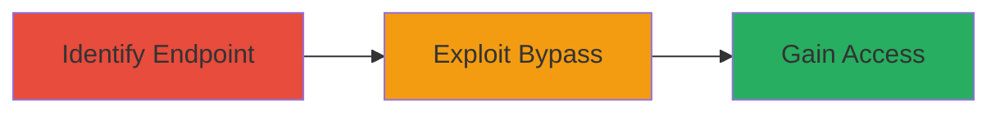

---
tags:
  - saml
  - authentication-bypass
  - uber
  - onelogin
type: attack_chain
tools:
  - '[[tools/Burp-Suite]]'
tactics:
  - '[[Initial Access]]'
  - '[[Privilege Escalation]]'
commands: []
platforms:
  - Web
complexity: medium
procedures:
  - '[[procedures/Identify-SAML-Authentication-Endpoint]]'
  - '[[procedures/Exploit-SAML-Verification-Bypass]]'
step_count: 2
techniques:
  - '[[Exploit Public-Facing Application]]'
  - '[[Modify Authentication Process]]'
description: >-
  Exploitation of improper SAML verification to bypass OneLogin authentication
  and gain unauthorized access to internal chats on uchat.uberinternal.com
skill_level: intermediate
impact_level: high
id: 3d2102a4-214d-4066-aa21-0f277bef50ce
created_at: '2025-12-13T09:01:26.611Z'
updated_at: '2025-12-13T09:01:26.611Z'
verified: false
validated: true
submitted: true
mitre_tactics:
  - '[[Initial Access]]'
  - '[[Privilege Escalation]]'
mitre_techniques:
  - '[[Exploit Public-Facing Application]]'
  - '[[Modify Authentication Process]]'
---
# SAML Authentication Bypass on Uber Internal Chat Service

## Overview

This attack chain demonstrates the exploitation of an improper SAML verification vulnerability in the authentication process of Uber's internal chat service at uchat.uberinternal.com. The vulnerability allows attackers to bypass OneLogin authentication, gaining unauthorized access to internal chats. This was reported via Uber's bug bounty program on HackerOne, highlighting the risks of misconfigured SAML implementations in web applications.

## Attack Flow

## Prerequisites & Requirements

### Required Tools
- [[tools/Burp-Suite]]

### Target Environment
- Web-based application using SAML for authentication
- Access to the target URL: https://uchat.uberinternal.com
- Network access to the authentication endpoint

### Initial Access Requirements
- No prior credentials needed
- Ability to intercept and modify HTTP requests

## Detailed Attack Procedures

### Step 1: Identify SAML Authentication Endpoint
procedure: [[procedures/Identify-SAML-Authentication-Endpoint]]

**Objective**: Locate the SAML authentication flow and endpoints used for OneLogin integration.

**Instructions**: Begin by navigating to the target URL https://uchat.uberinternal.com and initiating the login process to capture the SAML request and response using a proxy tool like [[tools/Burp-Suite]]. Inspect the HTTP traffic to identify the SAML assertion parameters.

**Expected Output**: Captured SAML request and response XML.

**Success Indicators**:
- SAML endpoint identified
- Authentication flow mapped

### Step 2: Exploit SAML Verification Bypass
procedure: [[procedures/Exploit-SAML-Verification-Bypass]]

**Objective**: Manipulate the SAML response to bypass verification and authenticate as an unauthorized user.

**Instructions**: Using the captured SAML response from the previous step, modify key attributes such as the user identifier or signature in [[tools/Burp-Suite]] to exploit the improper verification. Replay the modified response to the authentication endpoint.

**Expected Output**: Successful authentication bypass leading to access to internal chats.

**Success Indicators**:
- Unauthorized session established
- Access to restricted chat content

## Attack Chain Summary

### Key Achievements
1. Bypassed OneLogin SAML authentication
2. Gained unauthorized access to internal communications
3. Demonstrated high-impact vulnerability in authentication mechanisms
