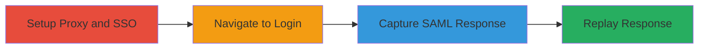

---
tags:
  - saml
  - authentication-bypass
  - replay-attack
type: attack_chain
tools:
  - '[[tools/Burp-Suite]]'
tactics:
  - '[[Initial Access]]'
  - '[[Privilege Escalation]]'
commands: []
platforms:
  - Web
complexity: medium
procedures:
  - '[[procedures/Exploit-SAML-Response-Reuse-Vulnerability]]'
step_count: 4
techniques:
  - '[[Valid Accounts]]'
  - '[[Use Alternate Authentication Material]]'
description: >-
  Exploitation of a SAML response reuse vulnerability in HackerOne's
  authentication system allowing repeated unauthorized logins.
skill_level: intermediate
impact_level: high
id: 8aca9ac8-4e4d-4308-99b0-194c66970d44
created_at: '2025-12-13T09:01:26.470Z'
updated_at: '2025-12-13T09:01:26.470Z'
verified: false
validated: true
submitted: true
mitre_tactics:
  - '[[Initial Access]]'
  - '[[Privilege Escalation]]'
mitre_techniques:
  - '[[Valid Accounts]]'
  - '[[Use Alternate Authentication Material]]'
---
# SAML Response Reuse for Unauthorized Access in HackerOne

Multi-stage attack chain demonstrating the exploitation of a SAML response reuse flaw in HackerOne's authentication system, allowing attackers to capture and replay SAML responses for repeated unauthorized access to user accounts.

## Chain Metrics Dashboard

| Metric | Value |
|--------|-------|
| Chain Status | Unverified |
| Total Steps | 4 |
| Execution Time | ~5 minutes |
| Skill Level | Intermediate |
| Complexity | Medium |
| Impact Level | High |

## Attack Flow Visualization

## Prerequisites & Requirements

### Required Tools

- [[tools/Burp-Suite]]

### Target Environment

- Web platform
- SAML Identity Provider (IDP) and HackerOne authentication service
- Network access to hackerone.com

### Initial Access Requirements

- Valid email configured for organization's SSO
- Ability to intercept HTTP traffic
- No prior credentials beyond initial legitimate login

## Detailed Attack Procedures

### Step 1: Configure Proxy and SSO
procedure: [[procedures/Exploit-SAML-Response-Reuse-Vulnerability]]

**Objective**: Set up the environment to capture authentication traffic using a proxy.

**Instructions**: Configure your email to use the organization's SSO provider. Set up Burp Suite to intercept and capture HTTP traffic.

**Expected Output**: Proxy configured and ready to capture traffic.

**Success Indicators**:
- Email set for SSO
- Burp Suite intercepting traffic successfully

### Step 2: Navigate to Login Screen
procedure: [[procedures/Exploit-SAML-Response-Reuse-Vulnerability]]

**Objective**: Initiate the login process to reach the SAML provider.

**Instructions**: Go to the HackerOne login screen, enter your email, and proceed to the organization's SAML provider for authentication.

**Expected Output**: Redirected to IDP login page.

**Success Indicators**:
- Successful redirection to IDP
- No authentication errors

### Step 3: Authenticate and Capture Response
procedure: [[procedures/Exploit-SAML-Response-Reuse-Vulnerability]]

**Objective**: Perform legitimate authentication and capture the SAML response.

**Instructions**: Authenticate with the IDP using valid credentials. Use Burp Suite to capture the POST request to hackerone.com/users/saml/auth containing the SAML response. Send the captured request to Burp Repeater.

**Expected Output**: SAML response captured in Burp Suite.

**Success Indicators**:
- Successful login to IDP
- POST request with SAML response intercepted

### Step 4: Replay Captured Response
procedure: [[procedures/Exploit-SAML-Response-Reuse-Vulnerability]]

**Objective**: Replay the SAML response multiple times to achieve repeated unauthorized access.

**Instructions**: Using Burp Repeater, resend the captured POST request with the SAML response 4-5 times to the /users/saml/auth endpoint. Observe new session identifiers in responses.

**Expected Output**: Multiple successful login responses with new sessions.

**Success Indicators**:
- Each replay results in a new valid session
- No rejection due to reuse detection

## Attack Chain Summary

### Key Achievements

1. Captured and replayed SAML response for multiple logins
2. Bypassed authentication controls without re-authentication
3. Gained unauthorized access to victim permissions and sensitive data

## Technique & Tactic Coverage

### MITRE ATT&CK Techniques

- [[Valid Accounts]]
- [[Use Alternate Authentication Material]]

### MITRE ATT&CK Tactics

- [[Initial Access]]
- [[Privilege Escalation]]

*Last updated: 2023-10-01*
