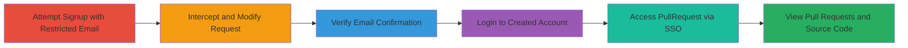

# SAML Signup Domain Enforcement Bypass Leading to Unauthorized Access to HackerOne PullRequest Organization

Multi-stage attack chain demonstrating a complete attack workflow exploiting a vulnerability in HackerOne's SAML signup process.

## Chain Metrics Dashboard

| Metric | Value |
|--------|-------|
| Chain Status | Unverified |
| Total Steps | 6 |
| Execution Time | ~10 minutes |
| Skill Level | Intermediate |
| Complexity | Medium |
| Impact Level | High |

## Attack Flow Visualization



## Prerequisites & Requirements

### Required Tools

- [[tools/Burp-Suite]]

### Target Environment

- Web platform with SAML/SSO integration (e.g., HackerOne)
- Access to signup endpoint (POST /users)
- No specific ports required beyond standard HTTPS (443)

### Initial Access Requirements

- No prior credentials needed
- Public network access to hackerone.com
- Victim's email address for verification (social engineering implied)

## Detailed Attack Procedures

### Step 1: Attempt Signup with Restricted Email
procedure: [[procedures/Attempt-Signup-with-Restricted-Email]]

**Objective**: Trigger the SAML redirect to observe domain enforcement behavior for restricted emails like @hackerone.com.

**Instructions**: Navigate to https://hackerone.com and submit the signup form using a restricted email (e.g., test@hackerone.com) with a chosen username, name, and password. This should result in a redirect to SSO login.

**Expected Output**: Redirect to /users/saml/sign_in with the email parameter.

**Success Indicators**:
- Signup form submission leads to SAML SSO redirect
- No account creation occurs due to domain restriction

### Step 2: Intercept and Modify Signup Request
procedure: [[procedures/Intercept-and-Modify-Signup-Request]]

**Objective**: Bypass domain enforcement by appending trailing control characters (%0d%0a) to the email parameter, preventing the SSO redirect and allowing account creation.

**Instructions**: Use [[tools/Burp-Suite]] to intercept the POST /users request. Modify the user[email] parameter to include %0d%0a at the end, e.g., user%5Bemail%5D=test%40hackerone.com%0d%0a. Forward the modified request.

Execute the initial request using [[commands/hackerone-signup-standard]] to observe behavior, then modify as shown in [[commands/hackerone-signup-bypass]]:

```bash
curl -X POST https://hackerone.com/users \
  -d 'user[name]=Test User&user[username]=testuser&user[email]=test@hackerone.com&user[password]=password123&user[password_confirmation]=password123'
```

Modified:

```bash
curl -X POST https://hackerone.com/users \
  -d 'user[name]=Test User&user[username]=testuser&user[email]=test@hackerone.com%0d%0a&user[password]=password123&user[password_confirmation]=password123'
```

**Expected Output**: Redirect to /users/sign_in without errors, indicating successful account creation.

**Success Indicators**:
- No SSO redirect triggered
- Account creation succeeds with restricted domain email

### Step 3: Verify Email Confirmation
procedure: [[procedures/Verify-Email-Confirmation]]

**Objective**: Complete email verification using the victim's session to activate the account.

**Instructions**: In a separate browser session or via social engineering, have the email owner (victim) click the verification link sent to the actual email address (without trailing characters).

**Expected Output**: Email verification success, account activated.

**Success Indicators**:
- Verification email received and clicked
- Account status changes to verified

### Step 4: Login to Created Account
procedure: [[procedures/Login-to-Created-Account]]

**Objective**: Authenticate into the newly created unauthorized account.

**Instructions**: Navigate to https://hackerone.com and log in using the chosen username and password.

**Expected Output**: Successful login to HackerOne dashboard.

**Success Indicators**:
- Access to user profile and dashboard
- No additional verification prompts

### Step 5: Access PullRequest Using HackerOne Login
procedure: [[procedures/Access-PullRequest-via-HackerOne-SSO]]

**Objective**: Leverage the HackerOne account to authenticate into the SAML-enabled PullRequest organization.

**Instructions**: Go to https://app.pullrequest.com/login and select 'Sign in with HackerOne'. Use the created account credentials.

**Expected Output**: Redirect to PullRequest dashboard upon successful SSO.

**Success Indicators**:
- SSO authentication succeeds
- Access granted to HackerOne organization in PullRequest

### Step 6: Gain Access to Pull Requests and Source Code
procedure: [[procedures/View-Pull-Requests-and-Source-Code]]

**Objective**: View sensitive pull requests and source code in the target organization.

**Instructions**: Once logged in, navigate to the pull requests section in the HackerOne infrastructure codebase.

**Expected Output**: List of all pull requests with source code diffs visible.

**Success Indicators**:
- Pull requests loaded
- Source code exposure confirmed

## Attack Chain Summary

### Key Achievements

1. Bypassed SAML domain restrictions to create unauthorized accounts
2. Gained access to SAML-integrated services like PullRequest
3. Exposed internal source code via pull requests

## Technique & Tactic Coverage

### MITRE ATT&CK Techniques

- [[Valid Accounts]]

### MITRE ATT&CK Tactics

- [[Initial Access]]

---

*Last updated: 2023-10-01T00:00:00Z*
