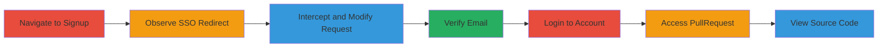

---
tags:
  - authentication-bypass
  - saml
  - account-creation
  - unauthorized-access
type: attack_chain
tools:
  - '[[tools/Burp-Suite]]'
tactics:
  - '[[Initial Access]]'
  - '[[Persistence]]'
commands:
  - '[[commands/normal-signup-post-request]]'
  - '[[commands/modified-signup-post-request]]'
platforms:
  - Web
complexity: medium
procedures:
  - '[[procedures/Bypass-SAML-Signup-Enforcement]]'
  - '[[procedures/Verify-Email-and-Login]]'
  - '[[procedures/Access-Linked-PullRequest-Service]]'
step_count: 7
techniques:
  - '[[Exploit Public-Facing Application]]'
  - '[[Valid Accounts]]'
description: >-
  Multi-stage attack chain exploiting a SAML signup bypass to create
  unauthorized accounts and access source code via linked services
skill_level: intermediate
impact_level: high
id: 97f67027-1351-4776-997b-82a2685ba919
created_at: '2025-12-13T09:01:26.725Z'
updated_at: '2025-12-13T09:01:26.725Z'
verified: false
validated: true
submitted: true
mitre_tactics:
  - '[[Initial Access]]'
  - '[[Persistence]]'
mitre_techniques:
  - '[[Exploit Public-Facing Application]]'
  - '[[Valid Accounts]]'
---
# SAML Signup Domain Enforcement Bypass Leading to Unauthorized Access to PullRequest

Multi-stage attack chain demonstrating a complete attack workflow.

## Chain Metrics Dashboard

| Metric | Value |
|--------|-------|
| Chain Status | Unverified |
| Total Steps | 7 |
| Execution Time | ~10 minutes |
| Skill Level | Intermediate |
| Complexity | Medium |
| Impact Level | High |

## Attack Flow Visualization



## Prerequisites & Requirements

### Required Tools

- [[tools/Burp-Suite]]

### Target Environment

- Web platform
- Required services/ports: HTTPS on port 443 for hackerone.com and app.pullrequest.com
- Network access requirements: Internet access to target domains

### Initial Access Requirements

- Credential requirements: None initially, but access to a victim email for verification
- Network position: External internet
- Prior access needed: None

## Detailed Attack Procedures

### Step 1: Navigate to the HackerOne Signup Page
procedure: [[procedures/Bypass-SAML-Signup-Enforcement]]

**Objective**: Access the signup page to begin the account creation process.

**Instructions**: Go to https://hackerone.com/ using a web browser.

**Expected Output**: The HackerOne signup page loads.

**Success Indicators**:
- Page loads successfully
- Signup form is visible

### Step 2: Attempt Signup with Restricted Email to Observe SSO Redirect
procedure: [[procedures/Bypass-SAML-Signup-Enforcement]]

**Objective**: Observe the normal SAML enforcement behavior.

**Instructions**: Attempt signup using an email like x@hackerone.com, which redirects to SSO login. Use [[commands/normal-signup-post-request]] to simulate:

```
POST /users HTTP/1.1
Host: hackerone.com
...
user%5Bname%5D=[NAME]&user%5Busername%5D=[USERNAME]&user%5Bemail%5D=email%40example.com&user%5Bpassword%5D=[PASSWORD]&user%5Bpassword_confirmation%5D=[PASSWORD]
```

**Expected Output**: Redirect to SSO login.

**Success Indicators**:
- Redirect observed
- SAML enforcement confirmed

### Step 3: Intercept and Modify the Signup Request to Bypass Enforcement
procedure: [[procedures/Bypass-SAML-Signup-Enforcement]]

**Objective**: Bypass the SAML domain check by modifying the request.

**Instructions**: Use [[tools/Burp-Suite]] to intercept the POST /users request and append %0d%0a to the user[email] parameter. Execute [[commands/modified-signup-post-request]]:

```
POST /users HTTP/1.1
Host: hackerone.com
...
user%5Bname%5D=[NAME]&user%5Busername%5D=[USERNAME]&user%5Bemail%5D=email%40example.com%0d%0a&user%5Bpassword%5D=[PASSWORD]&user%5Bpassword_confirmation%5D=[PASSWORD]
```

**Expected Output**: Account creation succeeds without redirect.

**Success Indicators**:
- Request succeeds
- Verification email sent

### Step 4: As the Victim, Verify the Email
procedure: [[procedures/Verify-Email-and-Login]]

**Objective**: Confirm the account creation via email verification.

**Instructions**: Click the confirmation link in the verification email sent by HackerOne.

**Expected Output**: Email verified and account activated.

**Success Indicators**:
- Verification successful
- Account ready for login

### Step 5: As the Attacker, Log in to the Created Account
procedure: [[procedures/Verify-Email-and-Login]]

**Objective**: Gain access to the unauthorized account.

**Instructions**: Log in using the chosen password for the account at https://hackerone.com/.

**Expected Output**: Successful login to the account.

**Success Indicators**:
- Login succeeds
- Dashboard access granted

### Step 6: Access PullRequest Using HackerOne Login
procedure: [[procedures/Access-Linked-PullRequest-Service]]

**Objective**: Use the compromised credentials to access linked services.

**Instructions**: Go to https://app.pullrequest.com/login and select 'Sign in with HackerOne'.

**Expected Output**: Redirect to PullRequest dashboard.

**Success Indicators**:
- Successful authentication
- Access to PullRequest granted

### Step 7: Gain Access to Pull Requests
procedure: [[procedures/Access-Linked-PullRequest-Service]]

**Objective**: View sensitive source code in pull requests.

**Instructions**: Navigate to the pull requests section to access all pull requests of HackerOne infrastructure codebase, including source code.

**Expected Output**: List of pull requests with source code visible.

**Success Indicators**:
- Source code exposed
- Persistent access possible via API keys

## Attack Chain Summary

### Key Achievements

1. Bypassed SAML enforcement to create unauthorized account
2. Gained access to linked PullRequest service
3. Exposed HackerOne source code and potential backdoor via API keys

## Technique & Tactic Coverage

### MITRE ATT&CK Techniques

- [[Exploit Public-Facing Application]]
- [[Valid Accounts]]

### MITRE ATT&CK Tactics

- [[Initial Access]]
- [[Persistence]]

*Last updated: [TIMESTAMP]*
