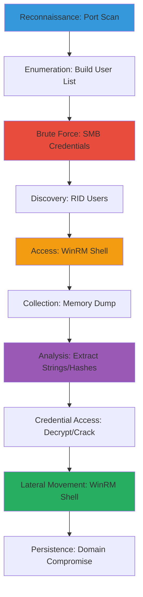

# SMB-Enumeration-Brute-Force-RID-Authentication-and-WinRM-Shell-via-Memory-Dump

This attack chain outlines a realistic penetration testing scenario against a Windows Active Directory environment. Starting with network reconnaissance to identify SMB services, it progresses through user enumeration via public sources and brute-force attacks, authenticated RID cycling for user discovery, credential extraction from process memory dumps, offline cracking of discovered hashes and encrypted passwords, and finally lateral movement via WinRM to achieve interactive shell access. The chain assumes a CTF-like setup where sensitive credentials (e.g., Cisco Type 7 passwords or hashes) are stored in memory, enabling escalation to domain compromise.

## Chain Metrics Dashboard

| Metric | Value |
|--------|-------|
| Chain Status | Unverified |
| Total Steps | 11 |
| Execution Time | ~4-8 hours |
| Skill Level | Advanced |
| Complexity | High |
| Impact Level | High |

## Attack Flow Visualization



## Prerequisites & Requirements

### Required Tools

- [[tools/Nmap]]
- [[tools/CrackMapExec]]
- [[tools/Hashcat]]
- [[tools/Evil-WinRM]]
- [[tools/Impacket]]
- [[tools/PowerSploit]]

### Target Environment

- Windows Server or Workstation with SMB (port 445) and WinRM (port 5985) enabled
- Active Directory domain
- Network connectivity from attacker machine (Kali Linux recommended)

### Initial Access Requirements

- No initial credentials required for reconnaissance
- Valid SMB credentials obtained via brute-force for authenticated steps
- Administrative access via WinRM for memory dumping

## Detailed Attack Procedures

### Step 1: Perform Basic Port Scan
procedure: [[procedures/basic-port-scan-with-service-enumeration]]

**Objective**: Identify open ports and services on the target, focusing on SMB to confirm attack surface.

**Instructions**: Launch an Nmap scan to enumerate ports 1-1024 and popular services. Use [[commands/nmap-port-scan-with-banner-enumeration]] to detect SMB version and banners.

```bash
nmap -sV $_TARGET_IP
```

If SMB is detected on port 445, proceed to enumeration.

**Expected Output**: List of open ports with service versions, e.g., 445/tcp open microsoft-ds Windows 10 SMB.

**Success Indicators**:
- SMB service confirmed on port 445
- No firewalls blocking scan

### Step 2: Decrypt Cisco Type 7 Password
procedure: [[procedures/decrypt-cisco-type-7-password]]

**Objective**: Decrypt any Cisco Type 7 encrypted passwords found in configurations or memory, which may provide alternative credentials.

**Instructions**: If a Type 7 password is identified (e.g., from prior recon), use the ciscot7.py script. Download from GitHub and run [[commands/python-ciscot7-decrypt-cisco-type-7-password]] with the encrypted string.

```bash
python ciscot7.py -d -p $_ENCRYPTED_PASSWORD
```

**Expected Output**: Plaintext password, e.g., Decrypted password: secrets!.

**Success Indicators**:
- Valid plaintext credential recovered
- Credential usable for further auth

### Step 3: Identify Password Hash Type
procedure: [[procedures/identify-password-hash-hashcat]]

**Objective**: Analyze extracted hashes to determine type and Hashcat mode for cracking.

**Instructions**: Reference Hashcat's example hashes page. For a sample like $axcrypt_sha1$..., search for the identifier to find mode 13300. Use [[commands/hashcat-identify-hash-type]] if automating.

```bash
hashcat --example-hashes | grep $_HASH_PREFIX
```

**Expected Output**: Matching hash mode, e.g., Mode 13300: AxCrypt.

**Success Indicators**:
- Hash type and mode identified
- Ready for cracking procedure

### Step 4: Brute Force Password Hashes
procedure: [[procedures/brute-force-password-hashes-hashcat]]

**Objective**: Crack identified hashes using dictionary attack to recover plaintext passwords.

**Instructions**: Use the determined mode with a wordlist like rockyou.txt. Run [[commands/hashcat-brute-force-password-hashes]] on the hash file.

```bash
hashcat -m $_MODE $_HASH_FILE /usr/share/wordlists/rockyou.txt
```

Monitor for cracks and recover via hashcat.potfile.

**Expected Output**: Cracked passwords displayed, e.g., hash:plaintext.

**Success Indicators**:
- At least one hash cracked
- Recovered credentials for SMB/WinRM

### Step 5: Build User List from Public Sources
procedure: [[procedures/build-user-list-from-public-webpage]]

**Objective**: Generate potential usernames from public employee data for brute-force targeting.

**Instructions**: Scrape a target webpage for names using browser dev tools or tools like CeWL. Generate variations: first, last, firstlast, initials. Example for "Mary Washington": mary, MaryWashington, mwashington. Save to users.txt.

Use [[commands/cewl-generate-wordlist-from-webpage]] for automation.

```bash
cewl -d 1 -w users.txt $_TARGET_URL
```

**Expected Output**: Text file with username candidates.

**Success Indicators**:
- 50+ unique usernames generated
- Patterns match common AD naming

### Step 6: Brute Force SMB Credentials
procedure: [[procedures/brute-force-smb-usernames-and-passwords]]

**Objective**: Test username/password combinations against SMB to gain initial authenticated access.

**Instructions**: Use the user list and common passwords. Run [[commands/crackmapexec-brute-force-smb-usernames-and-passwords]] with files.

```bash
crackmapexec smb $_TARGET_IP -u users.txt -p passwords.txt
```

Look for successful logins marked as Pwn3d!.

**Expected Output**: Valid credentials, e.g., [+] TARGET\user:pass (Pwn3d!).

**Success Indicators**:
- Valid SMB credentials obtained
- Access to shares confirmed

### Step 7: Brute Force SMB Users via RID
procedure: [[procedures/brute-force-smb-users-using-rid-authenticated]]

**Objective**: Enumerate additional domain users using authenticated RID cycling on SMB.

**Instructions**: With valid creds, use RID brute-force to list SIDs. Run [[commands/crackmapexec-brute-force-smb-users-using-rid]] or [[commands/impacket-lookupsid-brute-force-smb-users-using-rid]].

```bash
crackmapexec smb $_TARGET_IP -u $_USERNAME -p $_PASSWORD --rid-brute
```

**Expected Output**: List of users, e.g., 500: DOMAIN\Administrator (SidTypeUser).

**Success Indicators**:
- 10+ users enumerated
- High-value accounts like Administrator identified

### Step 8: Spawn Initial WinRM Shell
procedure: [[procedures/spawn-interactive-shell-with-winrm-linux]]

**Objective**: Gain interactive access to the target via WinRM using obtained credentials.

**Instructions**: Ensure WinRM is enabled (port 5985 open from scan). Connect with [[commands/evil-winrm-connect-to-winrm-server]].

```bash
evil-winrm -i $_TARGET_IP -u $_USERNAME -p $_PASSWORD
```

**Expected Output**: PowerShell prompt, e.g., Evil-WinRM* PS C:\Users\user>.

**Success Indicators**:
- Interactive shell established
- Basic commands (whoami, pwd) succeed

### Step 9: Dump Target Process Memory
procedure: [[procedures/dump-process-memory-powershell]]

**Objective**: Extract memory from a sensitive process (e.g., lsass.exe) to harvest credentials.

**Instructions**: In the WinRM shell, import PowerSploit's Out-Minidump. List processes with [[commands/get-process-list-running-processes]], then dump with [[commands/out-minidump-dump-memory-of-process]].

```powershell
Get-Process -Name lsass | Out-Minidump -DumpFilePath C:\temp\lsass.dmp
```

Exfil the dump file.

**Expected Output**: .dmp file generated, e.g., lsass_1234.dmp.

**Success Indicators**:
- Memory dump created without errors
- File size indicates full capture

### Step 10: Extract Strings from Memory Dump
procedure: [[procedures/find-interesting-strings-in-raw-memory-dump]]

**Objective**: Parse the memory dump for readable strings like passwords, hashes, or configs.

**Instructions**: On attacker machine, use strings tool with grep for keywords. Run [[commands/strings-search-raw-data-for-human-readable-strings]] on the dump.

```bash
strings lsass.dmp | grep -i password
```

Use -A/-B for context around matches.

**Expected Output**: Relevant strings, e.g., admin:password123 or Cisco config snippets.

**Success Indicators**:
- Credentials or hashes extracted
- Cisco Type 7 or other encryptions found

### Step 11: Escalate with Final WinRM Shell
procedure: [[procedures/spawn-interactive-shell-with-winrm-linux]]

**Objective**: Reconnect or pivot to higher-privilege shell using newly cracked credentials for full compromise.

**Instructions**: Use cracked creds from previous steps. Run [[commands/evil-winrm-connect-to-winrm-server]] again if needed for persistence.

```bash
evil-winrm -i $_TARGET_IP -u $_ADMIN_USER -p $_CRACKED_PASS
```

Execute domain admin commands like net group "Domain Admins" /domain.

**Expected Output**: Elevated PowerShell prompt with admin rights.

**Success Indicators**:
- Domain admin privileges confirmed
- Full system control achieved

## Attack Chain Summary

### Key Achievements

- SMB service discovery and initial credential brute-force
- Comprehensive user enumeration via RID and public sources
- Credential extraction and cracking from memory (hashes, Cisco passwords)
- Interactive remote shell access via WinRM for persistence and escalation

---

*Last updated: 2023-05-29T16:48:53.162677+00:00*
