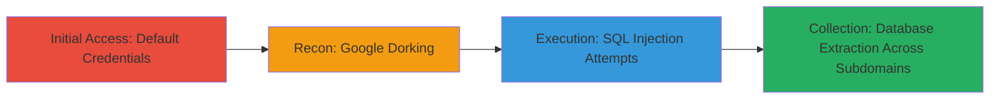

---
tags:
  - sqli
  - default-credentials
  - google-dorking
  - sqlmap
  - web-vulnerability
  - database-exfiltration
type: attack_chain
tools:
  - '[[tools/Google-Dorking]]'
  - '[[tools/SQLMap]]'
tactics:
  - '[[Initial Access]]'
  - '[[Reconnaissance]]'
  - '[[Collection]]'
verified: false
platforms:
  - Web
  - PHP
submitted: true
complexity: medium
created_at: '2023-10-01T00:00:00Z'
procedures:
  - '[[procedures/Access-Admin-Panel-with-Default-Credentials]]'
  - '[[procedures/Attempt-Blind-SQL-Injection-on-Login]]'
  - '[[procedures/Google-Dorking-for-Vulnerable-PHP-Endpoints]]'
  - '[[procedures/Exploit-SQL-Injection-with-SQLMap-on-Multiple-Subdomains]]'
step_count: 4
techniques:
  - '[[Default Accounts]]'
  - '[[Exploit Public-Facing Application]]'
  - '[[Hardware]]'
updated_at: '2025-12-14T03:46:25.985Z'
description: >-
  Multi-stage SQL injection attack starting with default credentials on a
  defunct admin panel, escalated through Google dorking to exploit vulnerable
  PHP endpoints across shared subdomains, leading to database metadata
  extraction.
skill_level: intermediate
impact_level: high
id: 0ba14102-e074-40af-8861-185d148148da
validated: true
mitre_tactics:
  - '[[Initial Access]]'
  - '[[Reconnaissance]]'
  - '[[Collection]]'
mitre_techniques:
  - '[[Default Accounts]]'
  - '[[Exploit Public-Facing Application]]'
  - '[[Hardware]]'
---
# SQL Injection Exploitation via Default Credentials and Google Dorking on Shared DoD Subdomains

Multi-stage attack chain demonstrating reconnaissance and exploitation of SQL injection vulnerabilities on DoD subdomains, starting from a defunct admin panel and expanding via shared database instances to extract sensitive metadata.

## Chain Metrics Dashboard

| Metric | Value |
|--------|-------|
| Chain Status | Unverified |
| Total Steps | 4 |
| Execution Time | ~30 minutes |
| Skill Level | Intermediate |
| Complexity | Medium |
| Impact Level | High |

## Attack Flow Visualization

## Prerequisites & Requirements

### Required Tools

- [[tools/Google-Dorking]]
- [[tools/SQLMap]]

### Target Environment

- Web platform with PHP-based applications
- Exposed subdomains with database backends (e.g., MySQL)
- No specific ports required beyond standard HTTP/HTTPS (80/443)

### Initial Access Requirements

- Public internet access to target subdomains
- No prior credentials needed beyond defaults like admin/admin
- Basic knowledge of SQL injection payloads

## Detailed Attack Procedures

### Step 1: Access Admin Panel
procedure: [[procedures/Access-Admin-Panel-with-Default-Credentials]]

**Objective**: Gain initial foothold by accessing a defunct admin panel using default credentials to identify potential entry points.

**Instructions**: Navigate to the suspected admin panel URL on the target subdomain (e.g., admin.target-subdomain.gov) and attempt login with username 'admin' and password 'admin'.

**Expected Output**: Successful login to the admin interface, revealing backend structure.

**Success Indicators**:
- Login succeeds without errors
- Admin dashboard loads, indicating outdated or unpatched system

### Step 2: Attempt SQL Injection on Login
procedure: [[procedures/Attempt-Blind-SQL-Injection-on-Login]]

**Objective**: Test the login form for blind SQL injection vulnerabilities to potentially bypass authentication or extract data.

**Instructions**: Inject SQL payloads into the username or password fields, such as ' OR 1=1 --, and observe response delays or errors for blind SQLi confirmation. Use browser developer tools or a proxy like Burp Suite to intercept and modify requests.

**Expected Output**: No successful exploitation in this case, but confirmation of potential vulnerability through error messages or timing differences.

**Success Indicators**:
- Response anomalies (e.g., delays >5s for true conditions)
- Database error leaks in responses

### Step 3: Reconnaissance via Google Dorking
procedure: [[procedures/Google-Dorking-for-Vulnerable-PHP-Endpoints]]

**Objective**: Discover additional vulnerable PHP endpoints on the subdomain using search engine dorking to expand the attack surface.

**Instructions**: Use Google search with dorks like site:target-subdomain.gov inurl:.php ext:php to identify exposed PHP files. Refine with terms like "inurl:login.php" or "inurl:search.php" to find forms likely vulnerable to SQLi.

**Expected Output**: List of PHP endpoints, such as search.php or user.php, that handle user input.

**Success Indicators**:
- Discovery of 5+ PHP files on the subdomain
- Endpoints with query parameters (e.g., ?id=1) indicating injection points

### Step 4: Exploit SQL Injection and Expand Scope
procedure: [[procedures/Exploit-SQL-Injection-with-SQLMap-on-Multiple-Subdomains]]

**Objective**: Exploit identified SQLi vulnerabilities to extract database information and identify shared instances across subdomains for broader impact.

**Instructions**: Run SQLMap against discovered endpoints, e.g., sqlmap -u "http://target-subdomain.gov/search.php?q=1" --banner --current-user. Analyze output for shared database details, then dork for similar endpoints on other subdomains and repeat exploitation.

**Expected Output**: Database banner (e.g., MySQL 5.7.XX), usernames, and metadata; confirmation of shared DB instance.

**Success Indicators**:
- Successful banner extraction
- Usernames and tables dumped
- Additional subdomains exploited with same DB access

## Attack Chain Summary

### Key Achievements

1. Initial access via default admin credentials on defunct panel
2. Discovery of multiple SQLi-vulnerable PHP endpoints via dorking
3. Extraction of database metadata including banner and usernames
4. Scope expansion to shared database across subdomains, risking sensitive user data exposure

## Technique & Tactic Coverage

### MITRE ATT&CK Techniques

- [[Default Accounts]] Default Accounts
- [[Exploit Public-Facing Application]] Exploit Public-Facing Application
- [[Hardware]] Gather Victim Host Information: Search Engines

### MITRE ATT&CK Tactics

- [[Initial Access]] Initial Access
- [[Reconnaissance]] Reconnaissance
- [[Collection]] Collection

---

*Last updated: 2023-10-01T00:00:00Z*
