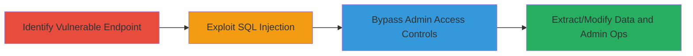

# SQL Injection and Broken Access Control in IBM Access Control Panel

Multi-stage attack chain demonstrating exploitation of SQL injection in the client_id parameter of IBM's access control panel, followed by leveraging broken access controls in the admin panel to perform unauthorized administrative operations and manipulate sensitive database information.

## Chain Metrics Dashboard

| Metric | Value |
|--------|-------|
| Chain Status | Unverified |
| Total Steps | 2 |
| Execution Time | ~15 minutes |
| Skill Level | Intermediate |
| Complexity | Medium |
| Impact Level | High |

## Attack Flow Visualization



## Prerequisites & Requirements

### Required Tools

- [[tools/sqlmap]]
- [[tools/Burp-Suite]]

### Target Environment

- Web application (IBM access control panel)
- Required services/ports: HTTP/HTTPS on port 80/443
- Network access requirements: Direct access to the public-facing application endpoint

### Initial Access Requirements

- No prior credentials needed for initial SQLi testing
- Network position: External attacker with internet access
- Prior access needed: None, as it's a public-facing vulnerability

## Detailed Attack Procedures

### Step 1: Exploit SQL Injection
procedure: [[procedures/Exploit-SQL-Injection-in-Client-ID-Parameter]]

**Objective**: Inject malicious SQL payloads into the client_id parameter to read sensitive data from the database, modify records, and execute administrative operations.

**Instructions**: Intercept requests to the vulnerable endpoint using [[tools/Burp-Suite]] or craft manual requests with [[commands/curl-sqli-test]]. Test for SQLi by appending a single quote to the client_id parameter and observing errors. If vulnerable, escalate to data extraction using [[tools/sqlmap]].

```bash
curl -X GET "https://target.ibm-app.com/endpoint?client_id=1'" -v
```

Then use sqlmap for automated exploitation:

```bash
sqlmap -u "https://target.ibm-app.com/endpoint?client_id=1" --dbs --batch
```

**Expected Output**: Database error messages confirming injection, followed by list of accessible databases.

**Success Indicators**:
- SQL error in response (e.g., syntax error near '')
- Successful enumeration of databases or tables

### Step 2: Bypass Access Control
procedure: [[procedures/Bypass-Access-Control-in-Admin-Panel]]

**Objective**: Gain unauthorized access to admin functions in the panel by exploiting insufficient access controls, allowing execution of privileged operations.

**Instructions**: Attempt direct access to admin URLs without authentication using [[commands/curl-admin-bypass]]. Modify request headers or parameters to impersonate an admin role if session-based. Combine with SQLi results to inject admin privileges if possible.

```bash
curl -X GET "https://target.ibm-app.com/admin" -H "User-Agent: Mozilla/5.0" -v
```

If blocked, test for parameter tampering:

```bash
curl -X POST "https://target.ibm-app.com/admin/action" -d "role=admin&user_id=1" -v
```

**Expected Output**: Access to admin dashboard or successful execution of admin actions without login.

**Success Indicators**:
- Admin page loads without authentication prompt
- Privileged actions (e.g., user modification) succeed

## Attack Chain Summary

### Key Achievements

1. Successful SQL injection leading to database read/write access
2. Bypassed admin panel controls for unauthorized operations
3. Potential full compromise of sensitive IBM access control data

## Technique & Tactic Coverage

### MITRE ATT&CK Techniques

- [[Exploit Public-Facing Application]]
- [[Valid Accounts]]

### MITRE ATT&CK Tactics

- [[Initial Access]]
- [[Defense Evasion]]

---
*Last updated: 2023-10-01T00:00:00Z*
