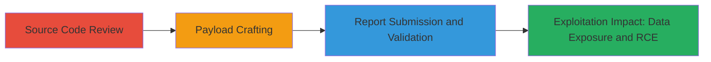

---
tags:
  - wordpress
  - sqli
  - rce
  - command-injection
  - php-injection
type: attack_chain
tools: []
tactics:
  - '[[Initial Access]]'
  - '[[Execution]]'
  - '[[Collection]]'
commands:
  - '[[commands/php-injection-shell-exec-cat-passwd]]'
  - '[[commands/cat-etc-passwd]]'
  - '[[commands/sqli-id-bypass]]'
platforms:
  - Web
complexity: medium
procedures:
  - '[[procedures/Source-Code-Review-for-Input-Validation-Flaws-in-WordPoints]]'
  - '[[procedures/Crafting-Injection-Payloads-for-Rank-Creation-Exploitation]]'
  - '[[procedures/Submitting-Vulnerability-Report-and-Validating-with-Staff]]'
step_count: 3
techniques:
  - '[[Exploit Public-Facing Application]]'
  - '[[Command-Line Interface]]'
description: >-
  A multi-stage attack exploiting lack of input sanitization in the WordPoints
  plugin's rank creation function, enabling SQL injection for data exposure and
  potential command injection leading to RCE.
skill_level: intermediate
impact_level: high
id: dd306903-ab1c-4dae-b7d2-89bb117acf36
created_at: '2025-12-14T17:28:20.240Z'
updated_at: '2025-12-14T17:28:20.240Z'
verified: false
validated: true
submitted: true
mitre_tactics:
  - '[[Initial Access]]'
  - '[[Execution]]'
  - '[[Collection]]'
mitre_techniques:
  - '[[Exploit Public-Facing Application]]'
  - '[[Command-Line Interface]]'
---
# SQL Injection and RCE via Unsanitized Rank Inputs in WordPoints WordPress Plugin

Multi-stage attack chain demonstrating exploitation of input validation flaws in the WordPoints WordPress plugin, starting from source code review to identify vulnerabilities, crafting proof-of-concept payloads for SQL injection and remote code execution, and submitting the report for validation. The attack targets the rank creation functionality, potentially allowing database exposure and arbitrary command execution on the server.

## Chain Metrics Dashboard

| Metric | Value |
|--------|-------|
| Chain Status | Unverified |
| Total Steps | 3 |
| Execution Time | ~30 minutes |
| Skill Level | Intermediate |
| Complexity | Medium |
| Impact Level | High |

## Attack Flow Visualization



## Prerequisites & Requirements

### Required Tools

- Manual code review tools (e.g., text editor or IDE)
- WordPress test environment for POC validation

### Target Environment

- WordPress platform with WordPoints plugin installed
- PHP backend with MySQL database
- Administrative access to create ranks

### Initial Access Requirements

- Access to WordPress admin panel
- Ability to review plugin source code (publicly available)
- Network access to a test WordPress site

## Detailed Attack Procedures

### Step 1: Source Code Review
procedure: [[procedures/Source-Code-Review-for-Input-Validation-Flaws-in-WordPoints]]

**Objective**: Identify lack of input sanitization in rank creation functions to uncover potential injection vulnerabilities.

**Instructions**: Review the plugin's source files, focusing on the wordpoints_add_rank() function in ranks.php and get_data() in class-wordpoints-rank.php. Examine how user inputs for name, type, and group are handled with $wpdb->insert() without proper preparation, and check ID handling in get_data() with $wpdb->prepare().

**Expected Output**: Identification of unsanitized inputs that could allow SQL or command injection.

**Success Indicators**:
- Confirmed absence of validation for user inputs
- Noted reliance on wpdb escaping that may be insufficient

### Step 2: Payload Crafting and Testing
procedure: [[procedures/Crafting-Injection-Payloads-for-Rank-Creation-Exploitation]]

**Objective**: Develop and test proof-of-concept payloads to demonstrate SQL injection for data dumping and command injection for file disclosure or RCE.

**Instructions**: Create a rank with name set to the payload using [[commands/php-injection-shell-exec-cat-passwd]] to inject PHP code for command execution. For SQLi, use [[commands/sqli-id-bypass]] in the ID parameter when retrieving data. Test on a local WordPress site to observe effects like dumping /etc/passwd or all ranks.

```php
// Example rank creation via admin interface or API
$rank_data = array('name' => "xyz; echo shell_exec('cat /etc/passwd');");
```

**Expected Output**: Execution of injected code, such as displaying /etc/passwd contents or all database ranks.

**Success Indicators**:
- Injected payload executes without errors
- Sensitive data (e.g., user lists or files) is exposed in output

### Step 3: Report Submission and Validation
procedure: [[procedures/Submitting-Vulnerability-Report-and-Validating-with-Staff]]

**Objective**: Submit the findings with POCs to the plugin maintainers for confirmation and discuss exploitability.

**Instructions**: Compile code snippets and POCs, submit via HackerOne, and respond to staff requests for a working demo. Test payloads on a provided WordPress site and address disputes regarding WordPress core filtering.

**Expected Output**: Report acknowledgment, potential triage as informative or wontfix.

**Success Indicators**:
- Staff receives and reviews the report
- POC demonstrates impact despite core protections

## Attack Chain Summary

### Key Achievements

1. Identified critical input validation flaws in a popular WordPress plugin
2. Crafted exploitable payloads for SQLi and RCE, demonstrating high-impact risks
3. Engaged with maintainers to validate findings, highlighting potential for database and server compromise

## Technique & Tactic Coverage

### MITRE ATT&CK Techniques

- [[Exploit Public-Facing Application]]
- [[Command-Line Interface]]

### MITRE ATT&CK Tactics

- [[Initial Access]]
- [[Execution]]
- [[Collection]]

---
*Last updated: 2023-10-01T00:00:00Z*
