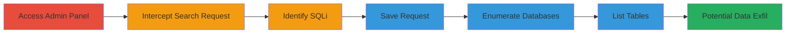

# SQL Injection in Acronis Admin Panel Leading to Database Enumeration

Multi-stage attack chain demonstrating exploitation of SQL injection in the Acronis development admin panel to gain insights into database structures, potentially exposing sensitive user data.

## Chain Metrics Dashboard

| Metric | Value |
|--------|-------|
| Chain Status | Unverified |
| Total Steps | 6 |
| Execution Time | ~15 minutes |
| Skill Level | Intermediate |
| Complexity | Medium |
| Impact Level | High |

## Attack Flow Visualization



## Prerequisites & Requirements

### Required Tools

- [[tools/SQLMap]]
- Web proxy tool (e.g., Burp Suite for interception)

### Target Environment

- Web platform with PHP/Laravel backend
- MySQL database service
- Accessible admin panel at https://admin.acronis.host/

### Initial Access Requirements

- Valid admin credentials for the target panel
- Network access to the development web service
- No prior compromise needed, but proxy interception capability required

## Detailed Attack Procedures

### Step 1: Access Admin Panel
procedure: [[procedures/Access-Acronis-Admin-Panel]]

**Objective**: Gain entry to the administrative interface to explore potential vulnerabilities.

**Instructions**: Navigate to the admin login page and authenticate using provided credentials.

**Expected Output**: Successful login redirect to the admin dashboard.

**Success Indicators**:
- Dashboard loads without errors
- Admin navigation menu visible

### Step 2: Navigate to Pages Section and Intercept Request
procedure: [[procedures/Navigate-to-Pages-Section-and-Intercept-Request]]

**Objective**: Locate the search functionality in the pages management section and capture the underlying API request.

**Instructions**: Access the pages section and perform a search to trigger the API call, intercepting it via a proxy.

**Expected Output**: Captured GET request to /api/admin/pages with search parameter.

**Success Indicators**:
- Request intercepted successfully
- Search functionality responds normally

### Step 3: Identify SQL Injection Vulnerability
procedure: [[procedures/Identify-SQL-Injection-Vulnerability]]

**Objective**: Test the search parameter for SQL injection by observing error responses to malicious inputs.

**Instructions**: Modify the intercepted request by injecting a single quote (') into the search parameter and resend to check for server errors.

**Expected Output**: Server error (e.g., 500 Internal Server Error) indicating unsanitized input handling.

**Success Indicators**:
- Error message reveals SQL-related details
- Confirms potential injection point in 'search' parameter

### Step 4: Save HTTP Request for SQLMap
procedure: [[procedures/Save-HTTP-Request-for-SQLMap]]

**Objective**: Prepare the vulnerable request file for automated exploitation with SQLMap.

**Instructions**: Export the raw HTTP request from the proxy tool to a text file on the local system.

**Expected Output**: A .txt file containing the full HTTP request headers and body.

**Success Indicators**:
- File saved without corruption
- File readable and parseable by SQLMap

### Step 5: Enumerate Databases with SQLMap
procedure: [[procedures/Enumerate-Databases-with-SQLMap]]

**Objective**: Confirm the SQLi vulnerability and discover accessible databases using automated tooling.

**Instructions**: Execute [[commands/sqlmap-enumerate-databases]] on the saved request file with elevated detection settings.

```bash
sudo python sqlmap.py -r /path/to/request.txt --level 5 --risk 3 --random-agent --dbs
```

**Expected Output**: List of three databases enumerated from the target.

**Success Indicators**:
- SQLi confirmed in 'search' parameter
- Multiple databases listed

### Step 6: List Tables in Acronis Site Database
procedure: [[procedures/List-Tables-in-Acronis-Site-Database]]

**Objective**: Explore the structure of the primary application database to identify sensitive tables.

**Instructions**: Run [[commands/sqlmap-list-tables]] targeting the 'acronis_site' database.

```bash
sqlmap -D acronis_site --tables
```

**Expected Output**: 24 tables listed, including 'users' and 'password_resets'.

**Success Indicators**:
- Sensitive tables like 'users' discovered
- Potential for further data dumping identified

## Attack Chain Summary

### Key Achievements

1. Gained admin access to the development panel
2. Identified and confirmed SQL injection in API endpoint
3. Enumerated databases and exposed table structures with sensitive data potential

## Technique & Tactic Coverage

### MITRE ATT&CK Techniques

- [[Exploit Public-Facing Application]]

### MITRE ATT&CK Tactics

- [[Initial Access]]
- [[Discovery]]

---

*Last updated: 2023-10-01T12:00:00Z*
