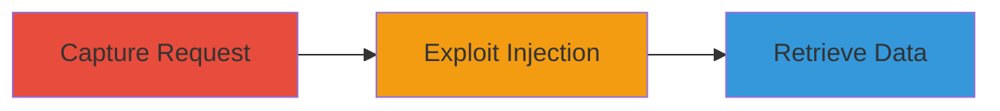

---
tags:
  - sql-injection
  - web
  - database
  - exploitation
type: attack_chain
tools:
  - '[[tools/sqlmap]]'
tactics:
  - '[[Initial Access]]'
  - '[[Collection]]'
verified: false
platforms:
  - Web
submitted: true
complexity: medium
created_at: '2023-10-01T00:00:00Z'
procedures:
  - '[[procedures/Capture-Vulnerable-HTTP-Request-for-SQLi]]'
  - '[[procedures/Exploit-SQL-Injection-with-sqlmap]]'
step_count: 2
techniques:
  - '[[Exploit Public-Facing Application]]'
updated_at: '2025-12-14T03:15:05.272Z'
description: >-
  A multi-step attack exploiting SQL injection in the log parameter of a POST
  request to the Acronis web application, allowing database user retrieval and
  potential escalation to full data access.
skill_level: intermediate
impact_level: high
id: 32aaeded-0f55-415b-8961-85dc049fad13
validated: true
mitre_tactics:
  - '[[Initial Access]]'
  - '[[Collection]]'
mitre_techniques:
  - '[[Exploit Public-Facing Application]]'
---
# SQL Injection in Acronis Log Parameter to Retrieve Database Credentials

Multi-stage attack chain demonstrating exploitation of SQL injection in the 'log' parameter of a POST request to https://www.acronis.cz/, leading to database user retrieval and potential unauthorized access.

## Chain Metrics Dashboard

| Metric | Value |
|--------|-------|
| Chain Status | Unverified |
| Total Steps | 2 |
| Execution Time | ~5 minutes |
| Skill Level | Intermediate |
| Complexity | Medium |
| Impact Level | High |

## Attack Flow Visualization



## Prerequisites & Requirements

### Required Tools

- [[tools/sqlmap]]
- Browser developer tools or proxy like Burp Suite for request capture

### Target Environment

- Web application at https://www.acronis.cz/
- Required services/ports: HTTPS (443)
- Network access requirements: Direct internet access to the target URL

### Initial Access Requirements

- No credentials required
- Public network position
- No prior access needed

## Detailed Attack Procedures

### Step 1: Capture Vulnerable Request
procedure: [[procedures/Capture-Vulnerable-HTTP-Request-for-SQLi]]

**Objective**: Identify and capture the POST request containing the vulnerable 'log' parameter to prepare for injection testing.

**Instructions**: Use browser developer tools or a proxy to intercept the POST request to https://www.acronis.cz/ that includes the 'log' parameter. Save the request to a file named request-cz.txt for further analysis and testing.

**Expected Output**: A saved HTTP request file (request-cz.txt) with the full POST details, including headers, body, and the 'log' parameter.

**Success Indicators**:
- Request successfully captured and saved
- 'log' parameter visible in the request body

### Step 2: Exploit SQL Injection
procedure: [[procedures/Exploit-SQL-Injection-with-sqlmap]]

**Objective**: Test and exploit the SQL injection vulnerability in the 'log' parameter to retrieve the current database user, confirming injection and enabling further data exfiltration.

**Instructions**: Load the captured request into sqlmap and execute the test targeting the 'log' parameter to retrieve database information. Use the following command:

using [[commands/sqlmap-test-log-parameter]]:

```bash
sqlmap -p log -r request-cz.txt --current-user --level=2 --risk=2
```

**Expected Output**: Confirmation of SQL injection vulnerability and output showing the current database user, e.g., 'u_acronis@localhost'.

**Success Indicators**:
- sqlmap confirms injectable parameter
- Database user retrieved successfully
- Potential for further queries to dump database contents

## Attack Chain Summary

### Key Achievements

1. Captured vulnerable POST request to the Acronis web application
2. Confirmed SQL injection in the 'log' parameter using automated testing
3. Retrieved database user credentials, enabling potential authentication bypass and data exfiltration

## Technique & Tactic Coverage

### MITRE ATT&CK Techniques

- [[Exploit Public-Facing Application]]

### MITRE ATT&CK Tactics

- [[Initial Access]]
- [[Collection]]

---
*Last updated: 2023-10-01T00:00:00Z*
