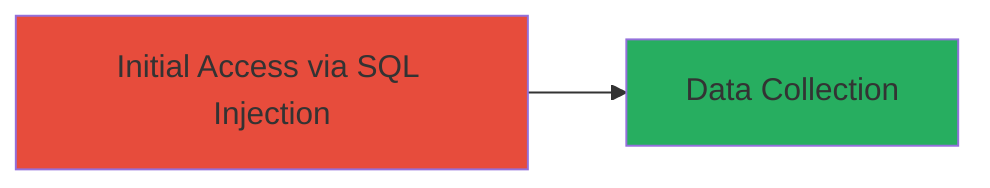

# SQL Injection in Anomali Threatstream Software for Employee Data Exposure

Multi-stage attack chain demonstrating exploitation of a SQL injection vulnerability in the Anomali software from Threatstream, hosted on ts02.uberinternal.com. This vulnerability, reported on February 16, 2017, by researcher kazan71p, allows an attacker to inject malicious SQL queries into a web parameter, potentially extracting sensitive employee data from the backend database. The impact is limited to Uber employees, not customer data, but warrants high severity due to the data exposure risk. Uber triaged and resolved the issue, awarding a $2,500 bounty.

## Chain Metrics Dashboard

| Metric | Value |
|--------|-------|
| Chain Status | Unverified |
| Total Steps | 1 |
| Execution Time | ~5 minutes |
| Skill Level | Intermediate |
| Complexity | Medium |
| Impact Level | High |

## Attack Flow Visualization



## Prerequisites & Requirements

### Required Tools

- [[tools/sqlmap]]

### Target Environment

- Web platform hosting Anomali from Threatstream
- Exposed web application on ts02.uberinternal.com
- Backend database (inferred SQL-based)

### Initial Access Requirements

- Network access to the external host
- No prior credentials needed (unauthenticated SQLi)
- Basic knowledge of the application's input parameters

## Detailed Attack Procedures

### Step 1: Exploit SQL Injection
procedure: [[procedures/Exploit-SQL-Injection-in-Anomali-Software]]

**Objective**: Identify and exploit the SQL injection vulnerability in the Anomali web interface to extract employee data from the database.

**Instructions**: Begin by testing the vulnerable parameter in the Anomali application for SQL injection using [[commands/sqlmap-test-injection]] to confirm the vulnerability:

```bash
sqlmap -u "http://ts02.uberinternal.com/anomali/search?q=1" --batch --level=1
```

If confirmed, escalate to database enumeration and data extraction using [[commands/sqlmap-dump-data]]:

```bash
sqlmap -u "http://ts02.uberinternal.com/anomali/search?q=1" --dbms=mysql --dump --batch
```

**Expected Output**: Confirmation of injectable parameter, followed by dumped table contents including employee records.

**Success Indicators**:
- SQL error messages or time-based delays indicating injection success
- Retrieved database schema and employee data tables
- No authentication barriers encountered
