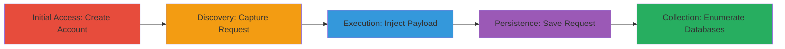

# SQL Injection in DoD Application to Enumerate and Exfiltrate Sensitive Databases

Multi-stage attack chain demonstrating exploitation of a SQL Injection vulnerability in the 'selMajcom' parameter of a U.S. Department of Defense ASP application, leading to unauthorized database enumeration, data exfiltration, and potential remote code execution.

## Chain Metrics Dashboard

| Metric | Value |
|--------|-------|
| Chain Status | Unverified |
| Total Steps | 5 |
| Execution Time | ~15 minutes |
| Skill Level | Intermediate |
| Complexity | Medium |
| Impact Level | High |

## Attack Flow Visualization

## Prerequisites & Requirements

### Required Tools

- [[tools/Burp-Suite]]
- [[tools/sqlmap]]

### Target Environment

- Web application on ASP with SQL Server backend
- Port 443 (HTTPS)
- Network access to https://████████mil/AFServices/RequestAccess.asp

### Initial Access Requirements

- No prior credentials needed; create a new user account
- Direct internet access to the target DoD application
- Burp Suite proxy configured in browser

## Detailed Attack Procedures

### Step 1: Initial Access
procedure: [[procedures/Create-User-Account-for-Initial-Access]]

**Objective**: Gain legitimate access to the application by creating a user account to initiate authenticated requests.

**Instructions**: Navigate to the registration endpoint and complete the user creation form.

**Expected Output**: Successful account creation with redirect to login or dashboard.

**Success Indicators**:
- User account created
- Able to log in and access the RequestAccess.asp endpoint

### Step 2: Discovery
procedure: [[procedures/Capture-HTTP-Request-with-Burp-Suite]]

**Objective**: Intercept the legitimate HTTP request to the vulnerable endpoint for modification.

**Instructions**: Configure Burp Suite as a proxy and navigate to the RequestAccess.asp page while authenticated.

**Expected Output**: Captured GET request in Burp Suite repeater or intruder.

**Success Indicators**:
- Request intercepted with session cookies
- Parameters like selMajcom visible

### Step 3: Execution
procedure: [[procedures/Inject-SQL-Payload-into-Parameter]]

**Objective**: Confirm the SQL Injection vulnerability by injecting payloads and observing responses.

**Instructions**: Modify the selMajcom parameter in the captured request with test payloads such as ' or time-based delays.

**Expected Output**: Response delay or error indicating injection success.

**Success Indicators**:
- Time-based delay confirms blind SQLi
- Boolean-based responses vary

### Step 4: Persistence
procedure: [[procedures/Save-Modified-Request-for-Automation]]

**Objective**: Prepare the vulnerable request for automated exploitation tools.

**Instructions**: Export the modified HTTP request from Burp Suite to a file.

**Expected Output**: File saved as dod.txt containing the injectable request.

**Success Indicators**:
- File created with full request details including headers and payload

### Step 5: Collection
procedure: [[procedures/Automate-SQLi-Exploitation-with-sqlmap]]

**Objective**: Enumerate databases and potentially exfiltrate data using automation.

**Instructions**: Run sqlmap on the saved request file with elevated detection levels.

**Expected Output**: List of 24 databases including sensitive ones like AFServicesUsers.

**Success Indicators**:
- Databases enumerated
- Potential for further dumping tables or executing commands

## Attack Chain Summary

### Key Achievements

1. Confirmed SQL Injection in selMajcom parameter
2. Enumerated 24 sensitive DoD databases
3. Enabled potential data exfiltration and RCE due to DBA permissions

## Technique & Tactic Coverage

### MITRE ATT&CK Techniques

- [[Exploit Public-Facing Application]]

### MITRE ATT&CK Tactics

- [[Execution]]
- [[Collection]]

---
*Last updated: 2023-10-01T00:00:00Z*
