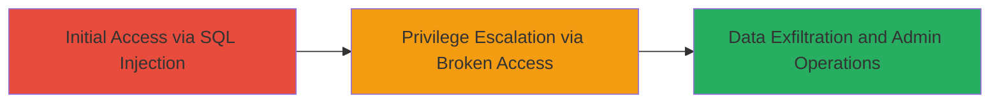

# SQL Injection in IBM Access Control Panel Leading to Unauthorized Admin Access

Multi-stage attack chain demonstrating exploitation of SQL injection and broken access controls in IBM's access control panel to achieve unauthorized data access and administrative operations.

## Chain Metrics Dashboard

| Metric | Value |
|--------|-------|
| Chain Status | Unverified |
| Total Steps | 2 |
| Execution Time | ~10 minutes |
| Skill Level | Intermediate |
| Complexity | Medium |
| Impact Level | High |

## Attack Flow Visualization



## Prerequisites & Requirements

### Required Tools

- [[tools/sqlmap]]
- Web browser or proxy like Burp Suite for manual testing

### Target Environment

- Web application (IBM access control panel)
- Required services/ports: HTTP/HTTPS on port 80/443
- Database backend (inferred SQL-based)

### Initial Access Requirements

- Network access to the IBM access control panel endpoint
- No prior credentials needed; public-facing application
- Ability to send HTTP requests with manipulated parameters

## Detailed Attack Procedures

### Step 1: Exploit SQL Injection
procedure: [[procedures/Exploit-SQL-Injection-in-Client-ID-Parameter]]

**Objective**: Inject malicious SQL via the client_id parameter to read or modify sensitive database data and execute administrative operations.

**Instructions**: Identify the vulnerable endpoint in the IBM access control panel that accepts the client_id parameter. Use a tool like sqlmap to test and exploit the injection point. For manual testing, append a single quote to the client_id to trigger errors, then craft payloads to dump data.

First, test for injection using [[commands/sqlmap-test]]:

```bash
sqlmap -u "https://target.ibm.com/endpoint?client_id=1" --batch --level=1
```

If vulnerable, extract database information with [[commands/sqlmap-dump]]:

```bash
sqlmap -u "https://target.ibm.com/endpoint?client_id=1" -D ibm_db --tables --batch
```

Then dump sensitive data:

```bash
sqlmap -u "https://target.ibm.com/endpoint?client_id=1" -D ibm_db -T users --dump --batch
```

**Expected Output**: Confirmation of SQLi vulnerability, list of tables, and dumped data such as user credentials or admin details.

**Success Indicators**:
- SQL error messages or boolean-based responses indicating injection success
- Retrieved database schema or data records
- Ability to execute queries like UNION SELECT for data exfiltration

### Step 2: Bypass Broken Access Controls
procedure: [[procedures/Bypass-Broken-Access-Controls-in-Admin-Panel]]

**Objective**: Leverage the elevated privileges from SQLi to access the admin panel without proper authorization, performing unauthorized administrative functions.

**Instructions**: Using the data obtained from SQLi (e.g., admin session tokens or user IDs), navigate to the admin panel endpoint. Test for broken access by directly accessing admin URLs with manipulated parameters or session cookies. Use a proxy to intercept and modify requests.

Intercept a normal request with Burp Suite, then modify the user role or ID parameter to an admin value obtained from the database dump. Send the request to the admin endpoint:

For example, change a parameter like user_id=1 to user_id=admin_id from dump.

**Expected Output**: Successful access to admin functions, such as user management or system configuration pages.

**Success Indicators**:
- Access to restricted admin interfaces without authentication prompts
- Execution of admin operations like creating users or modifying settings
- No access denial errors

## Attack Chain Summary

### Key Achievements

1. Successful SQL injection to extract and manipulate database contents
2. Bypassing access controls to gain unauthorized admin privileges
3. Potential for full compromise of the access control system

## Technique & Tactic Coverage

### MITRE ATT&CK Techniques

- [[Exploit Public-Facing Application]]
- [[Valid Accounts]]

### MITRE ATT&CK Tactics

- [[Initial Access]]
- [[Privilege Escalation]]

*Last updated: 2023-10-01T00:00:00Z*
