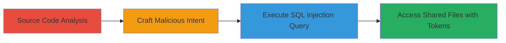

# SQL Injection in Nextcloud Android FileContentProvider to Exfiltrate Share Tokens and Access Shared Files

Multi-stage attack chain demonstrating exploitation of an SQL injection vulnerability in the Nextcloud Android app's FileContentProvider, where projection map restrictions are incompletely applied, allowing arbitrary SQL queries to the filelist.db SQLite database and unauthorized access to shared files via leaked tokens.

## Chain Metrics Dashboard

| Metric | Value |
|--------|-------|
| Chain Status | Unverified |
| Total Steps | 4 |
| Execution Time | ~5 minutes |
| Skill Level | Intermediate |
| Complexity | Medium |
| Impact Level | High |

## Attack Flow Visualization



## Prerequisites & Requirements

### Required Tools

- None (relies on Android debugging tools or adb for intent execution)

### Target Environment

- Android OS/Platform
- Nextcloud Android app installed (vulnerable version)
- Access to filelist.db via content provider (content://org.nextcloud/file URI)
- Local or device-level access to send intents

### Initial Access Requirements

- Physical or ADB access to the Android device
- No network credentials required; local app exploitation
- App must be installed and running with database populated

## Detailed Attack Procedures

### Step 1: Source Code Analysis
procedure: [[procedures/Analyze-Nextcloud-FileContentProvider-Source-Code]]

**Objective**: Identify the SQL injection vulnerability by reviewing the FileContentProvider implementation to understand incomplete projection restrictions.

**Instructions**: Review the Java source code from the Nextcloud Android GitHub repository, focusing on the query method in FileContentProvider.java. Note that projection map enforcement occurs only for ROOT_DIRECTORY cases around line 577, while SINGLE_FILE and DIRECTORY cases lack full validation around line 444.

**Expected Output**: Confirmation of vulnerability in URI handling and projection application.

**Success Indicators**:
- Identified incomplete restrictions in switch cases for ROOT_DIRECTORY, SINGLE_FILE, and DIRECTORY
- Located key lines (444 and 577) where isCallerNotAllowed check and projection map are applied

### Step 2: Craft Malicious Intent
procedure: [[procedures/Craft-Malicious-Intent-for-SQL-Injection-Bypass]]

**Objective**: Construct an intent with an injected projection to bypass restrictions and target the ocshares table.

**Instructions**: Prepare an Android intent for a content query using the URI content://org.nextcloud/file and a projection payload like "* from ocshares --" to inject SQL and evade the isCallerNotAllowed check.

**Expected Output**: Validated intent structure ready for execution.

**Success Indicators**:
- Intent targets the vulnerable URI without triggering immediate restrictions
- Projection payload crafted to append SQL without syntax errors

### Step 3: Execute SQL Injection Query
procedure: [[procedures/Execute-SQL-Injection-Query-via-Content-Provider]]

**Objective**: Send the malicious intent to query and extract sensitive data from the ocshares table in filelist.db.

**Instructions**: Use the content query command to execute the intent: [[commands/content-query-sqli-injection]]

```bash
content query --uri content://org.nextcloud/file --projection "* from ocshares --"
```

This injects the SQL payload to select all from ocshares, bypassing projection map limits.

**Expected Output**: Cursor rows with data like _id=1, token=rkNCkcYcbGEBDQN, path=/Nextcloud.mp4, owner_share=julien_contacts@cloud.local.yourosoft.com.

**Success Indicators**:
- Query returns unfiltered data from ocshares table
- Sensitive fields like share tokens and file paths disclosed

### Step 4: Access Shared Resources Using Extracted Tokens
procedure: [[procedures/Access-Shared-Resources-Using-Extracted-Tokens]]

**Objective**: Leverage extracted share tokens to forge URLs and access shared files without authorization.

**Instructions**: Construct a share URL using the token, e.g., https://cloud.local.yourosoft.com/index.php/s/rkNCkcYcbGEBDQN, and access it via browser or curl.

**Expected Output**: Unauthorized access to the shared file content.

**Success Indicators**:
- Successful download or view of shared file
- No authentication prompts for the forged share link

## Attack Chain Summary

### Key Achievements

1. Bypassed projection restrictions in FileContentProvider via SQL injection
2. Exfiltrated share tokens and metadata from filelist.db
3. Gained unauthorized access to shared Nextcloud files
4. Demonstrated full disclosure of sensitive database contents

## Technique & Tactic Coverage

### MITRE ATT&CK Techniques

- [[Exploit Public-Facing Application]]
- [[Data from Information Repositories]]

### MITRE ATT&CK Tactics

- [[Initial Access]]
- [[Collection]]

---
*Last updated: 2023-10-01T00:00:00Z*
