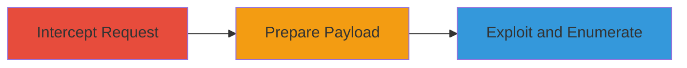

# SQL Injection in Revive Adserver Admin Search Leading to Full Database Access

Multi-stage attack chain demonstrating exploitation of a SQL injection vulnerability in Revive Adserver v6.0.0's administrative search functionality, allowing authenticated users to execute arbitrary SQL queries and access sensitive database information.

## Chain Metrics Dashboard

| Metric | Value |
|--------|-------|
| Chain Status | Unverified |
| Total Steps | 3 |
| Execution Time | ~10 minutes |
| Skill Level | Intermediate |
| Complexity | Medium |
| Impact Level | High |

## Attack Flow Visualization

## Prerequisites & Requirements

### Required Tools

- [[tools/Burp-Suite]]
- [[tools/nano]]
- [[tools/sqlmap]]

### Target Environment

- Revive Adserver v6.0.0 running on a web server with PHP and MySQL
- Administrative access as a manager user
- Localhost or accessible URL like http://localhost/www/
- Services: Web server (e.g., Apache), MySQL database
- Ports: 80 (HTTP), 3306 (MySQL, if direct access)

### Initial Access Requirements

- Valid credentials for a manager-level user in Revive Adserver
- Network access to the admin interface
- No prior access needed beyond authentication

## Detailed Attack Procedures

### Step 1: Intercept HTTP Request with Burp Suite
procedure: [[procedures/Intercept-HTTP-Request-with-Burp-Suite]]

**Objective**: Capture the vulnerable GET request to the admin search endpoint for later exploitation.

**Instructions**: Launch Burp Suite, configure its proxy, and use the built-in browser to navigate to the search page. Intercept the request containing the 'keyword' parameter.

**Expected Output**: Raw HTTP GET request saved or visible in Burp's proxy history, showing the unsanitized 'keyword' parameter.

**Success Indicators**:
- Request intercepted successfully
- 'keyword' parameter visible in the request (e.g., ?keyword=FUZZ)

### Step 2: Save Captured Request for Exploitation
procedure: [[procedures/Save-Captured-Request-for-Exploitation]]

**Objective**: Export the intercepted request to a file for use with automated exploitation tools.

**Instructions**: Use a text editor to save the Burp-exported request details into a file named testsql.txt.

**Expected Output**: A text file containing the full HTTP request, including headers and the vulnerable parameter.

**Success Indicators**:
- File testsql.txt created and contains the request
- File readable and properly formatted for tool input

### Step 3: Exploit SQL Injection with Sqlmap
procedure: [[procedures/Exploit-SQL-Injection-with-Sqlmap]]

**Objective**: Use sqlmap to confirm the SQL injection and enumerate accessible databases.

**Instructions**: Load the saved request into sqlmap and run database enumeration. Monitor for error-based or time-based confirmations using payloads like EXTRACTVALUE or SLEEP.

**Expected Output**: List of database names, confirming arbitrary SQL execution and potential for data extraction.

**Success Indicators**:
- Databases enumerated (e.g., 'revive_adserver', 'information_schema')
- No errors in sqlmap output; successful payload injection

## Attack Chain Summary

### Key Achievements

1. Identified and captured vulnerable request in admin-search.php
2. Prepared payload file for automated exploitation
3. Achieved full database access, enabling data extraction, modification, or deletion

## Technique & Tactic Coverage

### MITRE ATT&CK Techniques

- [[Exploit Public-Facing Application]]

### MITRE ATT&CK Tactics

- [[Initial Access]]
- [[Collection]]

---
*Last updated: 2023-10-01T00:00:00Z*
