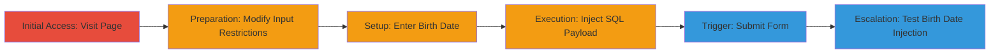

---
tags:
  - sqli
  - authentication-bypass
  - data-exfiltration
  - web-vulnerability
type: attack_chain
tools:
  - '[[tools/Browser-Developer-Tools]]'
tactics:
  - '[[Initial Access]]'
verified: false
platforms:
  - Web
submitted: true
complexity: medium
created_at: '2023-10-01T00:00:00Z'
procedures:
  - '[[procedures/Visit-Target-Scholarship-Status-Page]]'
  - '[[procedures/Modify-SSN-Field-Maxlength-Restriction]]'
  - '[[procedures/Enter-Random-Birth-Date]]'
  - '[[procedures/Inject-SQL-Payload-into-SSN-Field]]'
  - '[[procedures/Submit-Form-to-Bypass-Authentication]]'
  - '[[procedures/Test-Birth-Date-Fields-for-SQL-Injection]]'
step_count: 6
techniques:
  - '[[Exploit Public-Facing Application]]'
updated_at: '2025-12-14T03:15:09.869Z'
description: >-
  Multi-stage attack exploiting SQL injection in a web application's SSN and
  birth date fields to bypass authentication and access other users' scholarship
  status data.
skill_level: intermediate
impact_level: high
id: a1e4776e-3169-4bde-8c5b-502b5f30b72f
validated: true
mitre_tactics:
  - '[[Initial Access]]'
mitre_techniques:
  - '[[Exploit Public-Facing Application]]'
---
---

# SQL Injection in SSN Field to Bypass Authentication and Access Scholarship Data

Multi-stage attack chain demonstrating a complete attack workflow exploiting SQL injection in a .NET-based web application for scholarship status checking.

## Chain Metrics Dashboard

| Metric | Value |
|--------|-------|
| Chain Status | Unverified |
| Total Steps | 6 |
| Execution Time | ~5 minutes |
| Skill Level | Intermediate |
| Complexity | Medium |
| Impact Level | High |

## Attack Flow Visualization

## Prerequisites & Requirements

### Required Tools

- [[tools/Browser-Developer-Tools]]

### Target Environment

- Web platform (.NET ASP.NET application)
- No specific ports required (standard HTTPS)
- Publicly accessible web application

### Initial Access Requirements

- No credentials needed
- Direct network access to the target URL
- Modern web browser with developer tools

## Detailed Attack Procedures

### Step 1: Visit Target Page
procedure: [[procedures/Visit-Target-Scholarship-Status-Page]]

**Objective**: Gain initial access to the vulnerable scholarship status checking page.

**Instructions**: Open a web browser and navigate to the target application page.

**Expected Output**: The scholarship status form loads with SSN and birth date input fields.

**Success Indicators**:
- Page loads successfully without errors
- Form fields for SSN and birth date are visible

### Step 2: Modify SSN Field Maxlength Restriction
procedure: [[procedures/Modify-SSN-Field-Maxlength-Restriction]]

**Objective**: Bypass client-side input length restrictions to allow SQL payload injection.

**Instructions**: Use browser developer tools to inspect and edit the SSN field's maxlength attribute.

**Expected Output**: The SSN input field accepts inputs longer than 9 characters.

**Success Indicators**:
- Maxlength attribute changed (e.g., from 9 to 9999)
- Longer strings can be typed into the field

### Step 3: Enter Random Birth Date
procedure: [[procedures/Enter-Random-Birth-Date]]

**Objective**: Provide a birth date that may match existing user records to facilitate data access.

**Instructions**: Select arbitrary values in the birth date dropdowns or fields.

**Expected Output**: Birth date fields populated with selected values.

**Success Indicators**:
- Birth date is entered without validation errors
- Form remains submittable

### Step 4: Inject SQL Payload into SSN Field
procedure: [[procedures/Inject-SQL-Payload-into-SSN-Field]]

**Objective**: Introduce SQL injection payload to manipulate the authentication query.

**Instructions**: Type the SQL payload into the modified SSN field.

**Expected Output**: Payload accepted in the input field.

**Success Indicators**:
- Payload string (e.g., ' OR '1'='1) is entered successfully
- No client-side rejection

### Step 5: Submit Form to Bypass Authentication
procedure: [[procedures/Submit-Form-to-Bypass-Authentication]]

**Objective**: Execute the injection to bypass login and access another user's data.

**Instructions**: Click the submit button to send the form with the injected payload.

**Expected Output**: If a matching birth date exists, the application logs in as that user and displays their scholarship status.

**Success Indicators**:
- Unauthorized access to another user's scholarship data
- No authentication prompt or error

### Step 6: Test Birth Date Fields for SQL Injection
procedure: [[procedures/Test-Birth-Date-Fields-for-SQL-Injection]]

**Objective**: Verify and exploit SQL injection in birth date parameters via network manipulation.

**Instructions**: Use the browser's network tab to capture, edit, and resend the request with payloads in birth date fields.

**Expected Output**: HTTP 500 for syntax errors (e.g., ''') or HTTP 200 for valid injections (e.g., '''').

**Success Indicators**:
- Server responses indicate unsanitized input processing
- Potential for further database manipulation

## Attack Chain Summary

### Key Achievements

1. Bypassed client-side input restrictions using developer tools
2. Achieved authentication bypass via SQL injection in SSN field
3. Accessed sensitive user data including scholarship status
4. Identified additional SQL injection in birth date fields for potential escalation

## Technique & Tactic Coverage

### MITRE ATT&CK Techniques

- [[Exploit Public-Facing Application]]

### MITRE ATT&CK Tactics

- [[Initial Access]]

---

*Last updated: 2023-10-01T00:00:00Z*
