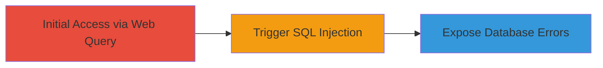

# SQL Injection in Trac Report Parameter to Expose Database Errors

Multi-stage attack chain demonstrating a complete attack workflow targeting the Trac ticket system on the Tor Project's website.

## Chain Metrics Dashboard

| Metric | Value |
|--------|-------|
| Chain Status | Unverified |
| Total Steps | 1 |
| Execution Time | ~1 minutes |
| Skill Level | Intermediate |
| Complexity | Medium |
| Impact Level | High |

## Attack Flow Visualization



## Prerequisites & Requirements

### Required Tools

- Browser or [[tools/curl]]

### Target Environment

- Web platform with Trac ticket system
- Services: Trac query endpoint
- Tech stack: Trac, Python
- Network access: Public internet to https://trac.torproject.org

### Initial Access Requirements

- No credentials required
- Direct public access to the Trac query URL
- No prior access needed

## Detailed Attack Procedures

### Step 1: Trigger SQL Injection
procedure: [[procedures/Trigger-SQL-Injection-in-Trac-Report-Parameter]]

**Objective**: Append a single quote to the 'report' parameter in the Trac query URL to break the SQL query and expose error messages revealing database structure.

**Instructions**: Construct and access the malicious URL using a browser or [[commands/curl-test-sqli-report]] to send the request:

```bash
curl "https://trac.torproject.org/projects/tor/query?status=closed&report=1'" -v
```

This injects a single quote after the report ID '1', causing a SQL syntax error if input is unsanitized.

**Expected Output**: HTTP response containing a SQL error message, such as a syntax error indicating unescaped input in the backend query.

**Success Indicators**:
- SQL syntax error displayed in the response body
- Database-related details leaked, like table names or query fragments

## Attack Chain Summary

### Key Achievements

1. Identified lack of input sanitization in the 'report' parameter
2. Triggered SQL error to confirm vulnerability
3. Demonstrated potential for further SQL injection to extract or manipulate ticket data

## Technique & Tactic Coverage

### MITRE ATT&CK Techniques

- [[Exploit Public-Facing Application]]

### MITRE ATT&CK Tactics

- [[Initial Access]]
- [[Collection]]

---
*Last updated: 2023-10-01T00:00:00Z*
