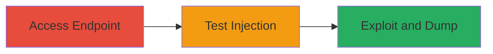

# SQL Injection in URL Path Parameters Leading to Database Dump

Multi-stage attack chain demonstrating exploitation of an SQL injection vulnerability in URL path parameters of the web application at https://corporate.admyntec.co.za/, resulting in unauthorized access to the backend database and sensitive user data.

## Chain Metrics Dashboard

| Metric | Value |
|--------|-------|
| Chain Status | Unverified |
| Total Steps | 3 |
| Execution Time | ~15 minutes |
| Skill Level | Intermediate |
| Complexity | Medium |
| Impact Level | High |

## Attack Flow Visualization

## Prerequisites & Requirements

### Required Tools

- [[tools/SQLmap]]

### Target Environment

- Web application with backend SQL database
- Accessible URL endpoints with path parameters (e.g., customerId)
- No authentication required for initial access

### Initial Access Requirements

- Direct network access to the target web application
- No prior credentials needed
- Browser or command-line tool for URL manipulation

## Detailed Attack Procedures

### Step 1: Access Target Web Endpoint
procedure: [[procedures/Access-Target-Web-Endpoint]]

**Objective**: Navigate to a legitimate application endpoint to identify potential injection points in URL path parameters.

**Instructions**: Open a web browser and access a generated URL from the customer registration or insurance process, such as https://corporate.admyntec.co.za/customerInsurance/newCustomerStep8/userId/868878/customerId/732562/contactPersonId/0. Observe the page rendering normally to confirm the endpoint is active.

**Expected Output**: Insurance details page loads without errors, displaying user-specific information.

**Success Indicators**:
- Page loads successfully
- URL parameters like customerId are visible and modifiable

### Step 2: Test SQL Injection in URL Parameters
procedure: [[procedures/Test-SQL-Injection-in-URL-Parameters]]

**Objective**: Introduce a single quote into the URL parameter to detect SQL injection by observing query breakage.

**Instructions**: Modify the URL by appending a single quote (') to the customerId parameter, e.g., https://corporate.admyntec.co.za/customerInsurance/newCustomerStep8/userId/868878/customerId/732562'/contactPersonId/0. Reload the page and check for backend errors indicating unsanitized input.

**Expected Output**: Database error message or blank page, confirming the injection point (e.g., SQL syntax error due to unclosed quote).

**Success Indicators**:
- Error response from server (e.g., MySQL syntax error)
- No normal page rendering

### Step 3: Exploit SQL Injection with SQLmap
procedure: [[procedures/Exploit-SQL-Injection-with-SQLmap]]

**Objective**: Automate exploitation to dump the entire backend database, extracting sensitive data like ID numbers, organization details, and documents.

**Instructions**: Launch SQLmap with the vulnerable URL, marking the customerId as the injection point using an asterisk (*), e.g., https://corporate.admyntec.co.za/customerInsurance/newCustomerStep8/userId/868878/customerId/732562*/contactPersonId/0. Run the tool to detect and exploit the vulnerability, dumping tables.

**Expected Output**: SQLmap outputs database schema, tables, and dumped data including user records.

**Success Indicators**:
- SQLmap confirms injectable parameter
- Successful dump of database contents to local files

## Attack Chain Summary

### Key Achievements

1. Identified SQL injection in URL path parameters without authentication
2. Confirmed vulnerability through manual testing with single quote
3. Dumped sensitive database via automated exploitation, enabling data exfiltration

## Technique & Tactic Coverage

### MITRE ATT&CK Techniques

- [[Exploit Public-Facing Application]]

### MITRE ATT&CK Tactics

- [[Initial Access]]
- [[Collection]]

---
*Last updated: 2023-10-01T00:00:00Z*
