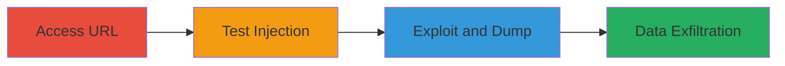

---
tags:
  - sqli
  - web
  - database-dump
  - sqlmap
type: attack_chain
tools:
  - '[[tools/SQLmap]]'
tactics:
  - '[[Initial Access]]'
  - '[[Collection]]'
verified: false
platforms:
  - Web
submitted: true
created_at: '2023-10-01T00:00:00Z'
procedures:
  - '[[procedures/Access-Insurance-Registration-URL]]'
  - '[[procedures/Test-SQL-Injection-with-Single-Quote]]'
  - '[[procedures/Exploit-SQL-Injection-with-SQLmap]]'
step_count: 3
techniques:
  - '[[Exploit Public-Facing Application]]'
updated_at: '2025-12-14T17:26:27.855Z'
description: >-
  Multi-stage attack exploiting SQL injection in URL path parameters of a web
  application to test for vulnerability and dump the entire backend database,
  exposing sensitive user data.
id: ac5616b5-123c-40cc-8b6f-898931f96b19
validated: true
mitre_tactics:
  - '[[Initial Access]]'
  - '[[Collection]]'
mitre_techniques:
  - '[[Exploit Public-Facing Application]]'
---
# SQL Injection in URL Path Parameters Leading to Database Dump

Multi-stage attack chain demonstrating exploitation of an SQL injection vulnerability in the URL path parameters of the https://corporate.admyntec.co.za/ insurance registration application, allowing an attacker to dump sensitive database contents including user IDs, organization details, and documents.

## Chain Metrics Dashboard

| Metric | Value |
|--------|-------|
| Chain Status | Unverified |
| Total Steps | 3 |
| Execution Time | ~10 minutes |
| Skill Level | Intermediate |
| Complexity | Medium |
| Impact Level | High |

## Attack Flow Visualization

## Prerequisites & Requirements

### Required Tools

- [[tools/SQLmap]]

### Target Environment

- Web application platform
- Backend SQL database (e.g., MySQL or similar)
- Access to the insurance registration flow URL

### Initial Access Requirements

- Valid session or public access to the registration endpoint
- No authentication required for the vulnerable URL
- Network access to https://corporate.admyntec.co.za/

## Detailed Attack Procedures

### Step 1: Access Generated URL
procedure: [[procedures/Access-Insurance-Registration-URL]]

**Objective**: Obtain the vulnerable URL generated during the insurance registration process to identify the path parameters for injection.

**Instructions**: Navigate to the insurance registration flow and proceed to the step where the URL for displaying details is generated. The URL follows the pattern: https://corporate.admyntec.co.za/customerInsurance/newCustomerStep8/userId/{userId}/customerId/{customerId}/contactPersonId/{contactPersonId}.

**Expected Output**: A page displaying insurance details with ID parameters in the URL.

**Success Indicators**:
- URL loaded successfully without errors
- Path parameters like userId, customerId visible in the browser address bar

### Step 2: Test SQL Injection
procedure: [[procedures/Test-SQL-Injection-with-Single-Quote]]

**Objective**: Introduce a single quote into a path parameter to break the SQL query and confirm the injection vulnerability.

**Instructions**: Modify the customerId parameter in the URL by appending a single quote ('). For example, change https://corporate.admyntec.co.za/customerInsurance/newCustomerStep8/userId/868878/customerId/732562/contactPersonId/0 to https://corporate.admyntec.co.za/customerInsurance/newCustomerStep8/userId/868878/customerId/732562'/contactPersonId/0 and reload the page.

**Expected Output**: A backend SQL error message, such as a syntax error or database exception, indicating the query was malformed.

**Success Indicators**:
- Error page or message revealing SQL syntax issues
- No normal page load, confirming injection point

### Step 3: Exploit and Dump Database
procedure: [[procedures/Exploit-SQL-Injection-with-SQLmap]]

**Objective**: Use an automated tool to exploit the confirmed SQL injection and enumerate/dump the database contents.

**Instructions**: Launch SQLmap with the vulnerable URL, marking the customerId parameter as the injection point using an asterisk (*). Run SQLmap to detect the DBMS, enumerate tables, and dump sensitive data like user information and documents.

**Expected Output**: SQLmap output showing database structure, table dumps, and downloaded files containing sensitive data.

**Success Indicators**:
- SQLmap confirms injectable parameter
- Successful dump of tables with user IDs, organizations, and documents

## Attack Chain Summary

### Key Achievements

1. Confirmed SQL injection in URL path parameters without authentication.
2. Exploited vulnerability to access the entire backend database.
3. Exfiltrated sensitive information including ID numbers and uploaded documents.

## Technique & Tactic Coverage

### MITRE ATT&CK Techniques

- [[Exploit Public-Facing Application]]

### MITRE ATT&CK Tactics

- [[Initial Access]]
- [[Collection]]

---
*Last updated: 2023-10-01T00:00:00Z*
