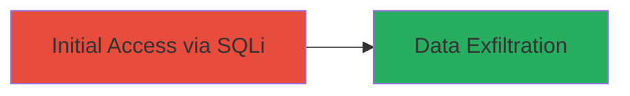

# SQL Injection in Ubiquiti Legacy Server for Unauthorized Data Access

Multi-stage attack chain demonstrating a complete attack workflow targeting a SQL injection vulnerability in a legacy web server.

## Chain Metrics Dashboard

| Metric | Value |
|--------|-------|
| Chain Status | Unverified |
| Total Steps | 1 |
| Execution Time | ~5 minutes |
| Skill Level | Intermediate |
| Complexity | Medium |
| Impact Level | High |

## Attack Flow Visualization



## Prerequisites & Requirements

### Required Tools

- [[tools/sqlmap]]

### Target Environment

- Web platform with legacy server
- SQL database backend (inferred from SQLi)
- Open ports for web service (e.g., 80/443)

### Initial Access Requirements

- Network access to the target web server
- No prior credentials needed (public-facing)
- Basic knowledge of SQL syntax

## Detailed Attack Procedures

### Step 1: Exploit SQL Injection
procedure: [[procedures/Exploit-SQL-Injection-in-Web-Application]]

**Objective**: Identify and exploit a SQL injection vulnerability in the legacy server's web endpoint to gain unauthorized access to database contents.

**Instructions**: Begin by testing the target endpoint for SQL injection susceptibility using [[commands/sqlmap-test-injection]] to probe for injectable parameters:

```bash
sqlmap -u "http://legacy.ubnt.com/search?q=test" --batch --level=1
```

If vulnerable, escalate to dump database information with [[commands/sqlmap-dump-data]]:

```bash
sqlmap -u "http://legacy.ubnt.com/search?q=test" -D ubiquiti_db --dump --batch
```

**Expected Output**: Confirmation of vulnerability and extracted data such as table names, user records, or sensitive information.

**Success Indicators**:
- SQL error messages or boolean-based blind injection responses
- Successful data dump showing database schema or records
- No authentication barriers bypassed

## Attack Chain Summary

### Key Achievements

1. Identified critical SQLi in legacy web server
2. Achieved unauthorized data access and potential manipulation
3. Reported vulnerability leading to bounty payout

## Technique & Tactic Coverage

### MITRE ATT&CK Techniques

- [[Exploit Public-Facing Application]]

### MITRE ATT&CK Tactics

- [[Initial Access]]
- [[Collection]]

---
*Last updated: 2023-10-01T00:00:00Z*
