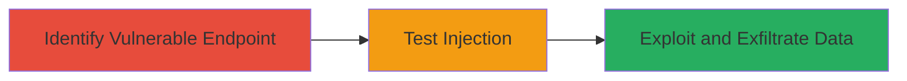

# SQL Injection in Website Search Functionality to Expose Unpublished Posts

Multi-stage attack chain demonstrating the exploitation of a SQL injection vulnerability in a website's search functionality to gain unauthorized access to unpublished posts and potentially execute other harmful SQL commands.

## Chain Metrics Dashboard

| Metric | Value |
|--------|-------|
| Chain Status | Unverified |
| Total Steps | 3 |
| Execution Time | ~15 minutes |
| Skill Level | Intermediate |
| Complexity | Medium |
| Impact Level | High |

## Attack Flow Visualization



## Prerequisites & Requirements

### Required Tools

- Browser or [[tools/curl]]
- SQL testing tool like [[tools/sqlmap]] (optional for automation)

### Target Environment

- Web application with search functionality
- SQL Database backend (e.g., MySQL, PostgreSQL)
- No specific ports required beyond standard HTTP/HTTPS (80/443)

### Initial Access Requirements

- Public access to the website's search page
- No credentials needed for unauthenticated search
- Network access to the target domain

## Detailed Attack Procedures

### Step 1: Identify Vulnerable Search Endpoint
procedure: [[procedures/Identify-Vulnerable-Search-Endpoint]]

**Objective**: Locate the search query input field and confirm it interacts with a SQL database without sanitization.

**Instructions**: Navigate to the website's search page and inspect the form or URL parameter for the query input (e.g., ?q= or search=). Use browser developer tools to monitor network requests during a normal search to verify SQL backend involvement via error messages or response times.

**Expected Output**: Identification of the parameter (e.g., /search?q=test) and any database-related indicators in responses.

**Success Indicators**:
- Search endpoint found
- Potential for input reflection in responses

### Step 2: Test SQL Injection Payload
procedure: [[procedures/Test-SQL-Injection-Payload]]

**Objective**: Inject a basic SQL payload to confirm the vulnerability by observing error messages or boolean responses.

**Instructions**: Use a simple payload like a single quote (') to trigger SQL errors. Execute [[commands/curl-basic-sqli-test]] to send the payload:

```bash
curl "https://target.com/search?q='" -v
```

Observe for SQL syntax errors in the response, such as "You have an error in your SQL syntax".

**Expected Output**: Database error message confirming lack of sanitization.

**Success Indicators**:
- SQL error exposed in response
- No input escaping observed

### Step 3: Exploit SQLi to Dump Unpublished Posts
procedure: [[procedures/Exploit-SQLi-to-Dump-Unpublished-Posts]]

**Objective**: Craft a payload to bypass filters and extract unpublished posts from the database, demonstrating unauthorized data access.

**Instructions**: Build on the confirmed vulnerability with a union-based injection to select from the posts table. Use [[commands/curl-union-sqli-dump]] to inject a payload targeting unpublished content (assuming a 'status' column where unpublished = 0):

```bash
curl "https://target.com/search?q=' UNION SELECT title, content, status FROM posts WHERE status=0--" -v
```

Parse the response for leaked data. For broader access, escalate to time-based or error-based techniques if union fails.

**Expected Output**: Leaked titles and content of unpublished posts in the search results.

**Success Indicators**:
- Unauthorized posts visible
- Database schema partially inferred

## Attack Chain Summary

### Key Achievements

1. Confirmed SQL injection in search query handling
2. Exposed unpublished posts via malicious payload
3. Demonstrated potential for further SQL command execution

## Technique & Tactic Coverage

### MITRE ATT&CK Techniques

- [[Exploit Public-Facing Application]]

### MITRE ATT&CK Tactics

- [[Initial Access]]
- [[Collection]]

---
*Last updated: 2024-10-01T00:00:00Z*
